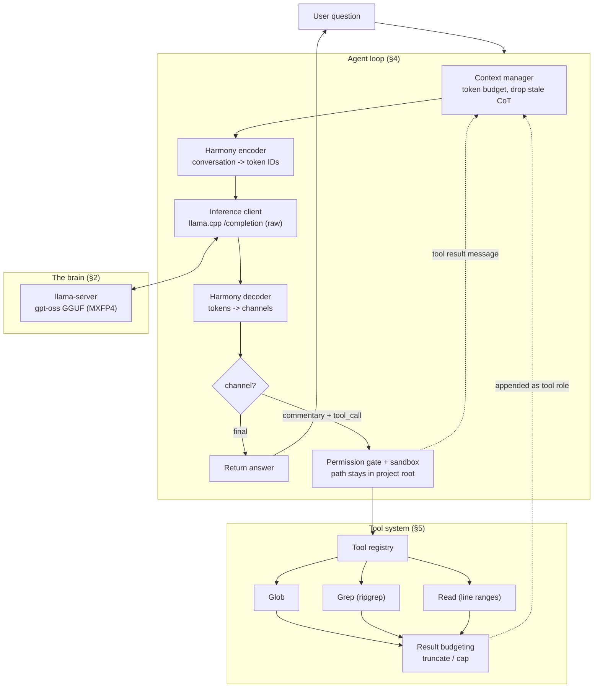

# Build Plan — Local Code Agent

**A Claude Code–style coding agent with gpt-oss as the brain, running completely local, driven by a hand-built Harmony prompt.**

This plan designs an agent that answers questions about (and later, edits) a codebase the way Claude Code does — by *navigating live* with a few sharp tools — but powered by an open-weight **gpt-oss** model you run yourself. You build the Harmony format by hand and feed raw token IDs to the model; no Ollama, no vLLM, no hosted API.

> Companion references in this repo:
> - `claude-internal-structure.md` — how Claude Code works internally (patterns we borrow).
> - `gpt-oss-doc.md` — raw local gpt-oss inference + the Harmony format in depth.
>
> This plan deliberately **does not re-explain** Harmony internals or gpt-oss inference mechanics — it points to `gpt-oss-doc.md`. It focuses on *the agent architecture that sits on top*.

---

## Table of Contents

0. [Goals, non-goals & what we borrow](#0-goals-non-goals--what-we-borrow)
1. [Architecture overview](#1-architecture-overview)
2. [The brain — gpt-oss local via llama.cpp](#2-the-brain--gpt-oss-local-via-llamacpp)
3. [The language — the Harmony codec](#3-the-language--the-harmony-codec)
4. [The nervous system — the agent loop](#4-the-nervous-system--the-agent-loop)
5. [The hands — the tool system (Glob / Grep / Read)](#5-the-hands--the-tool-system-glob--grep--read)
6. [Context management](#6-context-management)
7. [Permissions & sandbox](#7-permissions--sandbox)
8. [Memory (optional)](#8-memory-optional)
9. [Languages, directory layout & tech stack](#9-languages-directory-layout--tech-stack)
10. [Phased milestones](#10-phased-milestones)
11. [Things to watch / pitfalls](#11-things-to-watch--pitfalls)
12. [Verification & testing](#12-verification--testing)
13. [Future extensions](#13-future-extensions)
14. [Appendix — end-to-end pseudocode](#14-appendix--end-to-end-pseudocode)

---

## 0. Goals, non-goals & what we borrow

### Goal

A single-process CLI agent that, given a natural-language question about a local repo, **navigates the codebase with tools** (find files → search contents → read the relevant lines → follow references) and answers — using a **locally-running gpt-oss** model whose prompt you render in **Harmony** yourself.

### Non-goals (explicitly out of scope for v1)

Per the instruction to ignore these `claude-internal-structure.md` topics, this build **does not adopt**:

| Ignored § | Topic | What we do instead |
|-----------|-------|--------------------|
| **§4** | State — the two-tier architecture (bootstrap singleton + reactive store) | One plain in-process state object. No reactive store, no UI-driven state tiering. |
| **§5** | The API layer (multi-provider client, streaming SDK) | One local inference client (llama.cpp raw endpoint). No provider abstraction. |
| **§10** | Concurrent tool execution (partition + streaming executor) | Tools run **serially**. Multiple tool calls per turn are handled, but one after another. |
| **§11** | Sub-agents (spawning child agents) | **Single agent.** No `Agent` tool, no recursion. |
| **§17** | MCP — the universal tool protocol | Tools are **in-process Python functions**, not MCP servers. |
| **§18** | Remote control & cloud execution | **Fully local.** No bridge, no remote sessions. |

### What we borrow from Claude Code (the parts we *do* keep)

| Source | Pattern we adopt |
|--------|------------------|
| `claude-internal-structure.md` **§1, §6** | The **agent loop as the center of gravity**: one loop that streams the model, collects tool calls, executes them, appends results, repeats, and returns a typed reason for stopping. |
| **§7** | **Context management**: token-budget awareness, dropping stale chain-of-thought, per-tool result budgeting. |
| **§9** | **Self-describing tools** with **fail-closed defaults**, a validation→permission→execute pipeline, and **result budgeting**. |
| **§14** | A minimal **hook / permission gate** before any tool runs (PreToolUse-style). |
| **Appendix B** | **Navigate, don't index**: the **Glob → Grep → Read funnel**, model-driven "cheapest next step" tool selection, no embeddings/RAG. |
| `gpt-oss-doc.md` | Manual Harmony render/parse; raw token-ID inference; raw-CoT handling. |

**One-line philosophy (from Appendix B):** *reimplementing Claude Code's navigation is three cheap, exact tools + a cost-aware loop — not a vector database.*

### Language policy (polyglot by design)

**This is not a Python-only build.** Each layer uses the language actually required for it; the orchestrator language is a free choice because it talks to the engine over HTTP.

- **Inference engine — C/C++ (required).** llama.cpp *is* C++; you compile it. No choice here.
- **Fast search tools — Rust (required-ish).** `ripgrep` and `fd` are Rust — run the binaries, or link their crates. Don't reimplement them.
- **Harmony codec — Rust *or* Python.** `openai-harmony` officially ships **only** a Rust crate (crates.io) and Python bindings (PyPI). Pick the one matching your orchestrator.
- **Orchestrator / agent loop — Rust, Python, or TypeScript.** Free choice; see [§9.2 recommended stacks](#92-recommended-stacks).

Code in this plan is given in **Python** (fastest prototype) and **Rust** (single-binary, native Harmony + search), with a **TypeScript** path noted for mirroring Claude Code's own design.

---

## 1. Architecture overview

The core is the 4-piece pipeline from the reference plan, wrapped in an orchestration loop:

```
User question
   → Harmony encoder (openai-harmony): build the conversation,
     render it to exact token IDs
   → llama.cpp (raw /completion endpoint, model loaded from GGUF)
     generates tokens
   → Harmony decoder: parse tokens back into channels
     (analysis / commentary+tool_call / final)
   → if tool_call → run Glob/Grep/Read → append result as a tool
     message → loop back to encoder
   → if final → return to user (drop analysis CoT before next turn)
```

Expanded into components:



**Components at a glance:**

| # | Component | Responsibility | Reference |
|---|-----------|----------------|-----------|
| 1 | **Inference client** | Send token IDs to the local model, get tokens back | §2 |
| 2 | **Harmony codec** | Render conversation → token IDs; parse tokens → channels | §3, `gpt-oss-doc.md` |
| 3 | **Agent loop** | Orchestrate: encode → infer → decode → dispatch tools → repeat; decide when to stop | §4 |
| 4 | **Tool system** | Glob / Grep / Read, registry, schemas, result budgeting | §5 |
| 5 | **Context manager** | Track token budget, drop stale CoT, budget tool results, (opt) compact | §6 |
| 6 | **Permission/sandbox** | Validate every tool's file access stays inside the project | §7 |
| 7 | **Memory** (optional) | Persist facts about the repo/user across sessions | §8 |
| 8 | **CLI** | Read the question, stream the `final` answer, hide `analysis` | §4 |

---

## 2. The brain — gpt-oss local via llama.cpp

> **Assumption:** "no Ollama, no vLLM" almost always means **llama.cpp directly** — the actual inference engine underneath Ollama, but used raw, with full control over the prompt/tokens instead of a wrapper doing it for you. This plan is built around that. *If you'd rather use the HF `transformers` route (heavier, needs a real GPU) or vLLM's offline `LLM` class instead, both are documented in `gpt-oss-doc.md` §5–§6 — the tool loop in §4 is identical; only this section changes.*

### Build steps

1. **Get the model.** Pull a pre-converted GGUF — `ggml-org/gpt-oss-20b-GGUF` (or `-120b-GGUF`) on Hugging Face. It already ships in native **MXFP4** (the model's own trained precision), so **don't over-quantize further** — it's already ~4-bit and re-quantizing saves nothing.

2. **Build llama.cpp from source** with your backend flag:
   - NVIDIA: `-DGGML_CUDA=ON`
   - Mac: Metal is automatic
   Then run `llama-server` pointed at the GGUF.

3. **Use the raw `/completion` endpoint, not `/v1/chat/completions`.** The chat endpoint auto-applies llama.cpp's own Harmony template — the same "it formats on top of yours and breaks things" problem Ollama has. The plain `/completion` endpoint accepts a **raw prompt (or token array)** with no templating; that's where you inject your own Harmony-rendered prompt.

4. **Install `openai-harmony`** (`pip install openai-harmony`). Don't hand-write token strings — use its `HarmonyEncoding` (details in §3).

5. **Define the tools** as Harmony function-tool schemas in the developer message (§5).

6. **Implement the tools for real** (§5).

7. **Write the orchestration loop** (§4).

### Server flags that matter

- **`--cache-prompt` / `cache_prompt: true`** on requests — reuse the KV cache across the growing conversation so you don't reprocess the whole prefix every round trip (see §6, §11).
- Send **token IDs** to `/completion` (the `prompt` field accepts an array of ints) so what the model sees is exactly what Harmony rendered — no re-tokenization.
- Request the **output token IDs back** so the Harmony decoder parses tokens, not re-encoded text. *(Flag name varies by llama.cpp version — verify; e.g. return-tokens option, or detokenize/parse the token stream you get.)*

### The engine boundary is language-agnostic

`llama-server` speaks **HTTP/JSON**: the orchestrator POSTs a body whose `prompt` is an array of token IDs and reads the output tokens back. **That HTTP boundary is why the C++ engine doesn't force the rest of the agent into any one language** — Rust, Python, and TypeScript all just send JSON. If you want to skip the process boundary entirely, Rust can link the engine in-process via the `llama-cpp-2` FFI crate (heavier build, no server to manage).

### Hardware sanity-check (do this first)

| Model | Practical minimum | Notes |
|-------|-------------------|-------|
| **gpt-oss-20b** | ~16 GB+ RAM/VRAM | Comfortable on most modern laptops; MXFP4 native on Hopper+/RTX 50xx |
| **gpt-oss-120b** | 80 GB-class GPU | CPU offload works but is painfully slow for interactive use |

For code Q&A, **start with 20b.** Low on VRAM? Offload layers to CPU — it just runs slower.

---

## 3. The language — the Harmony codec

You render the prompt and parse the response yourself. Full spec lives in `gpt-oss-doc.md` §8–§10; here's just the agent-facing contract.

### Encode (conversation → token IDs)

```python
from openai_harmony import (
    load_harmony_encoding, HarmonyEncodingName,
    Conversation, Message, Role, SystemContent, DeveloperContent,
    ReasoningEffort, ToolDescription,
)

enc = load_harmony_encoding(HarmonyEncodingName.HARMONY_GPT_OSS)

def render(history, tools, reasoning="medium", instructions="You are a code assistant."):
    system = (SystemContent.new()
              .with_reasoning_effort(ReasoningEffort[reasoning.upper()]))
    developer = (DeveloperContent.new()
                 .with_instructions(instructions)
                 .with_function_tools(tools))          # tools = [ToolDescription.new(...), ...]

    messages = [
        Message.from_role_and_content(Role.SYSTEM, system),
        Message.from_role_and_content(Role.DEVELOPER, developer),
        *history,                                       # prior user/assistant/tool messages
    ]
    convo = Conversation.from_messages(messages)
    prefill_ids = enc.render_conversation_for_completion(convo, Role.ASSISTANT)
    stop_ids = enc.stop_tokens_for_assistant_actions()  # <|return|>, <|call|>
    return prefill_ids, stop_ids
```

- **`render_conversation_for_completion(convo, Role.ASSISTANT)`** → exact token IDs, guaranteed to match what the model was trained on.
- **`stop_tokens_for_assistant_actions()`** → the correct stop-token IDs (`<|return|>`, `<|call|>`). Get these wrong and the model rambles past where it should stop.

### Decode (tokens → channels)

```python
def parse(output_token_ids):
    return enc.parse_messages_from_completion_tokens(output_token_ids, Role.ASSISTANT)
    # each message has: role, channel (analysis|commentary|final), recipient, content
```

### Channel contract (what the loop does with each)

| Channel | Meaning | Loop action |
|---------|---------|-------------|
| **analysis** | Raw chain-of-thought — **not safety-filtered** | Keep internal; **never show the user**; drop between turns (§6). |
| **commentary** | Tool call (`recipient=functions.<name>`, args as JSON) | Dispatch the tool (§5). May contain **multiple** calls. |
| **final** | The user-facing answer | Show it; end the turn. |

### Reasoning effort

Set `low` / `medium` / `high` in the system message. **`medium` is usually enough for code Q&A**; `high` burns a lot more analysis tokens per question. Start at medium.

---

## 4. The nervous system — the agent loop

This is the center of gravity (borrowed from `claude-internal-structure.md` §6, minus concurrency/§10 and sub-agents/§11). One loop, one code path, a typed reason for stopping.

### Loop state

```python
@dataclass
class LoopState:
    history: list          # Harmony messages (user/assistant/tool), grows each turn
    turn: int = 0
    max_turns: int = 12    # circuit breaker (§6/§11-style guard, minus the multi-agent parts)
```

### Terminal reasons (why the loop stopped)

`completed` · `max_turns` · `tool_error_fatal` · `model_error` · `aborted`

### The loop (pseudocode)

```python
def run(user_text, state, tools, tool_impls, sandbox):
    state.history.append(user_message(user_text))

    while True:
        if state.turn >= state.max_turns:
            return terminate("max_turns", state)
        state.turn += 1

        # 1. CONTEXT: budget + drop stale CoT before rendering (§6)
        state.history = context_manager.prepare(state.history)

        # 2. ENCODE
        prefill_ids, stop_ids = render(state.history, tools)

        # 3. INFER (raw token IDs in, token IDs out; reuse KV cache)
        try:
            out_ids = infer(prefill_ids, stop_ids, cache_prompt=True)
        except InferenceError as e:
            return terminate("model_error", state, e)

        # 4. DECODE into channel messages
        msgs = parse(out_ids)
        analysis = [m for m in msgs if m.channel == "analysis"]
        tool_calls = [m for m in msgs if m.channel == "commentary" and m.recipient]
        final = [m for m in msgs if m.channel == "final"]

        # 5. DONE? no tool calls => this turn produced a final answer
        if not tool_calls:
            answer = "".join(m.content for m in final)
            state.history.append(assistant_final(answer, analysis))   # store, then...
            state.history = context_manager.drop_cot_after_final(state.history)  # (§6)
            return terminate("completed", state, answer)

        # 6. TOOL CALLS — execute SERIALLY (§10 ignored on purpose)
        #    Keep analysis CoT this turn (tool-call exception, §6 / gpt-oss-doc §11.3)
        state.history.append(assistant_tool_calls(tool_calls, analysis))
        for call in tool_calls:                       # may be >1 per turn
            result = dispatch_tool(call, tools, tool_impls, sandbox)   # §5, §7
            result = context_manager.budget_tool_result(result)       # §6.2 truncation
            state.history.append(tool_message(call.recipient, result))

        # loop back: model sees tool results and continues
```

Notes:
- **Multiple tool calls per turn** are supported (Harmony allows it) but run **one after another** — we deliberately skip the concurrency machinery of §10.
- **CoT handling is the load-bearing rule:** keep `analysis` in history *only while a turn ends in a tool call*; **drop it once a turn ends in `final`** (`gpt-oss-doc.md` §11.3). This is what keeps the window from filling with stale reasoning.
- **Circuit breaker:** `max_turns` prevents an infinite tool loop from burning the machine (the minimal version of §6's death-spiral guards).

---

## 5. The hands — the tool system (Glob / Grep / Read)

The three tools from **Appendix B** are the whole point. They form a **funnel — broad → narrow → deep** — each step cheaper than the next, so the model only pays the expensive cost (loading full file content) once it's confident a file matters.

```
Glob   → locate candidate files by path pattern   (cheapest, no contents)
  ↓
Grep   → search inside that set for the symbol     (mid, matching lines only)
  ↓
Read   → load the files that matter (line ranges)  (deepest, full content)
  ↓
follow imports/refs found in Read → grep → read → …  (repeat)
```

The model chooses the tool each turn by reasoning *"what do I know, what am I missing, which tool gets me the missing piece cheapest"* — you don't hard-code the order.

### Self-describing tools with fail-closed defaults (§9)

```python
@dataclass
class Tool:
    name: str
    description: str
    schema: dict                          # JSON Schema for args (-> Harmony ToolDescription)
    run: Callable[[dict, Sandbox], str]   # returns a string result
    read_only: bool = True                # FAIL-CLOSED: default read-only
    max_result_chars: int = 30_000        # result budgeting default (§6.2)
```

Register them and hand their schemas to the Harmony developer message:

```python
def harmony_tools(registry):
    return [ToolDescription.new(t.name, t.description, parameters=t.schema)
            for t in registry.values()]
```

### Tool 1 — Glob (path pattern match; does not read contents)

**Schema**

```json
{
  "type": "object",
  "properties": {
    "pattern": {"type": "string", "description": "Glob like **/*.py or **/*config*.{js,ts,json}"},
    "limit":   {"type": "integer", "description": "Max paths to return", "default": 200}
  },
  "required": ["pattern"]
}
```

**Implementation** — `pathlib.Path.rglob`, or shell out to `fd` (faster on big trees).

```python
def glob_run(args, sandbox):
    root = sandbox.root
    limit = min(args.get("limit", 200), 1000)
    hits = []
    for p in root.glob(args["pattern"]):          # or: fd --glob <pattern>
        rel = sandbox.relativize(p)               # raises if outside root (§7)
        if p.is_file():
            hits.append(str(rel))
            if len(hits) >= limit:
                break
    return "\n".join(hits) or "(no matches)"
```

### Tool 2 — Grep (regex content search; returns matches + locations)

**Schema**

```json
{
  "type": "object",
  "properties": {
    "pattern":  {"type": "string", "description": "Regex, e.g. function\\s+createUser"},
    "path":     {"type": "string", "description": "Dir/file to scope the search", "default": "."},
    "glob":     {"type": "string", "description": "Restrict to files matching this glob"},
    "max_matches": {"type": "integer", "default": 100}
  },
  "required": ["pattern"]
}
```

**Implementation** — shell out to **ripgrep** (`rg --json`). Don't hand-roll regex in Python over a large repo: ripgrep is faster and won't catastrophically backtrack on adversarial patterns the way Python `re` can.

```python
def grep_run(args, sandbox):
    target = sandbox.resolve(args.get("path", "."))       # §7
    cmd = ["rg", "--json", "--max-count", str(args.get("max_matches", 100)),
           args["pattern"], str(target)]
    if args.get("glob"):
        cmd[1:1] = ["--glob", args["glob"]]
    out = subprocess.run(cmd, capture_output=True, text=True, timeout=30).stdout
    # parse rg --json lines -> "path:line: text", cap total (§6.2)
    return format_rg_json(out, cap=args.get("max_matches", 100))
```

### Tool 3 — Read (full file content, with line ranges)

**Schema**

```json
{
  "type": "object",
  "properties": {
    "path":       {"type": "string"},
    "start_line": {"type": "integer", "description": "1-indexed; optional"},
    "end_line":   {"type": "integer", "description": "1-indexed; optional"}
  },
  "required": ["path"]
}
```

**Implementation** — plain read, but **support a line range** so it can pull lines 40–90 instead of a whole 2000-line file. Return with line numbers (the model cites and re-greps by them).

```python
def read_run(args, sandbox):
    p = sandbox.resolve(args["path"])                     # §7
    lines = p.read_text(errors="replace").splitlines()
    s = max(1, args.get("start_line", 1))
    e = min(len(lines), args.get("end_line", len(lines)))
    numbered = [f"{i:>6}\t{lines[i-1]}" for i in range(s, e + 1)]
    return "\n".join(numbered)                            # budgeting applied by caller (§6.2)
```

### Implementation note — native libraries vs. subprocess (language choice)

The snippets above are **Python (Stack B)** and **shell out** to `ripgrep`/`fd`. If your orchestrator is **Rust (Stack A)**, call the libraries **in-process** instead — no subprocess spawn, no JSON round-trip, tighter sandboxing:

- **Grep** → the `grep` crate (`grep-searcher` + `grep-regex`) walking the tree with the `ignore` crate (respects `.gitignore`, skips VCS dirs — the same six-dir exclusion Claude Code's Grep uses).
- **Glob** → the `globset` + `ignore` crates.
- **Read** → `std::fs` + a line-range slice.

**TypeScript (Stack C)** shells out like Python (via `child_process`). Either way the *tool contract* — JSON-Schema args in, budgeted string out — is identical; only the implementation language changes. The three schemas above are language-neutral (they become Harmony `ToolDescription`s regardless).

### Dispatch (validation → permission → execute → budget)

A compressed version of §9's 14-step pipeline (we drop the MCP/§17, concurrency/§10, and hook-heavy parts):

```python
def dispatch_tool(call, tools, impls, sandbox):
    tool = tools.get(call.recipient.split(".")[-1])
    if tool is None:
        return f"ERROR: unknown tool {call.recipient}"
    try:
        args = json.loads(call.content)                  # Harmony gives JSON args
    except json.JSONDecodeError as e:
        return f"ERROR: bad tool arguments: {e}"
    if not permission_gate(tool, args, sandbox):         # §7
        return "ERROR: denied by permission policy"
    try:
        return impls[tool.name](args, sandbox)           # execute
    except Exception as e:
        return f"ERROR: {type(e).__name__}: {e}"         # tool errors are data, not crashes
```

### Tier 2 tools (optional — for an agent that *edits*, not just answers)

Add later, same interface, but `read_only=False` and stricter permission gating:
- **Read-before-Edit staleness check** (like §9's `readFileState`): reject an edit if the file changed since the model last read it.
- **Edit** (exact-string replace), **Write** (create/overwrite), **Bash** (run a command — the highest-risk tool; require explicit allow-listing and sandboxing).

For the v1 code-Q&A agent, **Glob + Grep + Read is the complete MVP.**

---

## 6. Context management

Adopt the useful parts of §7; skip the heavy compaction machinery until you need it.

### 6.1 Token budget

- gpt-oss window ≈ **131k tokens**, shared across system + developer + full history + all CoT + the answer.
- Track usage with `len(prefill_ids)` (you already render to token IDs) plus a margin for the output cap.
- When you approach the window, act (drop CoT → summarize → hard-trim). See 6.3.

### 6.2 Result budgeting (the highest-value, lowest-effort win)

Truncate tool outputs — a Grep hitting 500 matches or a Read of a 10k-line file defeats the whole point.

```python
def budget_tool_result(text, cap=30_000):
    if len(text) <= cap:
        return text
    head = text[:cap]
    return head + f"\n\n…[truncated {len(text)-cap} chars — narrow the pattern or request a line range]"
```

Let the model **ask for more/narrower** rather than dumping everything. Per-tool caps: Grep by `max_matches`, Read by line range, Glob by `limit`.

### 6.3 Drop stale chain-of-thought (the load-bearing rule)

- After a turn ends in a **`final`** message, **drop all `analysis` content from prior turns** on the next render.
- **Exception:** while a turn ends in a **tool call**, keep that turn's `analysis` — it's the context the model needs to continue (`gpt-oss-doc.md` §11.3).

```python
def drop_cot_after_final(history):
    # keep user msgs, final answers, and tool results; strip analysis from completed turns
    return [m for m in history if not (m.role == "assistant" and m.channel == "analysis"
                                       and m.turn_completed_with_final)]
```

### 6.4 Compaction (optional, add when conversations get long)

When usage crosses ~85–90% of the window, ask the model to compress older turns into a structured summary (what's been established, files seen, open questions) and replace the raw history with it. This mirrors Claude Code's compaction (`claude-internal-structure.md` §7) — implement it only once single-turn CoT-dropping isn't enough.

---

## 7. Permissions & sandbox

The model's output now directs filesystem calls — treat every tool arg as untrusted (Claude Code §9 permission model + §14 PreToolUse hook, minimal form).

### Path sandbox (mandatory)

```python
class Sandbox:
    def __init__(self, root):
        self.root = Path(root).resolve()

    def resolve(self, rel):
        p = (self.root / rel).resolve()
        if not str(p).startswith(str(self.root) + os.sep) and p != self.root:
            raise PermissionError(f"path escapes project root: {rel}")
        return p

    def relativize(self, p):
        p = Path(p).resolve()
        if not str(p).startswith(str(self.root) + os.sep):
            raise PermissionError("outside project root")
        return p.relative_to(self.root)
```

- **Every tool** routes file access through `sandbox.resolve()` / `sandbox.relativize()`.
- Block escapes via `../`, absolute paths, and symlinks that leave the root (resolve, then prefix-check — the trailing-separator check prevents `root-evil/` matching `root/`).

### Permission gate (PreToolUse-style)

```python
def permission_gate(tool, args, sandbox):
    if tool.read_only:
        return True                                   # reads inside the sandbox are auto-allowed
    # writes / bash: require explicit policy (allow-list, or interactive y/n)
    return policy.allows(tool.name, args)
```

For v1 (read-only Glob/Grep/Read), reads inside the root are auto-approved; there's nothing destructive. Add interactive confirmation when you introduce Tier-2 write tools.

---

## 8. Memory (optional)

If you want the agent to remember facts about the repo/user across sessions, adopt the lightweight version of `claude-internal-structure.md` §8 / `gpt-oss-doc.md`-adjacent ideas:

- **File-based**, human-readable Markdown under `~/.local-agent/<repo-hash>/memory/`.
- A small always-loaded `MEMORY.md` index; individual notes loaded on demand.
- Four types worth keeping: **user** (who they are), **feedback** (corrections/conventions), **project** (ongoing work), **reference** (where things live).
- **Derivability test:** don't store what you can re-derive by grepping the repo. Memory is for what the *code doesn't already say*.

Skip for the MVP; it's a clean add-on once the loop works.

---

## 9. Languages, directory layout & tech stack

### 9.1 Language per component

| Component | Language | Choice or requirement |
|-----------|----------|-----------------------|
| **Inference engine** (llama.cpp) | **C/C++** | **Required** — it *is* C++; you compile it. |
| **Model** (GGUF) | — (data) | `ggml-org/gpt-oss-20b-GGUF`, native MXFP4. |
| **Harmony codec** | **Rust** (crate) or **Python** (binding) | Official bindings exist **only** for these two. Match your orchestrator. |
| **Grep** | **Rust** | `ripgrep` binary (any language) or `grep`+`ignore` crates (Rust in-process). |
| **Glob / file-find** | **Rust** | `fd` binary (any language) or `globset`+`ignore` crates (Rust in-process). |
| **Orchestrator / agent loop** | **Rust · Python · TypeScript** | Free choice — talks to the engine over HTTP. |
| **CLI** | same as orchestrator | — |
| **Engine IPC** | **HTTP/JSON** | Language-agnostic boundary (or Rust FFI via `llama-cpp-2`). |

### 9.2 Recommended stacks

Pick one orchestrator language; the C++ engine and Rust search tools are shared by all three.

**Stack A — Rust-native (recommended for a real, single-binary agent).**
Orchestrator in Rust · `openai-harmony` **crate** · `grep`/`ignore`/`globset` crates in-process (no subprocess) · HTTP to `llama-server` (or `llama-cpp-2` FFI). → One static binary + the GGUF. Fastest runtime, strongest sandboxing, no interpreter. Most work up front.

**Stack B — Python (recommended for the fastest prototype).**
Orchestrator in Python 3.11+ · `openai-harmony` **pip** · shell out to `ripgrep`/`fd` · HTTP to `llama-server` (`httpx`). → Quickest to a working M3; heaviest runtime dependency. Best for proving the loop.

**Stack C — TypeScript/Node (recommended to mirror Claude Code's own design).**
Orchestrator in TS using **async generators** for the loop — the exact pattern of Claude Code's `query.ts` (`claude-internal-structure.md` §6). · **Caveat: no official JS Harmony binding** → run a tiny Rust/Python Harmony sidecar over stdio/HTTP, or bind the Rust crate with **napi-rs**. · ripgrep/fd via `child_process` · HTTP to `llama-server` (`fetch`). → Closest architectural match to Claude Code; costs you a Harmony sidecar.

> **Suggested path:** prototype the loop in **Stack B** to validate Harmony + tools fast (M0–M3), then port the orchestrator to **Stack A** for a shippable single binary once the design is proven. The tool contract and loop are identical, so the port is mechanical.

### 9.3 Directory layout

**Stack A (Rust) — primary:**

```
local-agent/
├── Cargo.toml
├── src/
│   ├── main.rs          # CLI: read question, stream `final`, hide `analysis`
│   ├── agent_loop.rs    # §4 orchestration loop + terminal states
│   ├── harmony.rs       # §3 render/parse via the openai-harmony crate
│   ├── inference.rs     # §2 HTTP client to llama-server (token IDs in/out, cache_prompt)
│   ├── context.rs       # §6 budget, drop_cot, budget_tool_result, (opt) compaction
│   ├── sandbox.rs       # §7 path sandbox + permission gate
│   └── tools/
│       ├── mod.rs       # §5 Tool trait + registry + harmony schemas
│       ├── glob.rs      # globset/ignore  (or shell fd)
│       ├── grep.rs      # grep/ignore crates  (or shell ripgrep)
│       └── read.rs      # std::fs + line range
├── config.toml          # server url, window size, caps, reasoning effort
└── models/gpt-oss-20b.gguf
```

**Stack B (Python) — mirror:** same tree with `src/*.rs` → `agent/*.py`, `Cargo.toml` → `pyproject.toml`, `main.rs` → `cli.py`.

### 9.4 Dependencies by stack

| Purpose | Shared / Stack A (Rust) | Stack B (Python) | Stack C (TS) |
|---------|-------------------------|------------------|--------------|
| Inference engine | **llama.cpp** (`llama-server`), built with GPU backend | ← same | ← same |
| Model | `ggml-org/gpt-oss-20b-GGUF` (MXFP4) | ← same | ← same |
| Harmony | `openai-harmony` **crate** | `openai-harmony` **pip** | Harmony **sidecar** (Rust/Py) or napi-rs |
| Search | `grep`+`ignore`+`globset` crates (or `rg`/`fd` bins) | `ripgrep`/`fd` binaries | `ripgrep`/`fd` binaries |
| HTTP to engine | `reqwest` | `httpx` | `fetch` (built-in) |
| JSON | `serde_json` | stdlib `json` | built-in |
| Runtime | Rust 1.75+ (static binary) | Python 3.11+ | Node 20+ |

---

## 10. Phased milestones

| Milestone | Deliverable | Done when… |
|-----------|-------------|-----------|
| **M0 — Brain online** | `llama-server` running on the GGUF; a raw `/completion` call with a hand-rendered Harmony prompt returns tokens | You can round-trip "What is 2+2?" through raw Harmony and parse a `final` answer. |
| **M1 — Codec** | `harmony.py` render/parse + correct stop tokens | Multi-turn conversation renders and parses cleanly; `analysis` vs `final` split correctly. |
| **M2 — One tool** | Read tool + dispatch + sandbox | Model can call `Read` on a file you name and answer about it. |
| **M3 — The funnel** | Add Glob + Grep; the full loop | "Where is `createUser` defined and what does it do?" works via Grep→Read with no file named up front. |
| **M4 — Robustness** | Result budgeting, CoT dropping, `max_turns`, error-as-data | Long sessions don't blow the window; a bad tool call doesn't crash the loop. |
| **M5 (opt)** | Compaction, memory, Tier-2 edit tools | Agent handles very long sessions / edits code. |

Build in this order — each milestone is runnable on its own.

---

## 11. Things to watch / pitfalls

- **Bypass the chat template.** Use llama.cpp's raw `/completion` (or the `"raw": true` option), never `/v1/chat/completions` — otherwise it applies its own Harmony template *on top of yours* and breaks generation.
- **Stop tokens.** Pass Harmony's stop-token IDs (`<|return|>`, `<|call|>`) to the sampler / rely on the GGUF's EOG metadata. Get this wrong and the model rambles past where it should stop. **Verify** how your llama.cpp build exposes stop-by-token-id.
- **Truncate tool outputs** (§6.2) — the single most common way this design fails is a Grep/Read that floods the window.
- **Sandbox everything** (§7) — model output now drives filesystem calls; validate every path stays in the project root.
- **Reuse the KV cache** (`cache_prompt: true`) — the loop re-sends the growing conversation each round trip; without prefix reuse you reprocess the whole prefix every call and it's slow. (This is the local echo of Claude Code's prompt-cache discipline — keep the stable prefix first, volatile content last.)
- **Multiple tool calls per turn** — Harmony can emit more than one; loop over them (serially, per our §10 exclusion). Don't assume exactly one.
- **Reasoning effort** — `medium` for code Q&A; `high` burns far more analysis tokens per question.
- **Don't over-quantize** — the GGUF is already MXFP4 (~4-bit); re-quantizing degrades quality for no memory win.
- **Never surface `analysis`** — it's unfiltered and may leak your instructions; show only `final`.
- **Hardware first** — confirm 20b fits (~16 GB) before wiring everything; 120b needs an 80 GB-class GPU to stay interactive.

---

## 12. Verification & testing

- **Golden-path smoke test:** a tiny fixture repo + a fixed question with a known answer; assert the loop reaches `final` and the answer mentions the right file/function.
- **Tool unit tests:** Glob/Grep/Read against the fixture (patterns, line ranges, empty results, sandbox-escape attempts that must raise).
- **Budgeting test:** feed a huge file to Read → assert the result is capped and carries the "truncated" hint.
- **CoT-drop test:** run two turns; assert prior-turn `analysis` is absent from the second render but tool results persist.
- **Sandbox test:** `../../etc/passwd`, absolute paths, and symlink escapes all raise `PermissionError`.
- **Reproducibility:** fix the sampler `seed` (and `temperature`) in `config.toml` so agent runs are repeatable when you're debugging behavior; log the model file hash + config with each session.
- **Determinism of parsing:** feed recorded token streams through the decoder and assert channel splits are stable.

---

## 13. Future extensions

- **Tier-2 tools:** Edit / Write / Bash with read-before-edit staleness checks and interactive approval.
- **Compaction + memory** (§6.4, §8) for very long sessions.
- **Streaming** the `final` channel to the CLI token-by-token (parse incrementally; only emit deltas when the current channel is `final`).
- **Alternate raw backends:** swap llama.cpp for Transformers `model.generate(input_ids=…)` or vLLM offline `LLM.generate(prompt_token_ids=…)` — the loop is unchanged (`gpt-oss-doc.md` §5–§6).
- **A "follow references" helper** that, given a symbol, chains Grep→Read automatically to gather a symbol + its dependencies in one tool.

---

## 14. Appendix — end-to-end pseudocode

A single-file sketch tying it together (illustrative; `[verify]` marks version-dependent details).

```python
# cli.py
import json, subprocess, os
from pathlib import Path
from dataclasses import dataclass, field
import httpx
from openai_harmony import (
    load_harmony_encoding, HarmonyEncodingName, Conversation, Message, Role,
    SystemContent, DeveloperContent, ReasoningEffort, ToolDescription,
)

ENC = load_harmony_encoding(HarmonyEncodingName.HARMONY_GPT_OSS)
SERVER = "http://localhost:8080/completion"       # llama-server raw endpoint

# ---- sandbox (§7) ----
class Sandbox:
    def __init__(self, root): self.root = Path(root).resolve()
    def resolve(self, rel):
        p = (self.root / rel).resolve()
        if p != self.root and not str(p).startswith(str(self.root) + os.sep):
            raise PermissionError(f"escapes root: {rel}")
        return p

# ---- tools (§5) ----
def glob_run(a, sb):
    return "\n".join(str(p.relative_to(sb.root)) for p in list(sb.root.glob(a["pattern"]))[:a.get("limit",200)] if p.is_file()) or "(none)"
def grep_run(a, sb):
    cmd = ["rg","--json","--max-count",str(a.get("max_matches",100)),a["pattern"],str(sb.resolve(a.get("path",".")))]
    return _fmt(subprocess.run(cmd,capture_output=True,text=True,timeout=30).stdout)
def read_run(a, sb):
    lines = sb.resolve(a["path"]).read_text(errors="replace").splitlines()
    s,e = max(1,a.get("start_line",1)), min(len(lines),a.get("end_line",len(lines)))
    return "\n".join(f"{i:>6}\t{lines[i-1]}" for i in range(s,e+1))

TOOLS = {
  "glob": (glob_run, ToolDescription.new("glob","Find files by path pattern",{"type":"object","properties":{"pattern":{"type":"string"},"limit":{"type":"integer"}},"required":["pattern"]})),
  "grep": (grep_run, ToolDescription.new("grep","Regex search file contents",{"type":"object","properties":{"pattern":{"type":"string"},"path":{"type":"string"},"max_matches":{"type":"integer"}},"required":["pattern"]})),
  "read": (read_run, ToolDescription.new("read","Read a file (optional line range)",{"type":"object","properties":{"path":{"type":"string"},"start_line":{"type":"integer"},"end_line":{"type":"integer"}},"required":["path"]})),
}

def budget(text, cap=30_000):
    return text if len(text)<=cap else text[:cap]+f"\n…[truncated {len(text)-cap} chars]"

# ---- inference (§2) ----
def infer(prefill_ids, stop_ids):
    r = httpx.post(SERVER, json={
        "prompt": prefill_ids,          # token IDs, no templating
        "cache_prompt": True,           # KV reuse (§6/§11)
        "n_predict": 1024,
        # "return_tokens": True,        # [verify] get output token IDs back
        # stop handling: rely on GGUF EOG for <|return|>/<|call|>, or [verify] stop-by-id
    }, timeout=None).json()
    return r["tokens"]                   # [verify] field carrying output token IDs

# ---- loop (§4) ----
def run(question, sb, reasoning="medium", max_turns=12):
    history = [Message.from_role_and_content(Role.USER, question)]
    for _ in range(max_turns):
        sys = SystemContent.new().with_reasoning_effort(ReasoningEffort[reasoning.upper()])
        dev = DeveloperContent.new().with_instructions(
            "You are a code assistant. Use glob/grep/read to navigate before answering."
        ).with_function_tools([td for _,td in TOOLS.values()])
        convo = Conversation.from_messages(
            [Message.from_role_and_content(Role.SYSTEM, sys),
             Message.from_role_and_content(Role.DEVELOPER, dev), *history]
        )
        prefill = ENC.render_conversation_for_completion(convo, Role.ASSISTANT)
        stop = ENC.stop_tokens_for_assistant_actions()

        out = infer(prefill, stop)
        msgs = ENC.parse_messages_from_completion_tokens(out, Role.ASSISTANT)

        calls = [m for m in msgs if m.channel == "commentary" and getattr(m, "recipient", None)]
        if not calls:                                   # final answer
            return "".join(m.content for m in msgs if m.channel == "final")

        history.extend(msgs)                            # keep analysis+calls this turn (§6.3 exception)
        for c in calls:                                 # serial (§10 excluded)
            name = c.recipient.split(".")[-1]
            fn, _ = TOOLS[name]
            try:
                result = budget(fn(json.loads(c.content), sb))
            except Exception as e:
                result = f"ERROR: {type(e).__name__}: {e}"
            history.append(Message.from_author_and_content(  # tool role message
                Author.new(Role.TOOL, c.recipient), result).with_channel("commentary"))
    return "(stopped: max_turns)"

if __name__ == "__main__":
    import sys
    sb = Sandbox(os.getcwd())
    print(run(" ".join(sys.argv[1:]), sb))
```

> This appendix is a **skeleton**, not production code. `[verify]` items (how your llama.cpp build returns output token IDs and handles stop-by-token-id) depend on version — confirm against the docs for the `llama.cpp` and `openai-harmony` versions you install. The tool-message construction and channel field names follow the Harmony API in `gpt-oss-doc.md` §9–§12; double-check exact method names against your installed `openai-harmony`.

### Rust skeleton (Stack A)

Same loop, single binary, native search + Harmony crate. Illustrative; `[verify]` marks exact `openai-harmony` crate names/signatures (Rust uses `snake_case` methods, `CamelCase` enum variants — confirm against the crate docs).

```rust
// src/main.rs  (Stack A — illustrative)
use serde_json::{json, Value};
use std::path::PathBuf;
use std::process::Command;

// ---- sandbox (§7) ----
struct Sandbox { root: PathBuf }
impl Sandbox {
    fn resolve(&self, rel: &str) -> std::io::Result<PathBuf> {
        let p = self.root.join(rel).canonicalize()?;
        if p != self.root && !p.starts_with(&self.root) {
            return Err(std::io::Error::new(
                std::io::ErrorKind::PermissionDenied, "path escapes project root"));
        }
        Ok(p)
    }
}

fn budget(t: &str, cap: usize) -> String {
    if t.len() <= cap { t.to_string() }
    else { format!("{}\n…[truncated {} chars]", &t[..cap], t.len() - cap) }
}

// ---- tools (§5): Stack A can use the grep/ignore/globset crates in-process;
//      shown here shelling to ripgrep for brevity ----
fn grep_run(a: &Value, sb: &Sandbox) -> String {
    let pat  = a["pattern"].as_str().unwrap_or_default();
    let path = sb.resolve(a["path"].as_str().unwrap_or(".")).unwrap();
    let out = Command::new("rg")
        .args(["--json", "--max-count", "100", pat]).arg(path)
        .output().map(|o| String::from_utf8_lossy(&o.stdout).into_owned())
        .unwrap_or_default();
    budget(&format_rg(&out), 30_000)                     // format_rg elided
}
fn read_run(a: &Value, sb: &Sandbox) -> String {
    let text  = std::fs::read_to_string(sb.resolve(a["path"].as_str().unwrap()).unwrap())
                    .unwrap_or_default();
    let lines: Vec<&str> = text.lines().collect();
    let s = a["start_line"].as_u64().unwrap_or(1).max(1) as usize;
    let e = (a["end_line"].as_u64().unwrap_or(lines.len() as u64) as usize).min(lines.len());
    lines[s-1..e].iter().enumerate()
        .map(|(i, l)| format!("{:>6}\t{}", s + i, l)).collect::<Vec<_>>().join("\n")
}

// ---- inference (§2): HTTP to llama-server with token IDs ----
fn infer(prefill_ids: &[u32]) -> Vec<u32> {
    let body = json!({ "prompt": prefill_ids, "cache_prompt": true, "n_predict": 1024 });
    let resp: Value = reqwest::blocking::Client::new()
        .post("http://localhost:8080/completion").json(&body).send().unwrap()
        .json().unwrap();
    // [verify] the field carrying output token IDs for your llama.cpp version
    resp["tokens"].as_array().unwrap().iter()
        .map(|v| v.as_u64().unwrap() as u32).collect()
}

// ---- loop (§4) ----  [verify] openai-harmony crate API
fn run(question: &str, sb: &Sandbox) -> String {
    let enc = harmony::load_harmony_encoding(harmony::HarmonyEncodingName::HarmonyGptOss); // [verify]
    let mut history = vec![harmony::user_message(question)];                               // [verify]
    for _ in 0..12 {                                     // max_turns circuit breaker
        let convo   = harmony::conversation(system_medium(), developer_with_tools(), &history); // [verify]
        let prefill = enc.render_conversation_for_completion(&convo, harmony::Role::Assistant); // [verify]
        let out     = infer(&prefill);
        let msgs    = enc.parse_messages_from_completion_tokens(&out, harmony::Role::Assistant); // [verify]

        let calls: Vec<_> = msgs.iter()
            .filter(|m| m.channel == "commentary" && m.recipient.is_some()).collect();
        if calls.is_empty() {                            // final answer
            return msgs.iter().filter(|m| m.channel == "final")
                       .map(|m| m.content.clone()).collect();
        }
        history.extend(msgs.clone());                    // keep analysis+calls this turn (§6.3)
        for c in calls {                                 // SERIAL (§10 excluded on purpose)
            let args: Value = serde_json::from_str(&c.content).unwrap_or(json!({}));
            let name = c.recipient.as_ref().unwrap().rsplit('.').next().unwrap();
            let result = match name {
                "grep" => grep_run(&args, sb),
                "read" => read_run(&args, sb),
                "glob" => glob_run(&args, sb),           // glob_run elided
                other  => format!("ERROR: unknown tool {other}"),
            };
            history.push(harmony::tool_message(c.recipient.clone().unwrap(), result)); // [verify]
        }
    }
    "(stopped: max_turns)".into()
}

fn main() {
    let sb = Sandbox { root: std::env::current_dir().unwrap() };
    let q: String = std::env::args().skip(1).collect::<Vec<_>>().join(" ");
    println!("{}", run(&q, &sb));
}
```

`Cargo.toml` deps: `reqwest` (blocking), `serde_json`, `openai-harmony`, and for in-process search `grep`, `ignore`, `globset`.

### TypeScript note (Stack C)

To mirror Claude Code directly, write the loop as an **async generator** in TS (its `query.ts` is exactly this — `claude-internal-structure.md` §6). The one gap is Harmony: **no official JS binding.** Cheapest first:

1. Run a tiny **Harmony sidecar** — a few lines of Rust or Python exposing `render` / `parse` over stdio or a local port — and call it from Node.
2. Or bind the Rust crate directly with **napi-rs**.

Everything else is native TS: the `llama-server` call (`fetch`), `ripgrep`/`fd` via `child_process`, the sandbox, and the loop.

---

### Ready to scaffold?

This plan builds in M0→M4 order. The next step is turning §14's skeleton into a real project — **pick a stack**: **A (Rust)** for a single binary, **B (Python)** for the fastest prototype, or **C (TypeScript)** to mirror Claude Code. I'll scaffold the orchestrator, the three tool modules, and a `llama-server` config, with the `[verify]` items resolved against the versions you install. Say which stack and I'll build it.
