# Claude Code — Internal Structure

A consolidated technical reference distilled from **[alejandrobalderas/claude-code-from-source](https://github.com/alejandrobalderas/claude-code-from-source)** — an 18-chapter reverse-engineering of Anthropic's Claude Code CLI, reconstructed from the `sourcesContent` field of the `.js.map` source maps published with early npm releases.

> **Provenance and disclaimer.** The upstream repo contains **no Claude Code source code**. Every code block there (and here) is original pseudocode illustrating architectural patterns. This document is a study aid, not a reproduction. Claude Code is a product of Anthropic; neither the upstream book nor this file is affiliated with or endorsed by Anthropic.

**Upstream scale:** ~2,000 TypeScript files analyzed · 18 chapters / 7 parts · ~6,200 lines of markdown · 25+ Mermaid diagrams · produced by 36 AI agents over ~6 hours in 4 phases (exploration → analysis → writing → review/revision).

---

## Table of Contents

| § | Topic |
|---|-------|
| [1](#1-the-six-core-abstractions) | The six core abstractions |
| [2](#2-the-golden-path-keystroke--output) | The golden path: keystroke → output |
| [3](#3-bootstrap--the-300ms-budget) | Bootstrap — the 300ms budget |
| [4](#4-state--the-two-tier-architecture) | State — the two-tier architecture |
| [5](#5-the-api-layer) | The API layer |
| [6](#6-the-agent-loop-queryts) | The agent loop (`query.ts`) |
| [7](#7-context-length-management) | **Context length management** |
| [8](#8-memory--learning-across-conversations) | **Memory — learning across conversations** |
| [9](#9-the-tool-system) | The tool system |
| [10](#10-concurrent-tool-execution) | Concurrent tool execution |
| [11](#11-sub-agents) | Sub-agents |
| [12](#12-fork-agents-and-the-prompt-cache) | Fork agents and the prompt cache |
| [13](#13-tasks-coordination-and-swarms) | Tasks, coordination, and swarms |
| [14](#14-extensibility--skills-and-hooks) | Extensibility — skills and hooks |
| [15](#15-the-terminal-ui) | The terminal UI |
| [16](#16-input-and-interaction) | Input and interaction |
| [17](#17-mcp--the-universal-tool-protocol) | MCP — the universal tool protocol |
| [18](#18-remote-control-and-cloud-execution) | Remote control and cloud execution |
| [19](#19-performance-engineering) | Performance engineering |
| [20](#20-constants--thresholds-quick-reference) | Constants & thresholds quick reference |
| [21](#21-the-patterns-worth-stealing) | The patterns worth stealing |

---

## 1. The Six Core Abstractions

Everything else in the codebase — 400+ utility files, a forked terminal renderer, vim emulation, cost tracking — exists to support these six. They were not designed upfront; they emerged from shipping a production agent to a large user base.

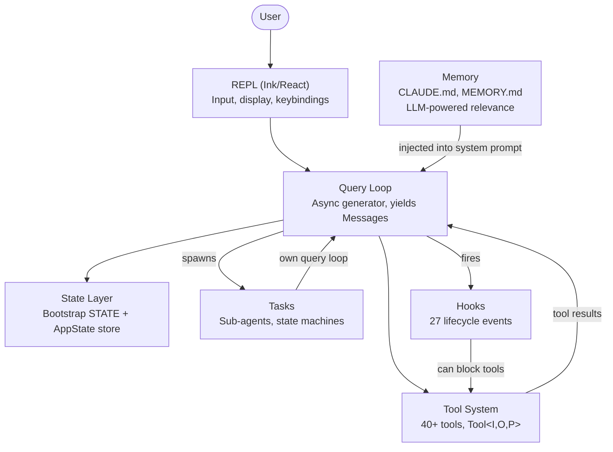
```mermaid
graph TD
    User([User]) --> REPL["REPL (Ink/React)<br/>Input, display, keybindings"]
    REPL --> QL["Query Loop<br/>Async generator, yields Messages"]
    QL --> TS["Tool System<br/>40+ tools, Tool&lt;I,O,P&gt;"]
    QL --> SL["State Layer<br/>Bootstrap STATE + AppState store"]
    TS -->|tool results| QL
    QL -->|spawns| Tasks["Tasks<br/>Sub-agents, state machines"]
    Tasks -->|own query loop| QL
    QL -->|fires| Hooks["Hooks<br/>27 lifecycle events"]
    Hooks -->|can block tools| TS
    Memory["Memory<br/>CLAUDE.md, MEMORY.md<br/>LLM-powered relevance"] -->|injected into system prompt| QL
```

**1. The Query Loop** (`query.ts`, ~1,700 lines). An async generator that is the heartbeat of the system. Streams a model response, collects tool calls, executes them, appends results, loops. Every interaction — REPL, SDK, sub-agent, headless `--print` — flows through this one function. Yields `Message` objects; returns a discriminated union `Terminal` encoding exactly why the loop stopped.

**2. The Tool System** (`Tool.ts`, `tools.ts`, `services/tools/`). 40+ tools implementing a ~45-member interface covering identity, schema, execution, permissions, and rendering. Tools carry their own permission logic, concurrency declarations, progress reporting, and UI rendering. A streaming executor starts concurrency-safe tools before the model finishes responding.

**3. Tasks** (`Task.ts`, `tasks/`). Background work units — primarily sub-agents. State machine: `pending → running → completed | failed | killed`. `AgentTool` spawns a new `query()` generator with its own message history, tool set, and permission mode. This gives Claude Code recursion: agents delegate to sub-agents, which can delegate further.

**4. State** (two layers). A mutable process singleton (`STATE`, ~80 fields) for session-level infrastructure — cwd, model config, cost tracking, telemetry, session ID. Set once at startup, mutated directly, no reactivity. Plus a minimal reactive store (~34 lines, Zustand-shaped) driving the UI: messages, input mode, tool approvals, progress. Infrastructure state changes rarely and needs no re-render; UI state changes constantly and must.

**5. Memory** (`memdir/`). Persistent context across sessions. Three tiers: project (`CLAUDE.md` in repo), user (`~/.claude/.../MEMORY.md`), team (shared subdirectory). At session start the system scans memory files, parses frontmatter, and an LLM selects which are relevant.

**6. Hooks** (`hooks/`, `utils/hooks/`). User-defined lifecycle interceptors firing at **27 distinct events** across 4 execution types: shell commands, single-shot LLM prompts, multi-turn agent conversations, HTTP webhooks. Hooks can block tool execution, modify inputs, inject context, or short-circuit the query loop. Part of the permission system is implemented through them — `PreToolUse` hooks can deny a tool call before the interactive prompt fires.

### How they connect

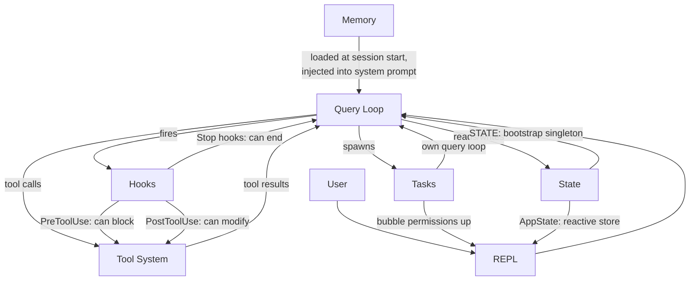
```mermaid
graph TD
    Memory -->|"loaded at session start,<br/>injected into system prompt"| QL["Query Loop"]
    User --> REPL --> QL
    QL -->|tool calls| TS["Tool System"]
    TS -->|tool results| QL
    QL -->|spawns| Tasks
    Tasks -->|own query loop| QL
    Tasks -->|bubble permissions up| REPL
    QL -->|fires| Hooks
    Hooks -->|PreToolUse: can block| TS
    Hooks -->|PostToolUse: can modify| TS
    Hooks -->|Stop hooks: can end| QL
    QL -->|reads/writes| State
    State -->|STATE: bootstrap singleton| QL
    State -->|AppState: reactive store| REPL
```

The circular dependency between query loop and tool system is the system's defining characteristic. Model generates tool calls → tools execute → results appended to history → model sees results and decides next action. This cycle continues until the model stops generating tool calls or an external constraint (token budget, max turns, user abort) terminates it.

---

## 2. The Golden Path: Keystroke → Output

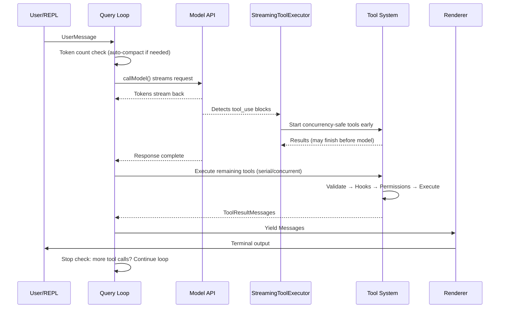
```mermaid
sequenceDiagram
    participant U as User/REPL
    participant Q as Query Loop
    participant M as Model API
    participant SE as StreamingToolExecutor
    participant T as Tool System
    participant R as Renderer

    U->>Q: UserMessage
    Q->>Q: Token count check (auto-compact if needed)
    Q->>M: callModel() streams request
    M-->>Q: Tokens stream back
    M-->>SE: Detects tool_use blocks
    SE->>T: Start concurrency-safe tools early
    T-->>SE: Results (may finish before model)
    M-->>Q: Response complete
    Q->>T: Execute remaining tools (serial/concurrent)
    T->>T: Validate → Hooks → Permissions → Execute
    T-->>Q: ToolResultMessages
    Q->>R: Yield Messages
    R->>U: Terminal output
    Q->>Q: Stop check: more tool calls? Continue loop
```

Three things to notice:

1. **The loop is a generator, not a callback chain.** The REPL pulls messages via `for await`, so backpressure is natural — if the UI can't keep up, the generator pauses.
2. **Tool execution overlaps model streaming.** `StreamingToolExecutor` starts concurrency-safe tools before the response completes. This is speculative execution; if the model's final output invalidates the call (rare), the result is discarded.
3. **The whole loop is re-entrant.** There is no separate "tool result handling" phase — results are appended to history and the loop calls the model again. The model signals completion by simply not making more tool calls.

### The permission system

Seven modes, most to least permissive:

| Mode | Behavior |
|------|----------|
| `bypassPermissions` | Everything allowed. No checks. Internal/testing only. |
| `dontAsk` | All allowed, still logged. No user prompts. (Background agents auto-deny anything that would prompt.) |
| `auto` | Transcript classifier (LLM) decides allow/deny. |
| `acceptEdits` | File edits auto-approved; other mutations prompt. |
| `default` | Standard interactive mode. User approves each action. |
| `plan` | Read-only. All mutations blocked. |
| `bubble` | Escalate decision to parent agent (sub-agent mode). |

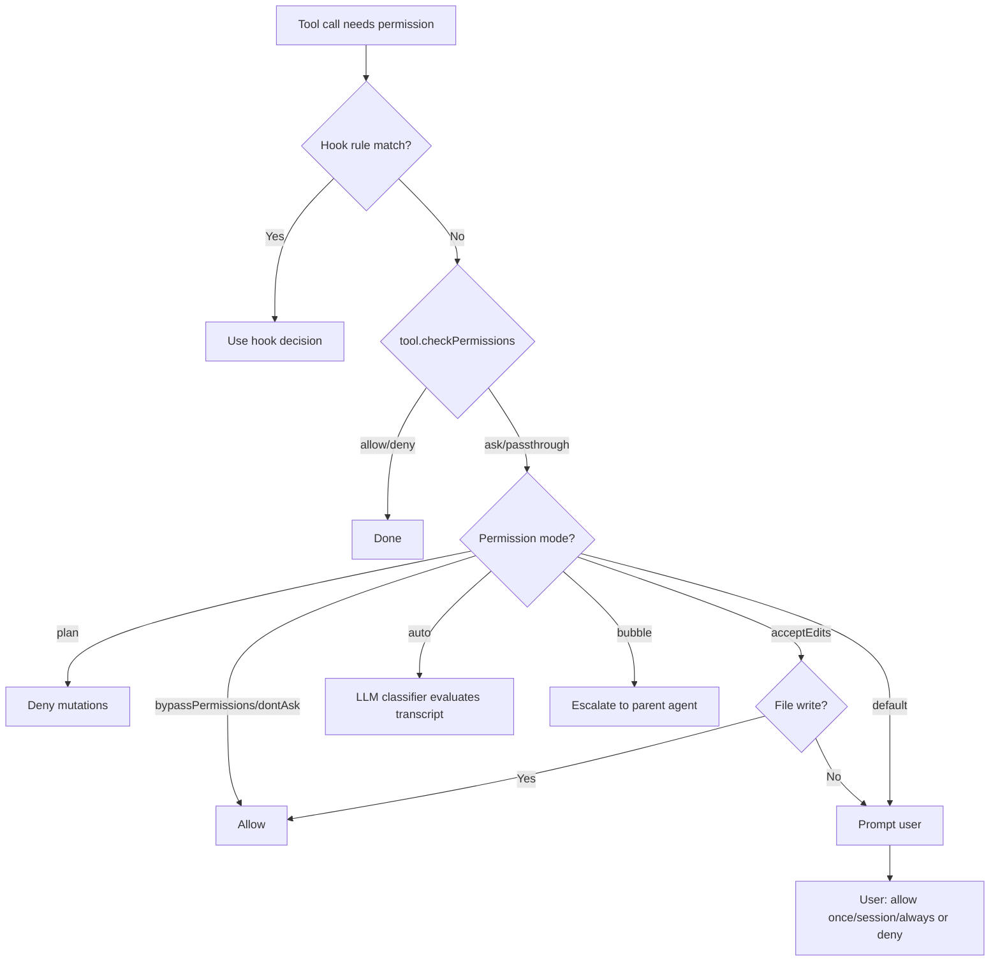
```mermaid
flowchart TD
    A["Tool call needs permission"] --> B{"Hook rule match?"}
    B -->|Yes| C["Use hook decision"]
    B -->|No| D{"tool.checkPermissions"}
    D -->|allow/deny| E["Done"]
    D -->|ask/passthrough| F{"Permission mode?"}
    F -->|bypassPermissions/dontAsk| G["Allow"]
    F -->|plan| H["Deny mutations"]
    F -->|acceptEdits| I{"File write?"}
    I -->|Yes| G
    I -->|No| J["Prompt user"]
    F -->|default| J
    F -->|auto| K["LLM classifier evaluates transcript"]
    F -->|bubble| L["Escalate to parent agent"]
    J --> M["User: allow once/session/always or deny"]
```

`auto` mode runs a separate lightweight LLM call classifying the tool invocation against the conversation transcript — this is what enables semi-autonomous operation. Sub-agents default to `bubble`, so they cannot approve their own dangerous actions.

### Multi-provider architecture

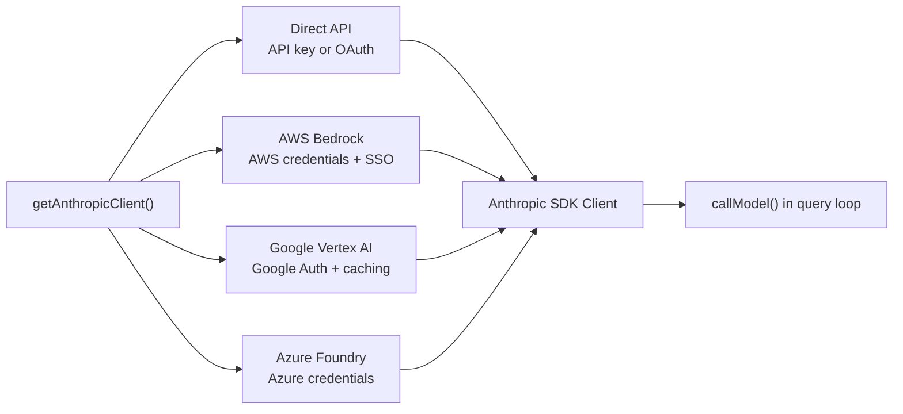
```mermaid
graph LR
    F["getAnthropicClient()"] --> D["Direct API<br/>API key or OAuth"]
    F --> B["AWS Bedrock<br/>AWS credentials + SSO"]
    F --> V["Google Vertex AI<br/>Google Auth + caching"]
    F --> A["Azure Foundry<br/>Azure credentials"]
    D --> SDK["Anthropic SDK Client"]
    B --> SDK
    V --> SDK
    A --> SDK
    SDK --> CL["callModel() in query loop"]
```

Provider selection is env-var driven, resolved at startup, stored in `STATE`. The query loop never checks which provider is active — switching Direct API → Bedrock is a config change, not a code change.

### The build system

Compile-time feature flags via Bun's `bun:bundle`:

```typescript
const reactiveCompact = feature('REACTIVE_COMPACT')
  ? require('./services/compact/reactiveCompact.js')
  : null
```

At build time `feature()` resolves to a boolean literal; dead-code elimination strips the `require()` entirely when false. `require()` is used instead of `import` specifically because dynamic `require()` can be fully eliminated, while dynamic `import()` returns a Promise the bundler must preserve.

> **The irony:** the flags successfully stripped the runtime code but left the full TypeScript in the published `sourcesContent` of the source maps. That is how the source became publicly readable.

---

## 3. Bootstrap — the 300ms Budget

300ms is the threshold at which humans perceive a tool as instant. Bootstrap must validate the environment, establish security boundaries, configure the communication layer, and render the UI — all under that line.

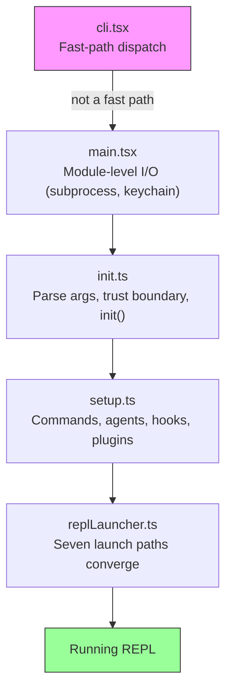
```mermaid
flowchart TD
    CLI["cli.tsx<br/>Fast-path dispatch"] -->|not a fast path| Main["main.tsx<br/>Module-level I/O (subprocess, keychain)"]
    Main --> Init["init.ts<br/>Parse args, trust boundary, init()"]
    Init --> Setup["setup.ts<br/>Commands, agents, hooks, plugins"]
    Setup --> Launch["replLauncher.ts<br/>Seven launch paths converge"]
    Launch --> REPL["Running REPL"]

    style CLI fill:#f9f,stroke:#333
    style REPL fill:#9f9,stroke:#333
```

### Four parallelism strategies

1. **Module-level subprocess dispatch** — fire keychain and MDM reads as side effects *during import evaluation*; the subprocesses run while the remaining ~135ms of static imports load.
2. **Promise parallelism in setup** — socket binding, hook snapshotting, command loading, agent definition loading all run concurrently.
3. **Post-render deferred prefetches** — git status, model capabilities, AWS credentials run after the prompt is visible.
4. **Dynamic imports to defer module evaluation** — `await import('./module.js')` in a dozen-plus places. OpenTelemetry (400KB + 700KB gRPC) loads only when telemetry initializes.

### Phase 0 — Fast-path dispatch (`cli.tsx`)

`claude --version`, `--help`, `claude mcp list` need one answer and nothing else. Check `argv`, dynamically import only the handler needed, exit before the rest of the system loads. ~12 such paths.

```typescript
if (args.length === 1 && args[0] === '--version') {
  const { printVersion } = await import('./commands/version.js')
  await printVersion()
  process.exit(0)
}
```

The principle: **do less by knowing more about intent.**

### Phase 1 — Module-level I/O (`main.tsx`)

```typescript
// These run at import time, not at call time
const mdmPromise = startMDMSubprocess()
const keychainPromise = readKeychainCredentials()
```

While the JS engine evaluates the rest of the import tree (~138ms), these promises are already in flight. Module evaluation is not idle time — it is time you can overlap with I/O. Requires suppressing ESLint's top-level-await and side-effect-in-module-scope rules.

### Phase 2 — Parse and trust (`init.ts`)

`init()` is **memoized** — multiple entry points (REPL, print mode, SDK mode) may each call it; memoization guarantees it runs exactly once.

**The trust boundary.** Claude Code reads environment variables, and environment variables can be poisoned (a malicious `.bashrc` setting `LD_PRELOAD` injects code into every subprocess). Ten distinct trust-sensitive operations are gated.

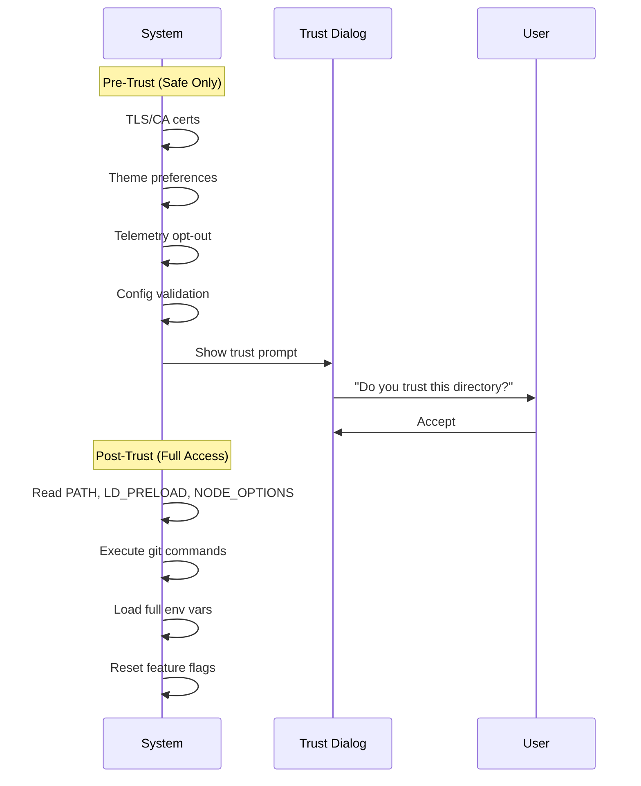
```mermaid
sequenceDiagram
    participant S as System
    participant T as Trust Dialog
    participant U as User

    Note over S: Pre-Trust (Safe Only)
    S->>S: TLS/CA certs
    S->>S: Theme preferences
    S->>S: Telemetry opt-out
    S->>S: Config validation

    S->>T: Show trust prompt
    T->>U: "Do you trust this directory?"
    U->>T: Accept

    Note over S: Post-Trust (Full Access)
    S->>S: Read PATH, LD_PRELOAD, NODE_OPTIONS
    S->>S: Execute git commands
    S->>S: Load full env vars
    S->>S: Reset feature flags
```

The boundary is not about the user trusting Claude Code — it is about **Claude Code trusting the environment**.

Commander's `preAction` hook is the architectural linchpin: Commander parses flags/subcommands *without* executing anything, and `preAction` fires after parsing but before the matched handler runs, so fast-path commands never pay the `init()` cost.

### Phase 3 — Setup (`setup.ts`)


```mermaid
gantt
    title Phase 3: Parallel Setup
    dateFormat X
    axisFormat %Lms

    section Sequential
    Commands registration   :0, 5
    section Parallel
    Agent definitions      :5, 15
    Hook registration      :5, 12
    Plugin initialization  :5, 20
    MCP server connections :5, 25
```

Setup also takes the **hook configuration snapshot** — read from disk once, frozen into an immutable snapshot, used for the rest of the session. Later modifications to hook config files on disk are ignored. (See §14.)

### Phase 4 — Launch (`replLauncher.ts`)

Seven paths converge: interactive REPL, print mode (`--print`), SDK mode, `--resume`, `--continue`, pipe mode, headless. All seven eventually call `query()`. The launch path determines *how* the loop is presented, not *what* it does.

### Timeline and budget


```mermaid
gantt
    title Bootstrap Timeline (~240ms)
    dateFormat X
    axisFormat %Lms

    section Phase 0
    Fast-path check          :0, 5

    section Phase 1
    Module evaluation        :5, 143
    MDM subprocess (parallel) :8, 60
    Keychain read (parallel)  :8, 50

    section Phase 2
    Commander parse          :143, 146
    init()                   :146, 160
    Trust boundary           :160, 175

    section Phase 3
    setup() + parallel registration :175, 210

    section Phase 4
    Launch path selection    :210, 215
    First render             :215, 240
```

| Phase | Time | What happens |
|-------|------|-------------|
| Fast-path check | ~5ms | Check argv, exit early if possible |
| Module evaluation | ~138ms | Import tree, fire parallel I/O |
| Commander parse | ~3ms | Parse flags and subcommands |
| `init()` | ~14ms | Config resolution, trust boundary |
| `setup()` | ~35ms | Commands, agents, hooks, plugins |
| Launch + first render | ~25ms | Pick path, mount React, first paint |
| **Total** | **~240ms** | 60ms headroom under budget |

Cold starts can push module evaluation past 200ms. Timings are approximate, derived from the codebase's own profiling checkpoints (warm start, modern hardware).

**Migrations** run during init: each is a versioned function; the system runs pending migrations in order and updates the version. Idempotent, typically <5ms total. Failures log and continue — availability beats strict consistency for local config.

### The narrowing-scope principle

- Phase 0: "any CLI invocation" → "needs full bootstrap"
- Phase 1: "everything must load" → "load in parallel with I/O"
- Phase 2: "unknown environment" → "trusted, configured environment"
- Phase 3: "no capabilities" → "fully registered"
- Phase 4: "seven possible modes" → "one concrete launch path"

The 300ms budget is a forcing function that prevents bootstrap from degenerating into scattered lazy initialization.

---

## 4. State — the Two-Tier Architecture

The naive approach (one global store) fails immediately: if the cost tracker updated the store that drives React re-renders, every API call would trigger a full reconciliation. Infrastructure modules run before React mounts, after it unmounts, and in contexts where no component tree exists at all.

### 4.1 Bootstrap state — the process singleton

```typescript
const STATE: State = getInitialState()
```

The comment above this line reads `AND ESPECIALLY HERE`; two lines above the type: `DO NOT ADD MORE STATE HERE - BE JUDICIOUS WITH GLOBAL STATE`.

Three reasons a mutable singleton is right here:
1. Must be available before any framework initializes — module-scope init is the only mechanism guaranteeing availability at import time.
2. The data is inherently process-scoped: session IDs, telemetry counters, cost accumulators, cached paths. No meaningful previous state to diff, no subscribers, no undo.
3. The module must be a **DAG leaf**. It imports nothing but utility types and `node:crypto`, so it is importable from anywhere without cycles. Enforced by a custom ESLint rule.

**The ~80 fields**, by category:

| Category | Examples |
|---|---|
| Identity and paths | `originalCwd` (resolved via `realpathSync`, NFC-normalized, never changes), `projectRoot`, `cwd`, `sessionId`, `parentSessionId` |
| Cost and metrics | `totalCostUSD`, `totalAPIDuration`, `totalLinesAdded`, `totalLinesRemoved` |
| Telemetry | `meter`, `sessionCounter`, `costCounter`, `tokenCounter` (OTel handles, nullable) |
| Model configuration | `mainLoopModelOverride`, `initialMainLoopModel` |
| Session flags | `isInteractive`, `kairosActive`, `sessionTrustAccepted`, `hasExitedPlanMode` |
| Cache optimization | `promptCache1hAllowlist`, `promptCache1hEligible`, `systemPromptSectionCache`, `cachedClaudeMdContent` |

**The getter/setter pattern.** `STATE` is never exported; ~100 individual accessor functions guard it:

```typescript
export function getProjectRoot(): string {
  return STATE.projectRoot
}
export function setProjectRoot(dir: string): void {
  STATE.projectRoot = dir.normalize('NFC')  // NFC on every path setter
}
```

This enforces encapsulation, NFC normalization (preventing Unicode mismatches on macOS), type narrowing, and bootstrap isolation. Verbose — but in a codebase where a stray mutation can bust a 50,000-token prompt cache, explicitness wins.

**The signal pattern.** Bootstrap cannot import listeners, so it uses a minimal pub/sub primitive `createSignal`. The `sessionSwitched` signal has exactly one consumer (`concurrentSessions.ts`, keeping PID files in sync), exposed as `onSessionSwitch = sessionSwitched.subscribe` so callers register themselves without bootstrap knowing who they are.

### The five sticky latches

Claude's API caches prompt prefixes server-side, but **the cache key includes HTTP headers**. If a beta header appears in request N but not N+1, the cache busts — even with identical prompt content. For a 50,000+ token system prompt, that is expensive.

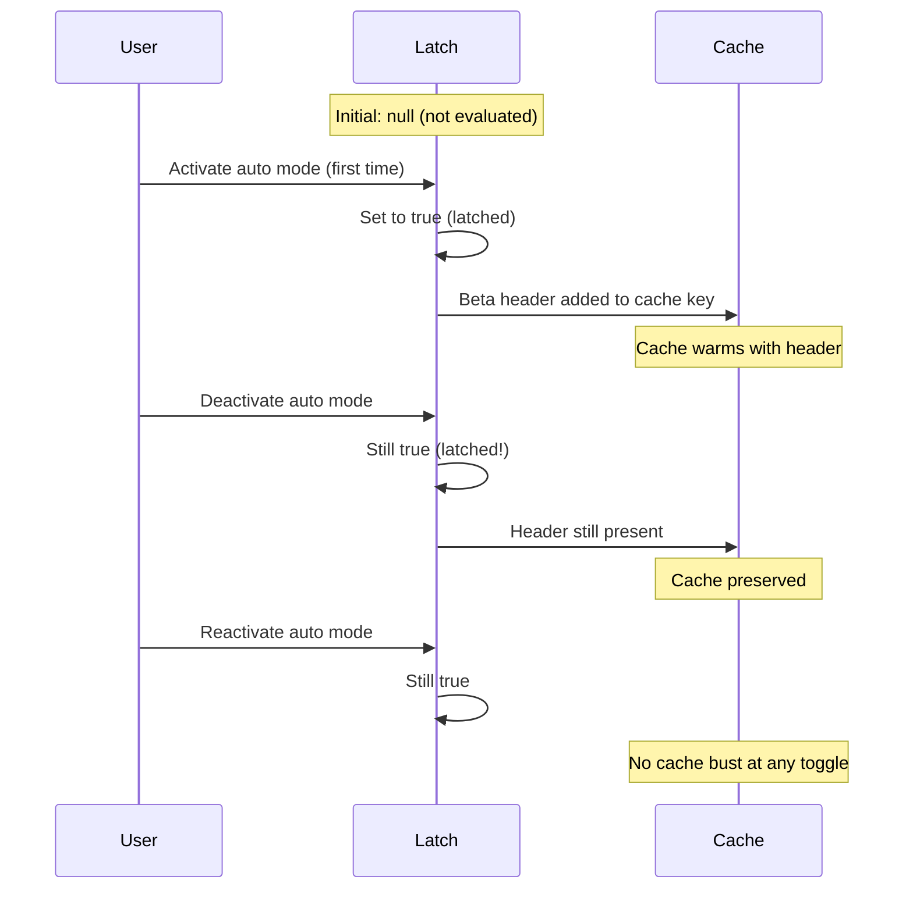
```mermaid
sequenceDiagram
    participant U as User
    participant L as Latch
    participant C as Cache

    Note over L: Initial: null (not evaluated)
    U->>L: Activate auto mode (first time)
    L->>L: Set to true (latched)
    L->>C: Beta header added to cache key
    Note over C: Cache warms with header

    U->>L: Deactivate auto mode
    L->>L: Still true (latched!)
    L->>C: Header still present
    Note over C: Cache preserved

    U->>L: Reactivate auto mode
    L->>L: Still true
    Note over C: No cache bust at any toggle
```

| Latch | What it prevents |
|-------|-----------------|
| `afkModeHeaderLatched` | Shift+Tab auto-mode toggling flipping the AFK beta header on/off |
| `fastModeHeaderLatched` | Fast-mode cooldown enter/exit flipping the fast-mode header |
| `cacheEditingHeaderLatched` | Remote feature-flag changes busting every active user's cache |
| `thinkingClearLatched` | Triggered on confirmed cache miss (>1h idle); prevents re-enabling thinking blocks from busting freshly warmed cache |
| `pendingPostCompaction` | Consume-once telemetry flag: distinguishes compaction-induced cache misses from TTL-expiry misses |

All five use the three-state type `boolean | null`: `null` = not yet evaluated, `true` = latched on. They never return to `null` or `false`.

```typescript
function shouldSendBetaHeader(featureCurrentlyActive: boolean): boolean {
  const latched = getAfkModeHeaderLatched()
  if (latched === true) return true       // Already latched — always send
  if (featureCurrentlyActive) {
    setAfkModeHeaderLatched(true)          // First activation — latch it
    return true
  }
  return false                             // Never activated — don't send
}
```

Why not always send all headers? Because an unrecognized header creates a *different cache namespace*. The latch means you only enter a namespace when you need it, then stay there.

### 4.2 AppState — the reactive store

~34 lines. A closure over a mutable variable, a `Set` of listeners, an `Object.is` equality check, and an `onChange` callback. Zustand without the library.

```typescript
function makeStore(initial, onTransition) {
  let current = initial
  const subs = new Set()
  return {
    read:      () => current,
    update:    (fn) => { /* Object.is guard, then notify */ },
    subscribe: (cb) => { subs.add(cb); return () => subs.delete(cb) },
  }
}
```

- **Updater function only.** No `setState(newValue)` — only `setState(prev => next)`, eliminating stale-state bugs.
- **`Object.is` equality check.** If the updater returns the same reference, the mutation is a no-op; no listeners fire.
- **`onChange` fires *before* listeners**, receiving old and new state, synchronously — so side effects complete before the UI re-renders.
- **No middleware, no devtools.** When you need exactly get/set/subscribe plus a change hook, 34 lines you own beats a dependency.

The `AppState` type is ~452 lines, wrapped in `DeepImmutable<>` with an intersection carve-out for fields holding functions, Maps, and mutable refs:

```typescript
export type AppState = DeepImmutable<{
  settings: SettingsJson
  verbose: boolean
  // ... ~150 more fields
}> & {
  tasks: { [taskId: string]: TaskState }  // Contains abort controllers
  agentNameRegistry: Map<string, AgentId>
}
```

React integration via `useSyncExternalStore`. The selector must return an *existing* sub-object reference — `useAppState(s => ({ a: s.a, b: s.b }))` produces a new object every render and re-renders on every state change.

### 4.3 How the tiers relate

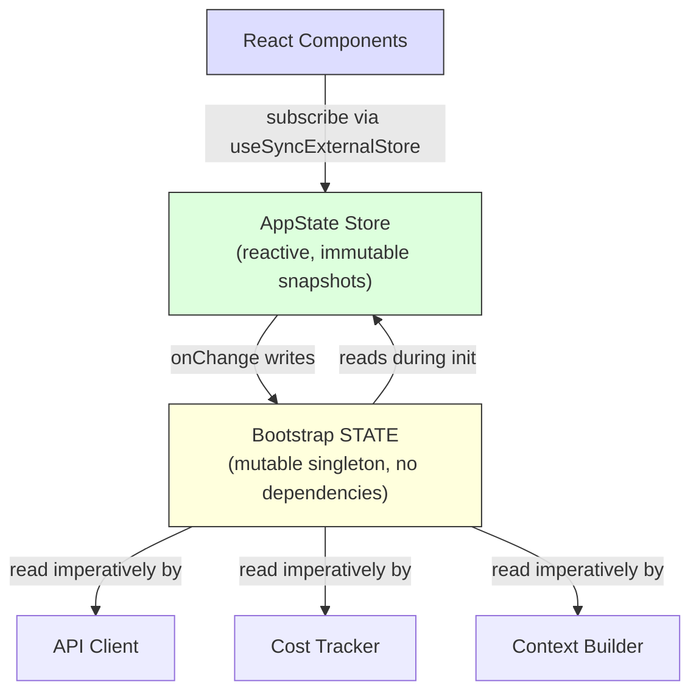
```mermaid
graph TD
    RC["React Components"] -->|subscribe via useSyncExternalStore| AS["AppState Store<br/>(reactive, immutable snapshots)"]
    AS -->|onChange writes| BS["Bootstrap STATE<br/>(mutable singleton, no dependencies)"]
    BS -->|reads during init| AS
    BS -->|read imperatively by| API["API Client"]
    BS -->|read imperatively by| CT["Cost Tracker"]
    BS -->|read imperatively by| CB["Context Builder"]

    style BS fill:#ffd,stroke:#333
    style AS fill:#dfd,stroke:#333
    style RC fill:#ddf,stroke:#333
```

Concrete flow for `/model claude-sonnet-4`:

1. Command handler calls `store.setState(prev => ({ ...prev, mainLoopModel: 'claude-sonnet-4' }))`
2. `Object.is` check detects a change
3. `onChangeAppState` fires → `setMainLoopModelOverride()` (bootstrap) + `updateSettingsForSource()` (disk)
4. All subscribers fire → React re-renders
5. The next API call reads the model from `getMainLoopModelOverride()` in **bootstrap** state

Steps 1–4 are synchronous; step 5 may run seconds later. The UI store is the source of truth for what the user chose; bootstrap state is the source of truth for what the API client uses.

### 4.4 Side effects: `onChangeAppState`

Centralizing side effects on a state *diff* rather than at mutation sites. Before this, permission mode was synced to the remote session by only 2 of 8+ mutation paths — Shift+Tab cycling, dialog options, slash commands, rewind, and bridge callbacks all mutated AppState silently. The fix hooks the diff in one place; the scattered callsites need zero changes. **Coverage becomes structural, not manual.**

Also handles: model changes (bootstrap sync), settings changes (clear credential caches, re-apply env vars), verbose toggle, expanded view.

### 4.5 Context building

Three memoized async functions in `context.ts`, computed **once per session**, not per turn:

- `getGitStatus` — five git commands in parallel via `Promise.all`, producing branch / default branch / recent commits / working tree status. Uses `--no-optional-locks` to avoid taking write locks that would interfere with a concurrent git operation in another terminal.
- `getUserContext` — loads CLAUDE.md, caches it in bootstrap state via `setCachedClaudeMdContent`. This cache **breaks a circular dependency**: the auto-mode classifier needs CLAUDE.md content → CLAUDE.md loading goes through the filesystem → which goes through permissions → which calls the classifier. Caching in a DAG leaf breaks the cycle.

All three use Lodash `memoize` (compute once, cache forever), *not* TTL caching — re-computing git status every 5 minutes would bust the server-side prompt cache. The system prompt tells the model outright: "This is the git status at the start of the conversation… a snapshot in time."

### 4.6 Cost tracking

Every API response flows through `addToTotalSessionCost`: accumulates per-model usage, updates bootstrap state, reports to OpenTelemetry, recursively processes advisor tool usage (nested model calls). Cost survives process restarts via save-and-restore to a project config file, guarded by session ID match.

Histograms use **reservoir sampling (Algorithm R)** with a 1,024-entry reservoir producing p50/p95/p99. Averages hide distribution shape: a session where 95% of calls take 200ms and 5% take 10s has the same mean as one where all calls take 690ms, but a radically different user experience.

### 4.7 Summary table

| Property | Bootstrap State | AppState |
|---|---|---|
| **Location** | Module-scope singleton | React context |
| **Mutability** | Mutable through setters | Immutable snapshots via updater |
| **Subscribers** | Signal (pub/sub) for specific events | `useSyncExternalStore` |
| **Availability** | Import time (before React) | After provider mounts |
| **Persistence** | Process exit handlers | Via onChange to disk |
| **Equality** | N/A (imperative reads) | `Object.is` reference check |
| **Dependencies** | DAG leaf (imports nothing) | Imports types across the codebase |
| **Test reset** | `resetStateForTests()` | Create new store instance |
| **Primary consumers** | API client, cost tracker, context builder | React components, side effects |

Some fields straddle the boundary: `mainLoopModel` lives in AppState (UI rendering) and `mainLoopModelOverride` in bootstrap (API consumption), kept in sync by `onChangeAppState`. Controlled duplication bridged by a central sync point beats a tangled dependency graph.

**None of this was designed upfront.** The sticky latches were added when cache busting became a measurable cost. The `onChange` handler was centralized when 6 of 8 sync paths were found broken. The CLAUDE.md cache was added when a circular dependency emerged.

---

## 5. The API Layer

This layer handles more failure modes than any other part of the system: four cloud providers behind one interface, byte-level prompt-cache awareness, streaming with active failure detection, and session-stable invariants so mid-conversation flag changes do not cause invisible performance cliffs.

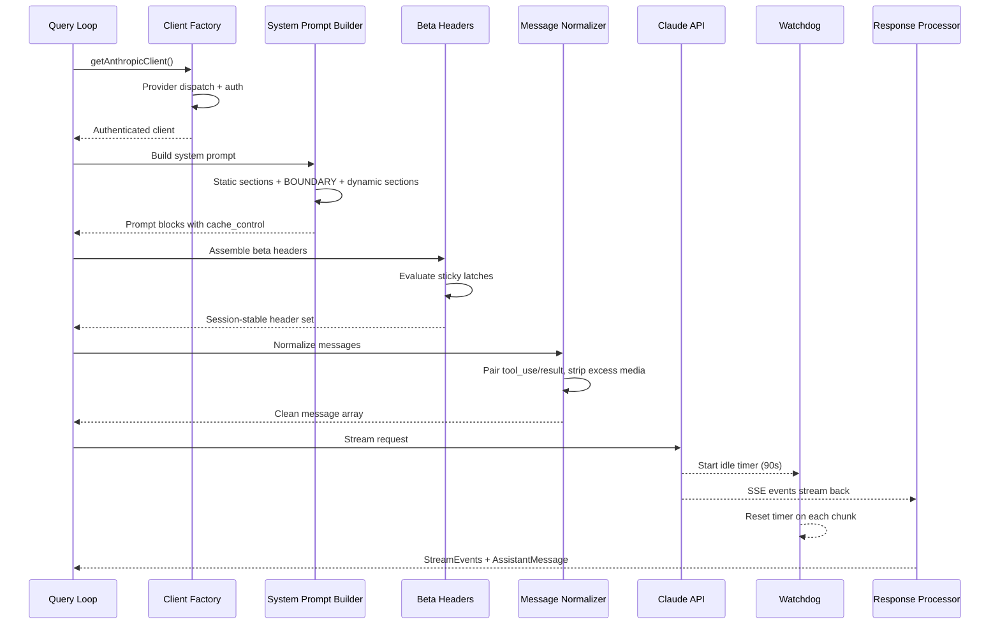
```mermaid
sequenceDiagram
    participant QL as Query Loop
    participant CF as Client Factory
    participant SP as System Prompt Builder
    participant BH as Beta Headers
    participant MN as Message Normalizer
    participant API as Claude API
    participant WD as Watchdog
    participant RP as Response Processor

    QL->>CF: getAnthropicClient()
    CF->>CF: Provider dispatch + auth
    CF-->>QL: Authenticated client

    QL->>SP: Build system prompt
    SP->>SP: Static sections + BOUNDARY + dynamic sections
    SP-->>QL: Prompt blocks with cache_control

    QL->>BH: Assemble beta headers
    BH->>BH: Evaluate sticky latches
    BH-->>QL: Session-stable header set

    QL->>MN: Normalize messages
    MN->>MN: Pair tool_use/result, strip excess media
    MN-->>QL: Clean message array

    QL->>API: Stream request
    API-->>WD: Start idle timer (90s)
    API-->>RP: SSE events stream back
    WD-->>WD: Reset timer on each chunk
    RP-->>QL: StreamEvents + AssistantMessage
```

### The client factory

All four provider SDK classes are cast via `as unknown as Anthropic`. The source comment is refreshingly honest: *"we have always been lying about the return type."* Deliberate type erasure so every consumer sees a uniform interface. Each provider SDK (`AnthropicBedrock`, `AnthropicFoundry`, `AnthropicVertex`) is dynamically imported so unused providers never load.

**`buildFetch` wrapper.** Every outbound fetch gets an `x-client-request-id` header — a per-request UUID. When a request times out, the server never assigns a request ID to the response, so without a client-side ID the API team cannot correlate the timeout with server logs. Only sent to first-party Anthropic endpoints (third-party providers might reject unknown headers).

### System prompt construction — the dynamic boundary

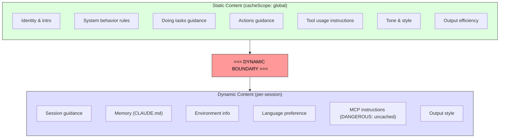
```mermaid
flowchart TD
    subgraph Static["Static Content (cacheScope: global)"]
        direction TB
        S1["Identity & intro"]
        S2["System behavior rules"]
        S3["Doing tasks guidance"]
        S4["Actions guidance"]
        S5["Tool usage instructions"]
        S6["Tone & style"]
        S7["Output efficiency"]
    end

    B["=== DYNAMIC BOUNDARY ==="]

    subgraph Dynamic["Dynamic Content (per-session)"]
        direction TB
        D1["Session guidance"]
        D2["Memory (CLAUDE.md)"]
        D3["Environment info"]
        D4["Language preference"]
        D5["MCP instructions (DANGEROUS: uncached)"]
        D6["Output style"]
    end

    Static --> B --> Dynamic

    style B fill:#f99,stroke:#333,color:#000
    style Static fill:#dfd,stroke:#333
    style Dynamic fill:#ddf,stroke:#333
```

Everything **before** the boundary is identical across sessions, users, and organizations → highest tier of server-side caching. Everything after contains user-specific content → per-session caching.

**The naming convention is deliberately loud.** Adding a section means choosing between `systemPromptSection` (safe, cached) and `DANGEROUS_uncachedSystemPromptSection(name, compute, reason)` (cache-breaking, requires a reason string). The `_reason` parameter is unused at runtime — it exists purely as mandatory documentation.

**The 2^N problem.** From `prompts.ts`:

> Each conditional here is a runtime bit that would otherwise multiply the Blake2b prefix hash variants (2^N).

Every boolean condition before the boundary doubles the number of unique global cache entries — 3 conditionals → 8 variants, 5 → 32. Compile-time feature flags (bundler-resolved) are acceptable before the boundary. Runtime checks (is this Haiku? does the user have auto mode?) must go after. An engineer adding a user-setting-gated section before the boundary could silently fragment the global cache and double the fleet's prompt-processing costs.

### Streaming

**Raw SSE over SDK abstractions.** The implementation uses raw `Stream<BetaRawMessageStreamEvent>` rather than the SDK's `BetaMessageStream`, because the latter calls `partialParse()` on every `input_json_delta` event — for tool calls with large JSON inputs (file edits with hundreds of lines) this re-parses the growing JSON string from scratch on every chunk, **O(n²)** behavior.

**The idle watchdog.** TCP connections die silently — server crash, load balancer drop, corporate proxy timeout. The SDK's request timeout is satisfied once HTTP 200 arrives; if the streaming body then stops, nothing catches it. The watchdog is a `setTimeout` that resets on every received chunk: warning at 45s, abort at 90s, logged with the client request ID.

**Non-streaming fallback.** On mid-response failure (network error, stall, truncation) the system falls back to a synchronous `messages.create()`. This handles proxies that return HTTP 200 with a non-SSE body, or truncate the SSE stream partway. Disabled when streaming tool execution is active — a fallback would re-execute the request and potentially run tools twice.

### Prompt cache — three tiers

| Tier | Scope | Notes |
|------|-------|-------|
| **Ephemeral** | Per-session, ~5 min server-defined TTL | Default; all users |
| **1-hour TTL** | Per-session, extended | Eligibility by subscription status, latched via `promptCache1hEligible` |
| **Global** | Cross-session, cross-organization | Static prompt portions are identical for all users, so one cached copy serves everyone |

Global scope is **disabled when MCP tools are present** — MCP tool definitions are user-specific and would fragment the cache into millions of unique prefixes.

Source comment on the latch block: *"Sticky-on latches for dynamic beta headers. Each header, once first sent, keeps being sent for the rest of the session so mid-session toggles don't change the server-side cache key and bust ~50-70K tokens."*

### `queryModel()` — the request assembly order

An async generator (~700 lines) yielding `StreamEvent`, `AssistantMessage`, and `SystemAPIErrorMessage`:

1. **Kill switch check** — safety valve for the most expensive model tier
2. **Beta header assembly** — model-specific, sticky latches applied
3. **Tool schema building** — parallel via `Promise.all()`, deferred tools excluded until discovered
4. **Message normalization** — repair orphaned `tool_use`/`tool_result` mismatches, strip excess media, remove stale blocks
5. **System prompt block construction** — split at the dynamic boundary, assign cache scopes
6. **Retry-wrapped streaming** — 529 (overloaded), model fallback, thinking downgrade, OAuth refresh

**Output token cap: 8,000 by default** — not 32K or 64K. Production data shows p99 output is **4,911 tokens**; standard limits over-reserve by 8–16×. On the <1% of requests that hit the cap, one clean retry at 64K.

**`withRetry()` is itself an async generator** yielding `SystemAPIErrorMessage` events, so "Server overloaded, retrying in 5s…" appears as a natural part of the event stream rather than a side-channel notification. Strategies: 529 → wait and retry (optionally downgrading fast mode); model fallback (Opus → Sonnet); thinking downgrade on context overflow; OAuth 401 → refresh token, retry once.

**The fast path.** `queryHaiku()` is a streamlined path for internal operations (compaction, classification) that skips tool search, advisor integration, thinking budgets, and agentic streaming infrastructure entirely.

---

## 6. The Agent Loop (`query.ts`)

One 1,730-line file. There is exactly one code path that talks to the model, executes tools, manages context, recovers from errors, and decides when to stop. The REPL calls it. The SDK calls it. Sub-agents call it. The headless runner calls it.

> It is complex in the way a submarine is complex: a single hull with many redundant systems, each one added because the ocean found a way in. Every `if` branch has a story.

### Why an async generator

```typescript
async function* agentLoop(params: LoopParams): AsyncGenerator<Message | Event, TerminalReason>
```

1. **Backpressure.** An event emitter fires whether the consumer is ready or not; a generator yields only when the consumer calls `.next()`. No buffer overflow, no dropped messages.
2. **Return value semantics.** The return type is a discriminated union encoding exactly why the loop stopped — 10 distinct terminal states, available as a typed return value from `for await...of` or `yield*` rather than an "end" event whose payload you hope contains the reason.
3. **Composability via `yield*`.** The outer `query()` delegates to `queryLoop()`, which transparently forwards every yielded value and the final return. Sub-generators like `handleStopHooks()` use the same pattern.

Cost: async generators cannot be rewound or forked. The agent loop is a strictly forward-moving state machine, so it needs neither.

`function*` also makes the function **lazy** — the body does not execute until the first `.next()`. `query()` returns instantly; heavy initialization (config snapshot, memory prefetch, budget tracker) happens only when the consumer starts pulling.

### What callers provide

```typescript
type LoopParams = {
  messages: Message[]
  prompt: SystemPrompt
  permissionCheck: CanUseToolFn
  context: ToolUseContext
  source: QuerySource         // 'repl', 'sdk', 'agent:xyz', 'compact', etc.
  maxTurns?: number
  budget?: { total: number }  // API-level task budget
  deps?: LoopDeps             // Injected for testing
}
```

- **`querySource`** — a string discriminant (`'repl_main_thread'`, `'sdk'`, `'agent:xyz'`, `'compact'`, `'session_memory'`). Many conditionals branch on it. The compact agent uses `'compact'` so the blocking-limit guard does not deadlock — it needs to run in order to *reduce* the token count.
- **`taskBudget`** — the API-level `output_config.task_budget`, distinct from the `+500k` auto-continue feature. `remaining` is computed per iteration from cumulative API usage and adjusted across compaction boundaries.
- **`deps`** — dependency injection seam; defaults to `productionDeps()`.

### The state object

Ten fields, each earning its place:

| Field | Why it exists |
|-------|---------------|
| `messages` | Conversation history, grown each iteration |
| `toolUseContext` | Mutable context: tools, abort controller, agent state, options |
| `autoCompactTracking` | Turn counter, turn ID, consecutive failures, compacted flag |
| `maxOutputTokensRecoveryCount` | Multi-turn recovery attempts for output limits (max 3) |
| `hasAttemptedReactiveCompact` | One-shot guard against infinite reactive-compaction loops |
| `maxOutputTokensOverride` | Set to 64K during escalation, cleared after |
| `pendingToolUseSummary` | Promise from the previous iteration's Haiku summary, resolved during current streaming |
| `stopHookActive` | Prevents re-running stop hooks after a blocking retry |
| `turnCount` | Monotonic, checked against `maxTurns` |
| `transition` | Why the previous iteration continued — `undefined` on first iteration |

**Immutable transitions in a mutable loop.** Every `continue` site constructs a complete new `State` object — not `state.messages = x`, not `state.turnCount++`, a full reconstruction:

```typescript
const next: State = {
  messages: [...messagesForQuery, ...assistantMessages, ...toolResults],
  toolUseContext: toolUseContextWithQueryTracking,
  autoCompactTracking: tracking,
  turnCount: nextTurnCount,
  maxOutputTokensRecoveryCount: 0,
  hasAttemptedReactiveCompact: false,
  pendingToolUseSummary: nextPendingToolUseSummary,
  maxOutputTokensOverride: undefined,
  stopHookActive,
  transition: { reason: 'next_turn' },
}
state = next
```

The verbosity is the feature: every transition is self-documenting, and tests assert on `transition` to verify the correct recovery path fired.

### The loop body

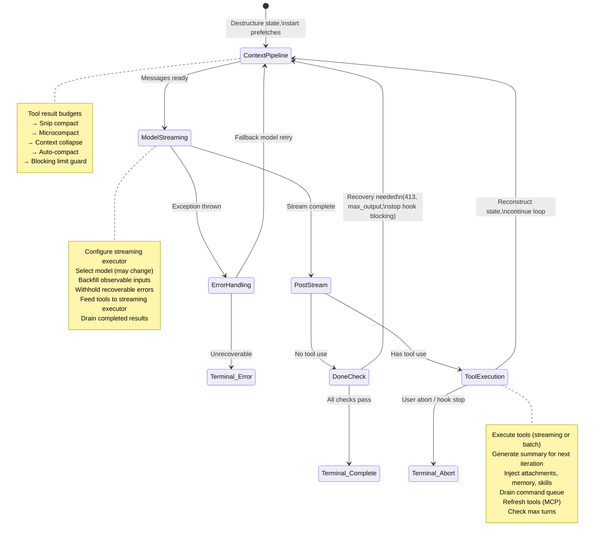
```mermaid
stateDiagram-v2
    [*] --> ContextPipeline: Destructure state,\nstart prefetches

    ContextPipeline --> ModelStreaming: Messages ready
    note right of ContextPipeline
        Tool result budgets
        → Snip compact
        → Microcompact
        → Context collapse
        → Auto-compact
        → Blocking limit guard
    end note

    ModelStreaming --> PostStream: Stream complete
    ModelStreaming --> ErrorHandling: Exception thrown
    note right of ModelStreaming
        Configure streaming executor
        Select model (may change)
        Backfill observable inputs
        Withhold recoverable errors
        Feed tools to streaming executor
        Drain completed results
    end note

    ErrorHandling --> Terminal_Error: Unrecoverable
    ErrorHandling --> ContextPipeline: Fallback model retry

    PostStream --> DoneCheck: No tool use
    PostStream --> ToolExecution: Has tool use

    DoneCheck --> Terminal_Complete: All checks pass
    DoneCheck --> ContextPipeline: Recovery needed\n(413, max_output,\nstop hook blocking)

    ToolExecution --> Terminal_Abort: User abort / hook stop
    ToolExecution --> ContextPipeline: Reconstruct state,\ncontinue loop
    note right of ToolExecution
        Execute tools (streaming or batch)
        Generate summary for next iteration
        Inject attachments, memory, skills
        Drain command queue
        Refresh tools (MCP)
        Check max turns
    end note
```

### Model streaming and fallback

```typescript
let attemptWithFallback = true
while (attemptWithFallback) {
  attemptWithFallback = false
  try {
    for await (const message of deps.callModel({ messages, systemPrompt, tools, signal })) {
      // Process each streamed message
    }
  } catch (innerError) {
    if (innerError instanceof FallbackTriggeredError && fallbackModel) {
      currentModel = fallbackModel
      attemptWithFallback = true
      continue
    }
    throw innerError
  }
}
```

**Thinking signatures are model-bound.** Replaying a protected-thinking block from one model to a different fallback model causes a 400. The code strips signature blocks before retry, and tombstones orphaned assistant messages from the failed attempt so the UI removes them.

### The withholding pattern

```typescript
let withheld = false
if (contextCollapse?.isWithheldPromptTooLong(message)) withheld = true
if (reactiveCompact?.isWithheldPromptTooLong(message)) withheld = true
if (isWithheldMaxOutputTokens(message)) withheld = true
if (!withheld) yield yieldMessage
```

SDK consumers (Cowork, the desktop app) **terminate the session on any message with an `error` field**. If you yield a prompt-too-long error and then successfully recover via reactive compaction, the consumer has already disconnected — the recovery loop keeps running but nobody is listening. So the error is withheld and pushed to `assistantMessages` where downstream recovery checks find it. Only if all recovery paths fail is it surfaced.

### Error recovery — the escalation ladder

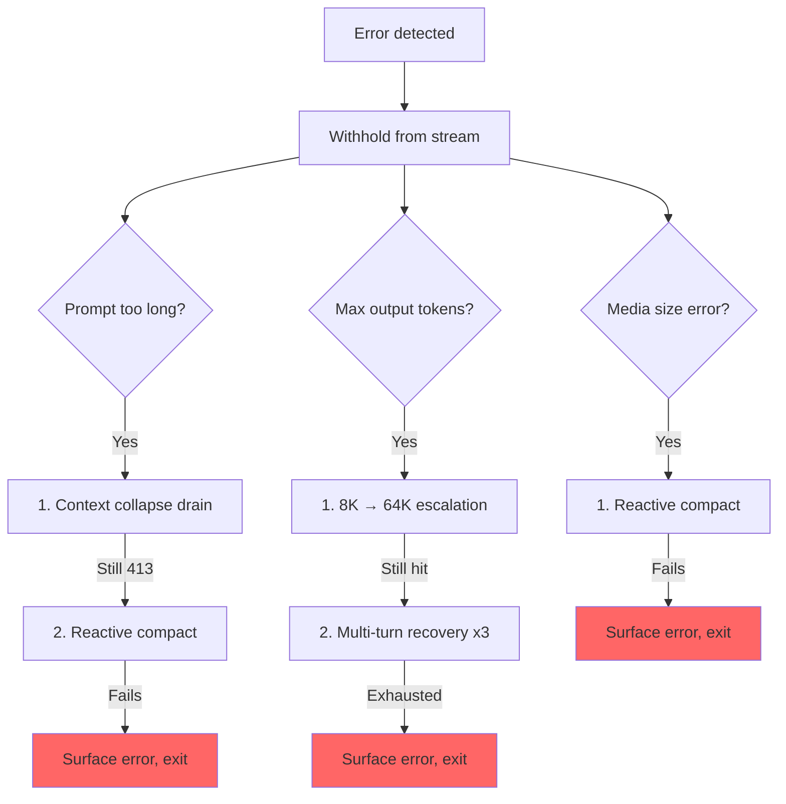
```mermaid
graph TD
    E[Error detected] --> W[Withhold from stream]

    W --> P{Prompt too long?}
    W --> M{Max output tokens?}
    W --> I{Media size error?}

    P -->|Yes| C1[1. Context collapse drain]
    C1 -->|Still 413| C2[2. Reactive compact]
    C2 -->|Fails| S1[Surface error, exit]

    M -->|Yes| M1[1. 8K → 64K escalation]
    M1 -->|Still hit| M2[2. Multi-turn recovery x3]
    M2 -->|Exhausted| S2[Surface error, exit]

    I -->|Yes| I1[1. Reactive compact]
    I1 -->|Fails| S3[Surface error, exit]

    style S1 fill:#f66
    style S2 fill:#f66
    style S3 fill:#f66
```

**The death spiral guards** — five of them, each added because someone hit the failure mode in production:

1. `hasAttemptedReactiveCompact` — one-shot flag; reactive compact fires once per error type.
2. `MAX_OUTPUT_TOKENS_RECOVERY_LIMIT = 3` — hard cap on multi-turn recovery.
3. Circuit breaker on auto-compact — after 3 consecutive failures, it stops trying entirely.
4. **No stop hooks on error responses.** The code returns before reaching stop hooks when the last message is an API error. Comment: *"error → hook blocking → retry → error → … (the hook injects more tokens each cycle)."*
5. **`hasAttemptedReactiveCompact` preserved across stop-hook retries.** Comment: *"Resetting to false here caused an infinite loop burning thousands of API calls."*

### Terminal and continue states

**10 terminal reasons:**

| Reason | Trigger |
|--------|---------|
| `blocking_limit` | Token count at hard limit, auto-compact OFF |
| `image_error` | ImageSizeError / ImageResizeError / unrecoverable media error |
| `model_error` | Unrecoverable API/model exception |
| `aborted_streaming` | User abort during model streaming |
| `prompt_too_long` | Withheld 413 after all recovery exhausted |
| `completed` | Normal completion (no tool use, budget exhausted, or API error) |
| `stop_hook_prevented` | Stop hook explicitly blocked continuation |
| `aborted_tools` | User abort during tool execution |
| `hook_stopped` | PreToolUse hook stopped continuation |
| `max_turns` | Hit the `maxTurns` limit |

**7 continue reasons:**

| Reason | Trigger |
|--------|---------|
| `collapse_drain_retry` | Context collapse drained staged collapses on 413 |
| `reactive_compact_retry` | Reactive compact succeeded after 413 or media error |
| `max_output_tokens_escalate` | 8K cap hit, escalating to 64K |
| `max_output_tokens_recovery` | 64K still hit, multi-turn recovery (up to 3) |
| `stop_hook_blocking` | Stop hook returned blocking errors, must retry |
| `token_budget_continuation` | Token budget not exhausted, nudge message injected |
| `next_turn` | Normal tool-use continuation |

### Token budgets

Users can request a budget for a turn (e.g. `+500k`). `checkTokenBudget` makes a binary continue/stop decision with three rules:

1. **Subagents always stop.** Budget is a top-level concept only.
2. **Completion threshold at 90%.** If `turnTokens < budget * 0.9`, continue.
3. **Diminishing-returns detection.** After 3+ continuations, if both the current and previous delta are below 500 tokens, stop early.

On "continue," a nudge message is injected telling the model how much budget remains.

### Stop hooks

Stop hooks run when the model finishes without requesting tool use. The pipeline runs template job classification, fires background tasks (prompt suggestion, memory extraction), then executes the stop hooks proper. Blocking errors — *"you said you were done, but the linter found 3 errors"* — are appended to history and the loop continues with `stopHookActive: true` (preventing re-running the same hooks on retry). A `preventContinuation` signal exits immediately with `{ reason: 'stop_hook_prevented' }`.

### Protocol safety nets

- **Orphaned tool results.** `yieldMissingToolResultBlocks` creates error `tool_result` messages for every `tool_use` block that never got a result. Fires in three places: outer error handler (model crash), fallback handler (model switch mid-stream), abort handler (user interruption). Without it, a crash during streaming leaves orphaned blocks that cause a protocol error on the next call.
- **Abort handling, two paths.** During streaming: the executor drains remaining results, generating synthetic `tool_results` for queued tools. The `signal.reason` check distinguishes a hard abort (Ctrl+C) from a submit-interrupt (user typed a new message) — submit-interrupts skip the interruption message since the queued user message already provides context. During tool execution: same logic plus a `toolUse: true` flag on the interruption message.

### The thinking rules

Three inviolable constraints on thinking / redacted_thinking blocks:

1. A message containing a thinking block must be part of a query whose `max_thinking_length > 0`
2. A thinking block may not be the last block in a message
3. Thinking blocks must be preserved for the duration of an assistant trajectory

Violations produce opaque API errors. Handled in three places: the fallback handler strips signature blocks, the compaction pipeline preserves the protected tail, and microcompact never touches thinking blocks.

### Dependency injection

`QueryDeps` is intentionally narrow — **four** dependencies, not forty: the model caller, the compactor, the microcompactor, and a UUID generator. Using `typeof fn` for the type definitions keeps signatures in sync automatically.

The three-way separation is the design: **mutable `State`** + **immutable `QueryConfig`** (feature flags, session state, env vars snapshotted once at `query()` entry and never re-read) + **injectable `QueryDeps`**. This makes the loop testable and makes an eventual refactor to a pure `step(state, event, config)` reducer straightforward.

### The minimal skeleton

Every feature in Claude Code's loop is an elaboration of one of these steps:

```
async function* agentLoop(params) {
  let state = initState(params)
  while (true) {
    const context = compressIfNeeded(state.messages)
    const response = await callModel(context)
    if (response.error) {
      if (canRecover(response.error, state)) { state = recoverState(state); continue }
      return { reason: 'error' }
    }
    if (!response.toolCalls.length) return { reason: 'completed' }
    const results = await executeTools(response.toolCalls)
    state = { ...state, messages: [...context, response.message, ...results] }
  }
}
```

---

## 7. Context Length Management

This is one of the two subsystems that most distinguishes Claude Code from a naive agent loop. Context is managed at **five independent levels**: the window size itself, the output slot reservation, tool-result budgeting, a four-layer compression pipeline, and prompt-cache-aware prompt ordering.

### 7.1 Window sizing and the output slot

Default context window: **200K tokens**, expandable to **1M** via the `[1m]` suffix on model names or experiment treatment.

The effective window subtracts the output reservation:

```
effectiveContextWindow = contextWindow - min(modelMaxOutput, 20000)
```

**Slot reservation — 8K default, 64K escalation.** This is described upstream as *"the most impactful single optimization."* The API reserves `max_output_tokens` of capacity for the model's response. The default SDK value is 32K–64K, but production data shows **p99 output length is 4,911 tokens** — the default over-reserves by 8–16×, wasting 24,000–59,000 tokens of usable context per turn. Claude Code caps at 8K and retries once at 64K on the rare truncation (<1% of requests).

For a 200K window, this is a **12–28% improvement in usable context, for free.**

### 7.2 Tool result budgeting

Two levels: per-tool and per-conversation.

**Per-tool `maxResultSizeChars`:**

| Tool | Limit | Rationale |
|------|-------|-----------|
| BashTool | 30,000 | Enough for most useful output |
| FileEditTool | 100,000 | Diffs can be large but the model needs them |
| GrepTool | 100,000 | Search results with context lines add up fast |
| FileReadTool | **Infinity** | Self-bounds via its own token limits; persisting would create circular Read loops |

When a result exceeds the threshold, the full content is written to `~/.claude/tool-results/{hash}.txt` and replaced with a `<persisted-output>` wrapper containing a preview and the file path. The model can `Read` the full output if it needs it.

**Additional documented ceilings:**

| Limit | Value | Purpose |
|-------|-------|---------|
| Per-tool characters | 50,000 | Results persisted to disk when exceeded |
| Per-tool tokens | 100,000 | ~400KB text upper bound |
| Per-message aggregate | 200,000 chars | Prevents N parallel tools blowing the budget in one turn |

The **per-message aggregate is the key insight**: without it, "read all files in src/" could produce 10 parallel reads each returning 40K characters. `ContentReplacementState` tracks the aggregate budget across the entire conversation — preventing death by a thousand cuts, where many tools each returning 90% of their individual limit still overwhelm the window.

**GrepTool pagination.** `head_limit` defaults to 250 entries. On truncation the response includes `appliedLimit: 250`, signalling the model to paginate via `offset`. `head_limit: 0` disables it. GrepTool also auto-excludes six VCS directories (`.git`, `.svn`, `.hg`, `.bzr`, `.jj`, `.sl`) — binary pack files would blow through token budgets.

### 7.3 The four compression layers

Before each API call, message history passes through up to five stages **in a specific order, and the order matters.**

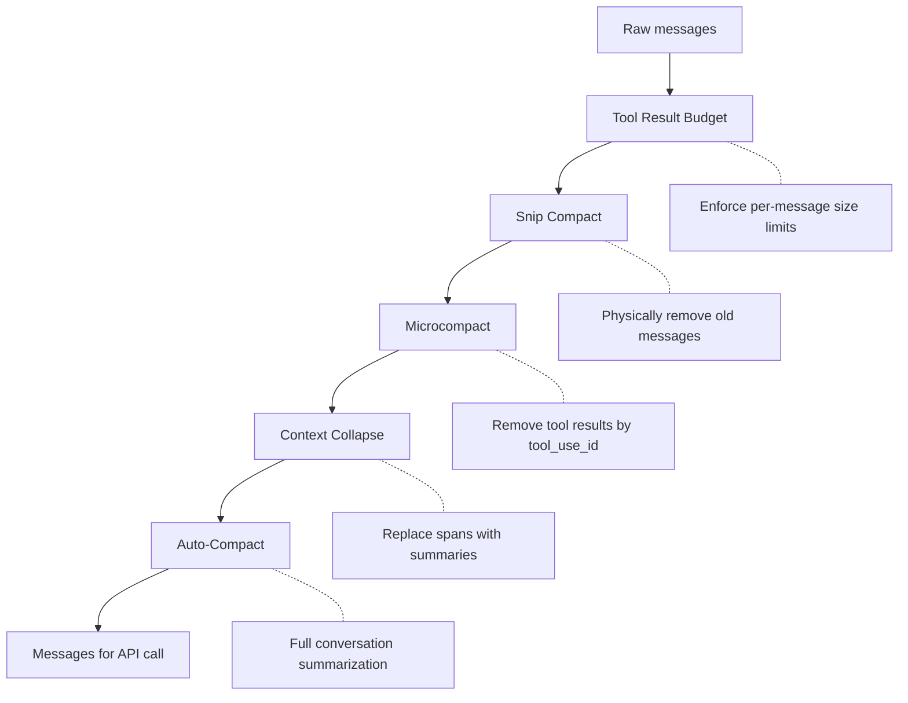
```mermaid
graph TD
    A[Raw messages] --> B[Tool Result Budget]
    B --> C[Snip Compact]
    C --> D[Microcompact]
    D --> E[Context Collapse]
    E --> F[Auto-Compact]
    F --> G[Messages for API call]

    B -.- B1[Enforce per-message size limits]
    C -.- C1[Physically remove old messages]
    D -.- D1[Remove tool results by tool_use_id]
    E -.- E1[Replace spans with summaries]
    F -.- F1[Full conversation summarization]
```

**Layer 0 — Tool Result Budget.** `applyToolResultBudget()` enforces per-message size limits. Tools without a finite `maxResultSizeChars` are exempted.

**Layer 1 — Snip Compact.** The lightest operation. Physically removes old messages from the array, yielding a boundary message to signal the removal to the UI. Reports how many tokens were freed; that number is plumbed into auto-compact's threshold check.

**Layer 2 — Microcompact.** Removes tool results that are no longer needed, identified by `tool_use_id`. For *cached* microcompact (which edits the API cache), the boundary message is **deferred until after the API response** — client-side token estimates are unreliable, and the actual `cache_deleted_input_tokens` from the response tells you what was really freed. Microcompact **never touches thinking blocks.**

**Layer 3 — Context Collapse.** Replaces spans of conversation with summaries. Runs *before* auto-compact deliberately: if collapse drops context below the auto-compact threshold, auto-compact becomes a no-op, preserving granular context instead of replacing everything with one monolithic summary.

**Layer 4 — Auto-Compact.** The heaviest operation — it **forks an entire Claude conversation to summarize the history.** Guarded by a circuit breaker: after 3 consecutive failures it stops trying. This prevents the nightmare observed in production — sessions stuck over the context limit burning **250K API calls per day** in an infinite compact-fail-retry loop.

The compaction pipeline **preserves the protected tail** of thinking blocks (rule 3 of §6's thinking rules).

### 7.4 Thresholds

```
effectiveContextWindow = contextWindow - min(modelMaxOutput, 20000)

Auto-compact fires:      effectiveWindow - 13,000
Blocking limit (hard):   effectiveWindow - 3,000
```

| Constant | Value | Purpose |
|----------|-------|---------|
| `AUTOCOMPACT_BUFFER_TOKENS` | 13,000 | Headroom below effective window for the auto-compact trigger |
| `MANUAL_COMPACT_BUFFER_TOKENS` | 3,000 | Reserves space so `/compact` still works |
| `MAX_CONSECUTIVE_AUTOCOMPACT_FAILURES` | 3 | Circuit breaker threshold |

The 13,000-token buffer means auto-compact fires well before the hard limit. **The gap between the auto-compact threshold and the blocking limit is where reactive compact operates** — if the proactive pass fails or is disabled, reactive compact catches the 413 and compacts on demand.

### 7.5 Token counting

`tokenCountWithEstimation` is the canonical function. It combines **authoritative API-reported token counts** (from the most recent response) with a rough estimate for messages added after that response. The approximation is deliberately **conservative — it errs toward higher counts**, so auto-compact fires slightly early rather than slightly late.

Counting is anchored on the API's actual `usage` field rather than client-side estimation, which accounts for prompt-caching credits, thinking tokens, and server-side transformations.

### 7.6 Deferred tool loading

Tools with `shouldDefer: true` are sent to the API with `defer_loading: true` — names and descriptions but **not full parameter schemas**. To use one, the model must first call `ToolSearchTool` to load its schema.

Two benefits: smaller initial prompt, and better cache hit rates — a deferred tool contributes only its name, so adding or removing a deferred MCP tool changes the prompt by a few tokens rather than hundreds.

The failure mode is instructive: calling a deferred tool without loading it causes Zod validation to fail (all typed parameters arrive as strings), and the system appends a targeted recovery hint.

### 7.7 Context stripping for sub-agents

Read-only agents (Explore, Plan) have `omitClaudeMd: true` and get `gitStatus` stripped:

```typescript
const shouldOmitClaudeMd =
  agentDefinition.omitClaudeMd &&
  !override?.userContext &&
  getFeatureValue_CACHED_MAY_BE_STALE('tengu_slim_subagent_claudemd', true)
```

CLAUDE.md contains commit conventions, PR rules, lint rules — irrelevant to an agent that cannot commit, cannot create PRs, cannot edit files. The git status snapshot can be up to **40KB** and is explicitly labeled stale; if the agent needs git info it can run `git status` itself for fresh data.

At **34 million Explore spawns per week**, stripping saves *billions of tokens per week across the fleet.* Kill-switched via GrowthBook (`tengu_slim_subagent_claudemd`, defaults true) in case stripping causes regressions.

Explore is also a **one-shot agent** (`ONE_SHOT_BUILTIN_AGENT_TYPES`): agentId, SendMessage instructions, and the usage trailer are skipped from its prompt, saving ~135 characters per invocation — roughly **4.6 billion characters per week**.

### 7.8 Prompt-cache-aware ordering

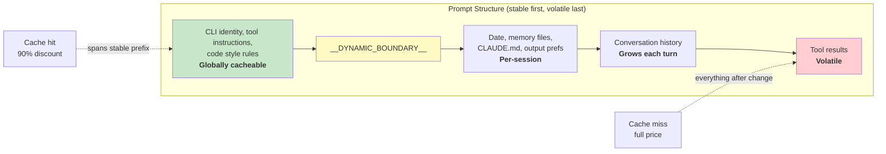
```mermaid
graph LR
    subgraph "Prompt Structure (stable first, volatile last)"
        A["CLI identity, tool instructions,<br/>code style rules<br/><b>Globally cacheable</b>"]
        B["__DYNAMIC_BOUNDARY__"]
        C["Date, memory files,<br/>CLAUDE.md, output prefs<br/><b>Per-session</b>"]
        D["Conversation history<br/><b>Grows each turn</b>"]
        E["Tool results<br/><b>Volatile</b>"]
    end

    A --> B --> C --> D --> E

    HIT["Cache hit<br/>90% discount"] -.->|"spans stable prefix"| A
    MISS["Cache miss<br/>full price"] -.->|"everything after change"| E

    style A fill:#c8e6c9
    style B fill:#fff9c4
    style E fill:#ffcdd2
```

Supporting mechanisms:

- **Memoized session date.** `const getSessionStartDate = memoize(getLocalISODate)`. Without this, the date changes at midnight and busts the entire cached prefix. A stale date is cosmetic; a cache bust reprocesses the entire conversation.
- **Section memoization.** `systemPromptSection(name, compute)` is cached until `/clear` or `/compact`. `DANGEROUS_uncachedSystemPromptSection(name, compute, reason)` recomputes every turn and requires a documented reason.
- **Tool ordering.** `assembleToolPool()` sorts built-ins and MCP tools into separate alphabetical partitions, then concatenates built-ins first. The API server places a prompt-cache breakpoint after the last built-in tool; a flat sort across all tools would interleave MCP tools and shift built-in positions whenever an MCP server is added or removed.
- **Agent list as attachment, not tool description.** Dynamic tool descriptions were measured as causing *~10.2% of fleet `cache_creation` tokens*. Moving the available-agents list from the AgentTool description into an attachment message keeps the tool description static, so connecting an MCP server or loading a plugin does not bust the cache for every subsequent call.

### 7.9 The memory relevance side-query as a context optimization

The memory system (§8) uses a lightweight **Sonnet** call — not the main Opus model — to select which memory files to include, capped at 256 max output tokens. A single irrelevant 2,000-token memory costs more in wasted context than the side query costs in API calls.

---

## 8. Memory — Learning Across Conversations

### 8.1 The stateless problem, and why not RAG

Without memory, a developer corrects the model's testing approach on Monday and it makes the same mistake on Tuesday. The agent is perpetually a new hire on their first day.

The industry-standard answer is RAG: embed documents, store vectors, retrieve chunks. That works for knowledge bases — documentation, FAQs, reference material. It is **architecturally mismatched** for agent memory. An agent's memory is not a knowledge base; it is a collection of **observations**: who the user is, what they have corrected, what the project's constraints are, where to find things. These are small, change frequently, and must be human-editable.

Claude Code's bet: **files on disk, Markdown format, LLM-powered recall, zero infrastructure** — simplicity in storage combined with intelligence in retrieval.

Consequences that shape the whole system:

- **Human-readable.** Open `~/.claude/projects/<slug>/memory/MEMORY.md` in any text editor. No tools, no decryption, no export command.
- **Human-editable.** Correct a stale memory with vim. Delete a wrong one with `rm`.
- **Version-controllable.** Team memories commit to git; changes diff cleanly.
- **Zero infrastructure.** Works offline, no server, any OS with a filesystem. No migration path because there is no schema.
- **Debuggable.** Diagnosis is `ls` and `cat`, not query logs.

There is a deeper epistemological point. A database holds *authoritative state*. An agent's memory holds *observations* — things that were true at a point in time and may not still be. Files communicate this naturally: they have mtimes, and humans can edit or delete them. **The storage medium communicates the nature of the data** — working notes, not gospel.

**Tool reuse as architectural principle.** The model reads and writes memories with `FileWriteTool` and `FileEditTool` — the same tools it uses to edit source code. There is no special memory API. The system prompt teaches a two-step write protocol and the model executes it with existing capabilities. Memory is not a subsystem bolted onto the agent; it is emergent behavior of the agent using its existing tools under new instructions.

### 8.2 Per-project scoping and layout

Memory is scoped to the **git repository root**, not the working directory — so a terminal in `src/components/` and one in `tests/` share a memory directory. Resolution finds the canonical git root first (via `findCanonicalGitRoot`, so all worktrees of a repo share one directory), falling back to the project root. The path is sanitized (slashes → dashes, via `sanitizePath()`) into a flat directory name:

```
~/.claude/projects/-Users-alex-code-myapp/memory/
```

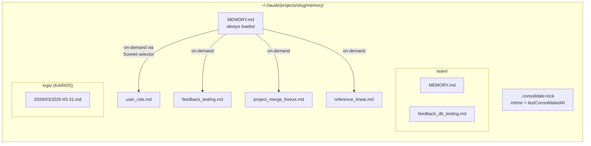
```mermaid
graph LR
    subgraph "~/.claude/projects/slug/memory/"
        MEMORY["MEMORY.md<br/><i>always loaded</i>"]
        UR["user_role.md"]
        FT["feedback_testing.md"]
        PM["project_merge_freeze.md"]
        RR["reference_linear.md"]
        CL[".consolidate-lock<br/><i>mtime = lastConsolidatedAt</i>"]
        subgraph "team/"
            TM["MEMORY.md"]
            TF["feedback_db_testing.md"]
        end
        subgraph "logs/ (KAIROS)"
            DL["2026/03/2026-03-31.md"]
        end
    end

    MEMORY -->|"on-demand via<br/>Sonnet selector"| UR
    MEMORY -->|"on-demand"| FT
    MEMORY -->|"on-demand"| PM
    MEMORY -->|"on-demand"| RR
```

Naming convention: `<type>_<topic>.md`. Not enforced by code — it is part of the prompt instructions, so the directory is visually scannable.

### 8.3 The four-type taxonomy

Exactly four types: **user**, **feedback**, **project**, **reference**.

The taxonomy is designed around a single criterion: **is this knowledge derivable from the current project state?** Code patterns, architecture, file structure, git history — all re-derivable by reading the codebase. Excluded. The four types capture what cannot be re-derived.

| Type | Records | Notes |
|------|---------|-------|
| **user** | Role, goals, responsibilities, expertise level | A senior Go engineer new to React gets different explanations than a first-time programmer |
| **feedback** | Guidance on how to approach work — **both corrections and confirmations** | *"If you only save corrections, you will drift away from approaches the user has already validated."* Structure: the rule, then a `**Why:**` line (often a past incident), then a `**How to apply:**` line with trigger conditions |
| **project** | Ongoing work context — who, why, by when | Prompt emphasizes converting relative dates to absolute: "Thursday" → "2026-03-05" so it stays interpretable weeks later |
| **reference** | Bookmarks — where information lives externally | Linear project URL, Grafana dashboard, Slack channel. Tells the model *where to look*, not *what to find* |

**The taxonomy is a filter, not just a category system.** Without it, an eager model saves everything — code patterns, architecture diagrams, error messages — creating a parallel, potentially stale copy of information better sourced from its origin. It also prevents a subtler failure: **memory as crutch.** If the model saves architectural decisions as memories, it stops reading the codebase to understand architecture.

The exclusion list is explicit: code patterns, git history, debugging solutions, anything in CLAUDE.md, ephemeral task details. **These exclusions apply even when the user explicitly asks to save.** If a user says "remember this PR list," the model is instructed to push back — *"what was surprising or non-obvious about it?"* That surprising part is worth keeping; the raw list is not. This instruction was validated through evals, going from **0/2 to 3/3** when the exclusion-override instruction was added.

### 8.4 Frontmatter as contract

```markdown
---
name: {{memory name}}
description: {{one-line description -- used to decide relevance}}
type: {{user, feedback, project, reference}}
---
```

The **`description` is the most load-bearing field.** It is what the Sonnet relevance selector uses to decide whether to surface this memory. "testing stuff" matches too broadly or not at all. *"Integration tests must hit real DB, not mocks — burned by mock divergence Q4"* matches exactly the conversations where it matters. It is the memory's search index — consumed not by a search engine but by a language model that understands nuance, context, and intent.

Frontmatter is also the **only part read during recall**: `scanMemoryFiles()` reads each file only to its **first 30 lines** to extract the header. The body stays private until the file is explicitly selected.

### 8.5 The write path

**Step 1 — write the memory file:**

```markdown
---
name: Testing Policy
description: Integration tests must hit real DB, not mocks
type: feedback
---

Don't mock the database in integration tests.

**Why:** We got burned last quarter when mocked tests passed but production
queries hit edge cases the mocks didn't cover.

**How to apply:** Any test file under `__tests__/` that touches database
operations should use the real PGlite instance from test-utils.
```

**Step 2 — update the index:**

```markdown
- [Testing Policy](feedback_testing.md) -- integration tests must hit real DB
```

Each index entry stays under **~150 characters**. The index is a table of contents, not a knowledge base.

When new information modifies an existing memory, the model uses `FileEditTool` to update the file rather than creating a duplicate. **The system does not version memories internally** — the file is local and the user has git. `ensureMemoryDirExists()` runs before the prompt is built, and the prompt tells the model the directory already exists, avoiding wasted turns on `ls` and `mkdir -p`.

### 8.6 The recall path

Two tiers: `MEMORY.md` is **always loaded** at session start for orientation; individual files are surfaced **on-demand** via an LLM relevance query selecting **up to five memories per turn**.

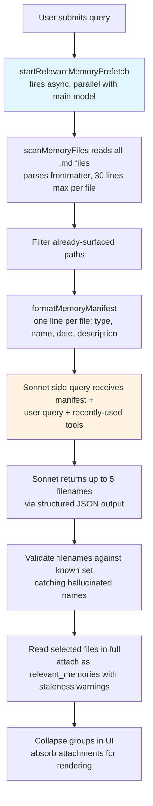
```mermaid
flowchart TD
    A[User submits query] --> B[startRelevantMemoryPrefetch<br/>fires async, parallel with main model]
    B --> C[scanMemoryFiles reads all .md files<br/>parses frontmatter, 30 lines max per file]
    C --> D[Filter already-surfaced paths]
    D --> E[formatMemoryManifest<br/>one line per file: type, name, date, description]
    E --> F[Sonnet side-query receives manifest +<br/>user query + recently-used tools]
    F --> G[Sonnet returns up to 5 filenames<br/>via structured JSON output]
    G --> H[Validate filenames against known set<br/>catching hallucinated names]
    H --> I[Read selected files in full<br/>attach as relevant_memories with staleness warnings]
    I --> J[Collapse groups in UI<br/>absorb attachments for rendering]

    style B fill:#e1f5fe
    style F fill:#fff3e0
```

**The async prefetch (step 2) is the key performance decision.** By the time the main model reaches a point where recalled context is useful, the side-query has usually already completed. The user experiences no additional latency.

**The Sonnet side-query prompt** instructs the selector to be conservative: include only memories useful for the current query, skip if uncertain, and avoid selecting API/usage documentation for tools already in active use (the model already has those loaded) — but **still surface warnings, gotchas, or known issues about those tools.** Response uses structured output `{ selected_memories: string[] }`, validated against the known filename set to catch hallucinations.

**Why an LLM and not keywords or embeddings:**

| Approach | Verdict |
|----------|---------|
| **Keyword matching** | Fast, but no understanding of context — cannot express "do not select memories for tools already in active use" |
| **Embedding similarity** | Handles semantic matching, but adds infrastructure (embedding model, vector store, update pipeline) and **struggles with negation** — the embedding of "do NOT use database mocks" is very close to "use database mocks" |
| **Sonnet side-query** | Understands semantic relevance, reasons about context, handles negation, zero infrastructure. Latency is bounded (hundreds of ms) and hidden behind the main model's initial processing |

Telemetry tracks selection rates **even when nothing is selected**: 0/150 indicates a precision problem; 0/3 indicates a coverage problem.

### 8.7 Staleness — warn, do not expire

This addresses a failure mode from real usage: old memories containing `file:line` citations to code that had since changed were being asserted as fact — **the citation made the stale claim sound more authoritative, not less.**

The solution is not expiration (old memories may hold institutional knowledge valid for years). Instead, age warnings are attached. Memories from **today or yesterday get no warning** (the function returns an empty string); everything older gets a caveat injected alongside the content, stating the age in days and warning that code-behavior claims or `file:line` citations may be outdated.

The human-readable format — "today," "yesterday," "47 days ago" — exists because **models are poor at date arithmetic.** A raw ISO timestamp does not trigger staleness reasoning the way "47 days ago" does. Validated through evals: the action-cue framing *"Before recommending from memory"* scored **3/3** versus **0/3** for the more abstract *"Trusting what you recall"* — **with identical body text.**

> There is a philosophical tension worth naming: the staleness system treats memories as hypotheses, not facts. But the model's natural tendency is to present information confidently. The staleness warning is fighting the model's own voice — using its instruction-following capability to override its confidence-generation tendency.

### 8.8 MEMORY.md — the always-loaded index

Two hard caps: **200 lines** and **25,000 bytes**.

The 200-line cap catches normal growth. The 25KB byte cap catches an observed failure mode: users packing long lines that stay under 200 lines but consume enormous token budgets. At the 97th percentile, a MEMORY.md with only **197 lines weighed 197KB**. When either cap fires, the guidance is actionable: *"Keep index entries to one line under ~200 chars; move detail into topic files."*

**This two-tier architecture is what lets memory scale.** A project with 150 memories has a 150-line index consuming perhaps 3,000 tokens — not 150 full files consuming 100,000.

### 8.9 Team memory

A subdirectory at `<autoMemPath>/team/`, gated behind a feature flag and requiring auto-memory to be enabled. The nesting is deliberate: **disabling auto-memory transitively disables team memory.**

Team-synced files come from other users, so a malicious teammate could attempt path traversal. **Three layers of defense:**

1. **Input sanitization.** `sanitizePathKey()` validates against null bytes, URL-encoded traversals (`%2e%2e%2f`), Unicode normalization attacks (fullwidth characters that normalize to `../`), backslashes, and absolute paths.
2. **String-level path validation.** `path.resolve()` normalizes remaining `..` segments; the resolved path is checked against the team directory prefix **including a trailing separator**, so `team-evil/` cannot match `team/`.
3. **Symlink resolution.** `realpathDeepestExisting()` resolves symlinks on the deepest existing ancestor. If `team/evil` is a symlink to `/etc/`, string validation sees a valid prefix but `realpath` reveals the true target.

All failures produce a `PathTraversalError`. **No partial successes, no fallbacks. Fail closed.**

**Scope guidance in the prompt:** user memories are always private; reference memories are usually team; feedback memories default to private unless they represent project-wide conventions. The cross-checking instruction — *"Before saving a private feedback memory, check that it does not contradict a team feedback memory"* — prevents conflicting guidance surfacing unpredictably depending on recall order.

### 8.10 KAIROS mode — append-only daily logs

Standard memory assumes discrete sessions. KAIROS (Claude Code's assistant mode) has long-lived sessions potentially running for days; the two-step write does not scale to continuous operation.

The solution is **architectural separation between capture and consolidation:**

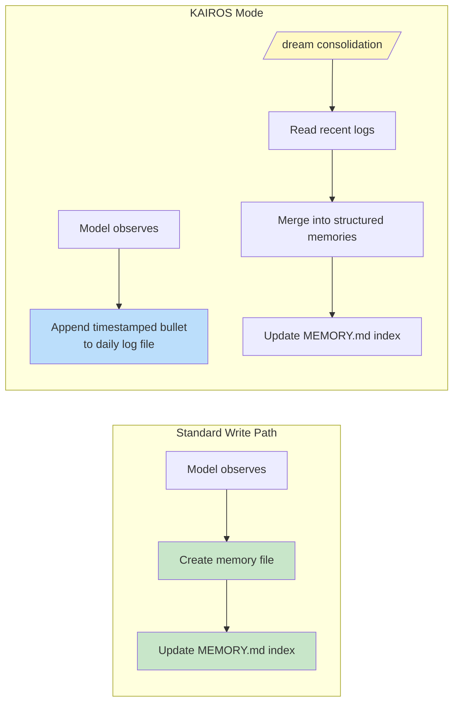
```mermaid
graph LR
    subgraph "Standard Write Path"
        A1[Model observes] --> A2[Create memory file] --> A3[Update MEMORY.md index]
    end

    subgraph "KAIROS Mode"
        B1[Model observes] --> B2[Append timestamped bullet<br/>to daily log file]
        B3[/dream consolidation/] --> B4[Read recent logs] --> B5[Merge into structured memories] --> B6[Update MEMORY.md index]
    end

    style A2 fill:#c8e6c9
    style A3 fill:#c8e6c9
    style B2 fill:#bbdefb
    style B3 fill:#fff9c4
```

The model appends short timestamped bullets to `<autoMemPath>/logs/YYYY/MM/YYYY-MM-DD.md`, instructed: **"Do not rewrite or reorganize the log"** — restructuring during capture loses the chronological signal consolidation needs.

**Caching detail:** the path in the prompt is described as a *pattern* rather than today's literal date, so the memory prompt is not invalidated when the date changes at midnight. The model derives the current date from a separate `date_change` attachment.

**`/dream` consolidation** runs in four phases: **Orient** (list directory, read index, skim existing files) → **Gather** (search logs, check for drifted memories) → **Consolidate** (write or update files, merge rather than duplicate) → **Prune** (update index under 200 lines, remove stale pointers). The emphasis on merging into existing files rather than creating new ones is what keeps the directory from growing linearly with usage.

**The consolidation lock** (`.consolidate-lock`) serves dual purpose: its **content is the holder's PID** (mutual exclusion) and its **mtime *is* `lastConsolidatedAt`** (scheduling state). Auto-dream fires when three gates pass, evaluated cheapest-first:

1. Hours since last consolidation > 24
2. Sessions modified since then > 5
3. No other process holds the lock

Crash recovery detects dead PIDs via `process.kill(pid, 0)`, with a one-hour staleness timeout as defense against PID reuse.

### 8.11 Background extraction — the safety net

The main agent has full memory-writing instructions, but agents are imperfect **in a predictable way**: when a user says "remember to always use integration tests" and then immediately asks "now fix the login bug," the model's attention shifts entirely to the bug.

At the end of each complete query loop, a **forked agent** — sharing the parent's prompt cache (§12), which is what makes it economical — analyzes recent messages and writes any memories the main agent missed. When the main agent has already written memories in the current turn range, the extraction agent skips that range.

Its tool budget is constrained: read-only tools plus write access **only to memory directory paths**. Its prompt instructs a two-turn strategy: turn 1 reads in parallel, turn 2 writes in parallel.

**The interaction is cooperative, not competitive.** The main agent's prompt always contains the full save instructions. When the main agent saves, the background agent defers. When it does not, the background agent catches the gap. Neither alone would be sufficient.

### 8.12 Path resolution and security

Auto-memory path resolution priority chain:

1. **`CLAUDE_COWORK_MEMORY_PATH_OVERRIDE`** — full-path override for Cowork
2. **`autoMemoryDirectory` in settings.json** — **only trusted settings sources; project settings are intentionally excluded**
3. **Default computed path** — `~/.claude/projects/<sanitized-git-root>/memory/`

The exclusion of project settings is a security decision. A malicious repository could commit `.claude/settings.json` with `autoMemoryDirectory: "~/.ssh"`, and the permission carve-out for memory files would grant the model automatic write access to SSH keys. Limiting the override to policy, flag, local, and user settings — **none committable to a repository** — closes this vector.

`isAutoMemPath()` normalizes paths before prefix-checking to prevent traversal, with the trailing-separator convention ensuring prefix matching requires a directory boundary.

**The enable/disable chain.** `isAutoMemoryEnabled()` has its own priority chain: environment variable → bare mode → CCR without persistent storage → settings → default enabled. When disabled, **both** the prompt section is dropped (the model receives no memory instructions) **and** the background processes stop (extract-memories, auto-dream, team sync). Both gates must align — removing the prompt alone would not stop the extraction agent, which has its own prompt.

### 8.13 Design summary

The memory system's complexity lives in the **behavioral layer** — prompt instructions, LLM-powered recall, staleness management, background extraction — **not in storage infrastructure.** That distribution of complexity is itself the design principle.

---

## 9. The Tool System

40+ tool implementations, a registry with feature-flag gating, a 14-step execution pipeline, a permission resolver with seven modes, and a streaming executor. Whether a tool is a built-in Bash executor or a third-party MCP server, it gets the same validation, permission checks, result budgeting, and error classification.

The `Tool` interface has ~45 members, but only **five** matter for understanding the system:

1. `call()` — execute
2. `inputSchema` — validate and parse input
3. `isConcurrencySafe()` — can this run in parallel?
4. `checkPermissions()` — is this allowed?
5. `validateInput()` — does this input make semantic sense?

Everything else (12 rendering methods, analytics hooks, search hints) supports UI and telemetry.

### Three type parameters

```typescript
Tool<Input extends AnyObject, Output, P extends ToolProgressData>
```

`Input` is a Zod object schema doing double duty: it generates the JSON Schema sent to the API *and* validates the model's response at runtime via `safeParse`. `P` is the progress event type — BashTool emits stdout chunks, GrepTool emits match counts, AgentTool emits sub-agent transcripts.

### `buildTool()` and fail-closed defaults

```typescript
const SAFE_DEFAULTS = {
  isEnabled:         () => true,
  isParallelSafe:    () => false,   // Fail-closed: new tools run serially
  isReadOnly:        () => false,   // Fail-closed: treated as writes
  isDestructive:     () => false,
  checkPermissions:  (input) => ({ behavior: 'allow', updatedInput: input }),
}

function buildTool(definition) {
  return { ...SAFE_DEFAULTS, ...definition }  // Definition overrides defaults
}
```

A tool that forgets `isConcurrencySafe` runs serially. A tool that forgets `isReadOnly` is treated as a write. A tool that forgets `toAutoClassifierInput` returns an empty string, so the auto-mode classifier skips it and the general permission system handles it instead of an automated bypass.

The one default that is **not** fail-closed is `checkPermissions`, which returns `allow` — because it runs *after* the general permission system has already evaluated rules, hooks, and mode policies. A tool returning `allow` is saying *"I have no tool-specific objection,"* not granting blanket access.

### Concurrency is input-dependent

`isConcurrencySafe(input: z.infer<Input>): boolean` takes the **parsed input**, because the same tool is safe for some inputs and unsafe for others. `ls -la` is concurrency-safe; `rm -rf /tmp/build` is not.

### The ToolResult return type

```typescript
type ToolResult<T> = {
  data: T
  newMessages?: (UserMessage | AssistantMessage | AttachmentMessage | SystemMessage)[]
  contextModifier?: (context: ToolUseContext) => ToolUseContext
}
```

- `data` — serialized into the API's `tool_result` content block
- `newMessages` — lets a tool inject additional messages (AgentTool appends sub-agent transcripts; memory tools inject system reminders visible next turn but stripped at the `normalizeMessagesForAPI` boundary)
- `contextModifier` — mutates `ToolUseContext` for subsequent tools (this is how `EnterPlanMode` switches permission mode and `ExitWorktree` changes cwd). **Only honored for non-concurrency-safe tools**; parallel tools have modifiers queued until the batch completes

### ToolUseContext — the god object

~40 fields, threaded through every tool call. It is, by any reasonable definition, a god object. It exists because the alternative — 15+ argument function signatures — is worse. Grouped by concern:

| Group | Contents |
|-------|----------|
| **Configuration** (`options`) | Tool set, model name, MCP connections, debug flags. Set once, mostly immutable |
| **Execution state** | `abortController`, `readFileState` (LRU file cache), `messages` |
| **UI callbacks** | `setToolJSX`, `addNotification`, `requestPrompt`. Only wired in REPL; undefined in SDK/headless |
| **Agent context** | `agentId`, `renderedSystemPrompt` (frozen parent prompt for fork sub-agents) |

`createSubagentContext()` makes deliberate choices about what to share vs isolate — `setAppState` becomes a no-op for async agents, `localDenialTracking` gets a fresh object, `contentReplacementState` is cloned from the parent. **Each choice encodes a production bug.**

### The registry

`getAllBaseTools()` returns the exhaustive list of tools that could exist in the current process — always-present tools first, then feature-gated ones:

```typescript
const SleepTool = feature('PROACTIVE') || feature('KAIROS')
  ? require('./tools/SleepTool/SleepTool.js').SleepTool
  : null
```

`assembleToolPool()` produces the final set: (1) built-ins with deny-rule filtering, REPL-mode hiding, and `isEnabled()` checks; (2) MCP tools filtered by deny rules; (3) each partition sorted alphabetically; (4) built-ins prefix + MCP suffix. **Sort-then-concatenate is a cache requirement, not aesthetics** — see §7.8.

### The 14-step execution pipeline

```mermaid
graph TD
    S1[1. Tool Lookup] --> S2[2. Abort Check]
    S2 --> S3[3. Zod Validation]
    S3 -->|Fails| ERR1[Input validation error]
    S3 -->|Passes| S4[4. Semantic Validation]
    S4 -->|Fails| ERR2[Tool-specific error]
    S4 -->|Passes| S5[5. Speculative Classifier Start]
    S5 --> S6[6. Input Backfill - clone, not mutate]
    S6 --> S7[7. PreToolUse Hooks]
    S7 -->|Hook denies| ERR3[Hook rejection]
    S7 -->|Hook stops| STOP[Abort execution]
    S7 -->|Passes| S8[8. Permission Resolution]
    S8 --> S9{9. Permission Denied?}
    S9 -->|Yes| ERR4[Permission denied result]
    S9 -->|No| S10[10. Tool Execution]
    S10 --> S11[11. Result Budgeting]
    S11 --> S12[12. PostToolUse Hooks]
    S12 --> S13[13. New Messages]
    S13 --> S14[14. Error Handling]
    S14 --> DONE[Tool Result → Conversation History]

    S10 -->|Throws| S14

    style ERR1 fill:#f66
    style ERR2 fill:#f66
    style ERR3 fill:#f66
    style ERR4 fill:#f66
    style STOP fill:#f66
```

**Steps 1–4 (validation).** Tool lookup falls back to `getAllBaseTools()` for alias matches, handling transcripts from older sessions where a tool was renamed. Abort check prevents wasted computation on calls queued before Ctrl+C propagated. Zod validation catches type mismatches (appending a ToolSearch hint for deferred tools). Semantic validation goes beyond schema conformance — FileEditTool rejects no-op edits, BashTool blocks standalone `sleep` when MonitorTool is available.

**Steps 5–6 (preparation).** Speculative classifier start kicks off the auto-mode security classifier **in parallel** for Bash commands, shaving hundreds of ms off the common path. Input backfill **clones** the parsed input and adds derived fields (expanding `~/foo.txt` to absolute paths) for hooks and permissions, preserving the original for transcript stability.

**Steps 7–9 (permission).** PreToolUse hooks can decide permissions, modify inputs, inject context, or stop execution. Permission resolution bridges hooks and the general system: if a hook decided, that is final; otherwise `canUseTool()` triggers rule matching, tool-specific checks, mode defaults, and interactive prompts. Denial builds an error message and executes `PermissionDenied` hooks.

**Steps 10–14 (execution and cleanup).** Execution runs `call()` with the **original** input. Result budgeting persists oversized output to disk. PostToolUse hooks can modify MCP output or block continuation. New messages are appended. Error handling classifies errors for telemetry, extracting safe strings from potentially mangled names — in minified builds `error.constructor.name` is mangled, so `classifyToolError()` extracts the most informative safe string available (telemetry-safe messages, errno codes, stable error names) **without ever logging the raw error message to analytics.**

### Permission resolution chain

1. **Hook decision** — if a PreToolUse hook returned `allow`/`deny`, final.
2. **Rule matching** — three rule sets (`alwaysAllowRules`, `alwaysDenyRules`, `alwaysAskRules`) matching on tool name and optional content pattern.
3. **Tool-specific check** — the tool's `checkPermissions()`. Most return `passthrough`.
4. **Mode-based default** — `bypassPermissions` allows; `plan` denies writes; `dontAsk` denies prompts.
5. **Interactive prompt** — in `default` and `acceptEdits`.
6. **Auto-mode classifier** — two-stage (fast model, then extended thinking for ambiguous cases).

**Permission rules** are `PermissionRule` objects with a `source` tracing provenance (userSettings, projectSettings, localSettings, cliArg, policySettings, session), a `ruleBehavior` (allow/deny/ask), and a `ruleValue` with tool name plus optional content pattern:

- `Bash(git *)` — any Bash command starting with `git`
- `Edit(/src/**)` — edits only within `/src`
- `Fetch(domain:example.com)` — fetching from a specific domain
- No `ruleContent` — matches all invocations of that tool

BashTool's matcher parses commands via `parseForSecurity()` (a bash AST parser) and splits compound commands into subcommands. **If AST parsing fails** (heredocs, nested subshells), the matcher returns `() => true` — fail-safe, so the hook always runs. *If the command is too complex to parse, it is too complex to confidently exclude from safety checks.*

The `safetyCheck` variant carries a `classifierApprovable` boolean: `.claude/` and `.git/` edits are `classifierApprovable: true` (unusual but sometimes legitimate); Windows path-bypass attempts are `false` (almost always adversarial).

### Individual tool highlights

**BashTool** — the most complex tool. `splitCommandWithOperators()` decomposes `cd /tmp && mkdir build && ls build` into subcommands, each classified against `BASH_SEARCH_COMMANDS` / `BASH_READ_COMMANDS` / `BASH_LIST_COMMANDS`. A compound command is read-only only if **all** non-neutral parts are safe; the neutral set (`echo`, `printf`) is ignored.

*The sed simulation* deserves attention: when a user approves a sed command in the permission dialog, the system pre-computes the result by running it in a sandbox and injects the output as `_simulatedSedEdit`. When `call()` executes, it applies the edit directly, **bypassing shell execution** — guaranteeing that what the user previewed is exactly what gets written, even if the file changed between preview and execution.

BashTool also manages background tasks and detects image output by **magic bytes** in stdout, switching to image content blocks.

**FileEditTool** — integrates with `readFileState`, the LRU cache of file contents and timestamps. Before applying an edit it checks whether the file changed since the model last read it; if stale (background process, another tool, the user), the edit is rejected with instructions to re-read. `findActualString()` does fuzzy matching, normalizing whitespace and quote styles so an edit with slightly-wrong trailing spaces still matches. `replace_all` enables bulk replacement; without it, non-unique matches are rejected.

**FileReadTool** — the only built-in with `maxResultSizeChars: Infinity` (persisting to disk would require reading the persisted file, which could itself exceed the limit → infinite loop). Self-bounds via token estimation and truncates at source. Reads text with line numbers, images (base64 multimodal blocks), PDFs (`extractPDFPages()`), Jupyter notebooks (`readNotebook()`), and directories (falling back to `ls`). Blocks dangerous device paths (`/dev/zero`, `/dev/random`, `/dev/stdin`) and handles the macOS screenshot filename quirk (U+202F narrow no-break space vs regular space in "Screen Shot" filenames).

**AgentTool** — returns `newMessages` containing the sub-agent transcript plus an optional `contextModifier`. Not concurrency-safe by default, so multiple Agent calls in one response run serially, each modifier applied before the next starts. In coordinator mode the pattern inverts — `isAgentSwarmsEnabled()` unlocks parallel agent execution.

---

## 10. Concurrent Tool Execution

A typical interaction involves 3–5 tool calls per turn. At 200ms each, sequential execution costs a full second; parallel execution of the independent ones cuts it to 200ms.

**The driving insight: safety is per-call, not per-tool-type.** `Bash("ls -la")` is safe to parallelize; `Bash("rm -rf build/")` is not. The system must inspect the input before deciding.

Two layers of optimization: **batch orchestration** (partition after the response is received) and **speculative execution** (start tools while the model is still streaming).

### The partition algorithm

```typescript
type Group = { parallel: boolean; calls: ToolCall[] }

function groupBySafety(calls: ToolCall[], registry: ToolRegistry): Group[] {
  return calls.reduce((groups, call) => {
    const def = registry.lookup(call.name)
    const input = def?.schema.safeParse(call.input)
    // Fail-closed: parse failure or exception → serial
    const safe = input?.success
      ? tryCatch(() => def.isParallelSafe(input.data), false)
      : false
    // Merge consecutive safe calls into one group
    if (safe && groups.at(-1)?.parallel) {
      groups.at(-1)!.calls.push(call)
    } else {
      groups.push({ parallel: safe, calls: [call] })
    }
    return groups
  }, [] as Group[])
}
```

Greedy and order-preserving:

```
Model requests: [Read, Read, Grep, Edit, Read]

Step 1: Read  → concurrent-safe → new batch {safe, [Read]}
Step 2: Read  → concurrent-safe → append   {safe, [Read, Read]}
Step 3: Grep  → concurrent-safe → append   {safe, [Read, Read, Grep]}
Step 4: Edit  → NOT safe        → new batch {serial, [Edit]}
Step 5: Read  → concurrent-safe → new batch {safe, [Read]}

Result: 3 batches
```

The order in which the model emits calls matters — interleaving a Write between two Reads yields three batches instead of two. In practice models cluster their reads, which is the case the algorithm is optimized for.

### Batch execution

**Concurrent batches** fire via an `all()` utility capping active generators at `MAX_CONCURRENCY` (default **10**, configurable via `CLAUDE_CODE_MAX_TOOL_USE_CONCURRENCY`). Ten is generous — you rarely see more than five or six calls per response; the limit is a safety valve for pathological cases.

**Context modifier queuing.** When tools run concurrently you cannot apply modifiers immediately (other tools are reading the same context). They are collected in a map keyed by tool use ID and applied **after the batch, in tool-order (not completion-order)**, preserving deterministic context evolution:

```typescript
for (const block of blocks) {
  const modifiers = queuedContextModifiers[block.id]
  if (!modifiers) continue
  for (const modifier of modifiers) {
    currentContext = modifier(currentContext)
  }
}
```

None of the current concurrency-safe tools produce modifiers — the infrastructure exists because MCP servers can add tools, and a custom read-only MCP tool might legitimately want to update a "files seen" set.

**Serial batches** apply modifiers immediately so the next tool sees the updated context. This is the critical difference: serial tools can change the world for subsequent tools.

### The streaming tool executor

```mermaid
gantt
    title Sequential vs Streaming Tool Execution
    dateFormat X
    axisFormat %Ls

    section Sequential
    Model streams response     :a1, 0, 2500
    Tool 1 (0.2s)              :a2, after a1, 200
    Tool 2 (0.3s)              :a3, after a2, 300
    Tool 3 (0.1s)              :a4, after a3, 100

    section Streaming Executor
    Model streams response     :b1, 0, 2500
    Tool 1 starts at 0.5s      :b2, 500, 700
    Tool 2 starts at 1.2s      :b3, 1200, 1500
    Tool 3 drain after stream  :b4, 2500, 2600
```

Sequential total 3.1s; streaming total 2.6s. **The savings compound** — when the model requests five read-only tools and the response takes 3s to stream, all five can start and finish during that window, leaving the post-stream drain with nothing to do.

**Tool lifecycle:** `queued → executing → completed → yielded`.

**`addTool()`** is called by the streaming parser each time a complete `tool_use` block arrives. It looks up the definition (immediately creating a `completed` error entry if not found), parses input and determines concurrency safety with the same logic as `partitionToolCalls()`, pushes a `TrackedTool` with status `'queued'`, and calls `processQueue()` — **fire-and-forget (`void this.processQueue()`)**, because `addTool()` runs inside the streaming parser's event handler and blocking there would stall response parsing.

**`processQueue()` — the admission check:**

```typescript
canRun = noToolsRunning || (newToolIsSafe && allRunningAreSafe)
```

A mutual-exclusion contract. A non-concurrent tool requires exclusive access; concurrent tools share the runway with other concurrent tools. When iterating, if a **non-concurrent** tool cannot run yet the loop **breaks** (ordering must be maintained); if a **concurrent** tool cannot run the loop **continues**.

### `executeTool()` — abort hierarchy and error cascade

**Three-level abort controller hierarchy:** the query-level controller (owned by the REPL, fires on Ctrl+C) parents the sibling controller (owned by the executor, fires on Bash errors) which parents each tool's individual controller.

Aborting the sibling controller kills all running tools. Aborting a tool's individual controller kills only that tool — **but bubbles up to the query controller** if the abort reason is not a sibling error. This bubble-up is essential for permission denial: when a user rejects a tool, the signal must reach the query loop so it can end the turn, otherwise the loop continues and sends a stale rejection to the model.

**The sibling error cascade: only Bash errors cascade.** Shell commands form implicit dependency chains (`mkdir build && cp src/* build/ && tar -czf dist.tar.gz build/`) — if `mkdir` fails, running `cp` and `tar` is pointless. Read and Grep errors are independent and do not cascade. Cancelled siblings get a synthetic message including the first 40 characters of the errored tool's command or path:

```
Cancelled: parallel tool call Bash(mkdir build) errored
```

**Progress messages** bypass the ordered result buffer, going to a `pendingProgress` array yielded immediately, with a resolve callback waking the `getRemainingResults()` loop — so the UI never appears frozen during long-running tools.

### Result harvesting and order preservation

**`getCompletedResults()`** — synchronous generator called between chunks of the streaming response. Walks tools in submission order, draining pending progress, yielding completed results. **If a non-concurrent tool is still executing, the walk breaks** — nothing after it can be yielded even if already complete, since later results might depend on its context modifications. For concurrent tools this restriction does not apply.

**`getRemainingResults()`** — post-stream drain. Loops until every tool is yielded: process the queue, yield completed results, then if tools are still executing but nothing new completed, `Promise.race` idle-waits on whichever finishes first (any executing tool's promise, or a progress-available signal). Avoids busy-polling while waking the moment anything happens.

**Order preservation.** Results are yielded in the order tools were *received*, not the order they *completed*. Given `[Read("a.ts"), Read("b.ts"), Read("c.ts")]` where `c` finishes first, the conversation must still show a, b, c — otherwise the next turn is confused about which result maps to which request. The cost is minor buffering; the alternative is conversation incoherence.

**`discard()`** — the streaming-fallback escape hatch. When the response stream fails mid-way and the system retries, tools already started from the failed attempt are orphaned. Setting `discarded = true` makes both harvesting methods return immediately with no results, and any tool that starts executing sees `streaming_fallback` from `getAbortReason()` and gets a synthetic error instead of running. The discarded executor is abandoned; a fresh one is created for the retry.

### Tool concurrency table

| Tool | Concurrency safe | Condition | Rationale |
|------|-----------------|-----------|-----------|
| **Read** | Always | — | Pure read, no side effects |
| **Grep** | Always | — | Pure read, wraps ripgrep |
| **Glob** | Always | — | Pure read, file listing |
| **Fetch** | Always | — | HTTP GET, no local side effects |
| **WebSearch** | Always | — | API call to search provider |
| **Bash** | Sometimes | Read-only commands only | `isReadOnly()` classifies subcommands |
| **Edit** | Never | — | Two concurrent edits to the same file corrupt it |
| **Write** | Never | — | Same corruption risk |
| **NotebookEdit** | Never | — | Modifies `.ipynb` files |

Bash safe-command sets:

- **Search:** `grep`, `rg`, `find`, `fd`, `ag`, `ack`
- **Read:** `cat`, `head`, `tail`, `wc`, `jq`, `less`, `file`, `stat`
- **List:** `ls`, `tree`, `du`, `df`
- **Neutral:** `echo`, `printf` (no side effects, but not "reads")

`ls -la && cat README.md` is safe. `ls -la && rm -rf build/` is not — the `rm` contaminates the entire command.

### The interrupt behavior contract

Each tool declares `interruptBehavior()` returning `'cancel'` or `'block'`:

- **`'cancel'`** — stop immediately, discard partial results, process the new user message. Used where partial execution is harmless (reads, searches).
- **`'block'`** — keep running to completion; the user's message waits. Used where interruption leaves inconsistent state (writes mid-flight, long-running bash). **This is the default.**

The UI shows an "interruptible" indicator only when **all** executing tools support cancellation. Conservative but correct — you cannot meaningfully interrupt a batch where one tool keeps running anyway.

### Context modifiers: the serial-only contract

```typescript
// NOTE: we currently don't support context modifiers for concurrent
//       tools. None are actively being used, but if we want to use
//       them in concurrent tools, we need to support that here.
if (!tool.isConcurrencySafe && contextModifiers.length > 0) {
  for (const modifier of contextModifiers) {
    this.toolUseContext = modifier(this.toolUseContext)
  }
}
```

The asymmetry is intentional: if Tool A modifies context and Tool B reads it, they have a data dependency, and data dependencies mean they cannot run concurrently. **By definition, if two tools are concurrency-safe, neither depends on the other's context modifications.** The system enforces this by deferring application.

---

## 11. Sub-Agents

Two files carry the system: `AgentTool.tsx` (the model-facing interface) and `runAgent.ts` (the lifecycle). The broader orchestration layer spans ~40 files across `tools/AgentTool/`, `tasks/`, `coordinator/`, `tools/SendMessageTool/`, and `utils/swarm/`.

### The input schema

Base fields, always present:

| Field | Type | Required | Purpose |
|-------|------|----------|---------|
| `description` | `string` | Yes | Short 3–5 word summary |
| `prompt` | `string` | Yes | Full task description |
| `subagent_type` | `string` | No | Which specialized agent |
| `model` | `enum('sonnet','opus','haiku')` | No | Model override |
| `run_in_background` | `boolean` | No | Launch asynchronously |

Full schema adds, when swarm/isolation features are active: `name` (makes the agent addressable via `SendMessage({to: name})`), `team_name`, `mode` (PermissionMode), `isolation` (`'worktree'`/`'remote'`), `cwd`.

**The schema is dynamically shaped by feature flags:**

```typescript
inputSchema = lazySchema(() => {
  let schema = baseSchema()
  if (!featureEnabled('ASSISTANT_MODE')) schema = schema.omit({ cwd: true })
  if (backgroundDisabled || forkMode)    schema = schema.omit({ run_in_background: true })
  return schema
})
```

> The schema is not just validation — it is the model's instruction manual. Removing fields the model should not use is more effective than adding "do not use this field" to the prompt. **The model cannot misuse what it cannot see.**

**Output** is a discriminated union: `{ status: 'completed', ... }` or `{ status: 'async_launched', agentId, description, prompt, outputFile }`. Two internal variants (`TeammateSpawnedOutput`, `RemoteLaunchedOutput`) are excluded from the exported schema so the bundler can dead-code-eliminate them. The `outputFile` path gives the parent a filesystem-based results channel that survives process restarts.

### Feature gating

The most complex in the codebase — 12+ flags and GrowthBook experiments:

| Gate | Controls |
|------|----------|
| `FORK_SUBAGENT` | Fork agent path |
| `BUILTIN_EXPLORE_PLAN_AGENTS` | Explore and Plan agents |
| `VERIFICATION_AGENT` | Verification agent |
| `KAIROS` | `cwd` override, assistant force-async |
| `TRANSCRIPT_CLASSIFIER` | Handoff classification, `auto` mode override |
| `PROACTIVE` | Proactive module integration |

Compile-time gates use `feature()` (string-replaced at build); runtime A/B tests use `getFeatureValue_CACHED_MAY_BE_STALE()` from GrowthBook — e.g. `tengu_amber_stoat` A/B tests whether removing Explore and Plan changes user behavior, without shipping a new binary.

### The `call()` decision tree

```
1. Is this a teammate spawn? (team_name + name both set)
   YES -> spawnTeammate() -> return teammate_spawned
2. Resolve effective agent type
   - subagent_type provided -> use it
   - omitted, fork enabled  -> undefined (fork path)
   - omitted, fork disabled -> "general-purpose"
3. Is this the fork path? -> Recursive fork guard -> FORK_AGENT definition
4. Resolve agent definition from activeAgents (filter deny rules, allowedAgentTypes)
5. Check required MCP servers (wait up to 30s for pending)
6. Resolve isolation ("remote" -> teleportToRemote; "worktree" -> createAgentWorktree)
7. Determine sync vs async
   shouldRunAsync = run_in_background || selectedAgent.background ||
                    isCoordinator || forceAsync || isProactiveActive
8. Assemble worker tool pool
9. Build system prompt and prompt messages
10. Execute (async -> registerAsyncAgent + void lifecycle; sync -> iterate runAgent)
```

Steps 1–6 are pure routing — no agent exists yet. Routing lives in `call()` rather than `runAgent()` so that `runAgent()` stays a pure lifecycle function that receives a resolved definition and executes it.

### The 15-step `runAgent()` lifecycle

An async generator, ~400 lines, 17 parameters. Every sub-agent — fork, built-in, custom, coordinator worker — flows through it. Seventeen parameters is not over-engineering; it is the natural consequence of one function serving seven agent shapes. The alternative is seven lifecycle functions with duplicated logic.

**1. Model resolution.** Chain: **caller override > agent definition > parent model > default.** `getAgentModel()` handles `'inherit'` and GrowthBook-gated overrides. This establishes a principle recurring throughout: *explicit overrides beat declarations, declarations beat inheritance, inheritance beats defaults.*

**2. Agent ID creation.** `agent-<hex>` derived from `crypto.randomUUID()`. Branded type `AgentId` prevents string confusion. The override path exists for resumed agents needing transcript continuity.

**3. Context preparation.** Fork agents clone the parent's history through `filterIncompleteToolCalls()`, which strips `tool_use` blocks lacking matching `tool_result` blocks — without this the API rejects the malformed conversation (it happens when the parent is mid-tool-execution at fork time). File state cache: fork children get a **shallow** clone (50 pointers, not 50 file contents); fresh agents start empty.

**4. CLAUDE.md stripping.** See §7.7.

**5. Permission isolation** — the most intricate step. A custom `getAppState()` wrapper overlays four concerns:

- **Permission mode cascade.** If the parent is in `bypassPermissions`, `acceptEdits`, or `auto`, **the parent's mode always wins** — an agent definition cannot weaken security the user explicitly set.
- **Prompt avoidance.** Background agents have no terminal, so `shouldAvoidPermissionPrompts` causes auto-deny rather than blocking. Exception: `bubble` mode agents surface prompts to the parent's terminal and can always prompt.
- **Automated check ordering.** Background agents that *can* prompt set `awaitAutomatedChecksBeforeDialog` — classifier and hooks run first, so the user is only interrupted if automated resolution fails. With five background agents running, this is the difference between a usable interface and a permission-prompt barrage.
- **Tool permission scoping.** `allowedTools` replaces session-level allow rules entirely, preventing parent approvals leaking into scoped agents. **SDK-level permissions (`--allowedTools`) are preserved** — those are the embedding application's explicit policy.

**6. Tool resolution.** Fork agents use `useExactTools: true` (parent's array unchanged — a cache optimization, see §12). Normal agents go through `resolveAgentTools()`: `tools: ['*']` vs an explicit list, minus `disallowedTools`, minus different base deny sets for built-in vs custom agents, minus `ASYNC_AGENT_ALLOWED_TOOLS` filtering for async agents.

**7. System prompt.** Fork agents receive the parent's **pre-rendered** prompt via `override.systemPrompt` (threaded from `toolUseContext.renderedSystemPrompt`). Recomputing could diverge — GrowthBook flags transition cold→warm between calls, and a single byte difference busts the entire cache prefix.

**8. Abort controller isolation.**

```typescript
const agentAbortController = override?.abortController
  ? override.abortController
  : isAsync
    ? new AbortController()
    : toolUseContext.abortController
```

Async agents get a **new, unlinked** controller — Escape should not kill background work the user chose to delegate. Sync agents **share** the parent's — the child blocks the parent, so stopping means stopping everything.

**9. Hook registration.** Frontmatter-declared hooks are scoped to `agentId` and auto-cleaned in the `finally` block. The `isAgent: true` flag converts `Stop` hooks to `SubagentStop`. Under `strictPluginOnlyCustomization`, only plugin/built-in/policy agent hooks register — user-controlled agents from `.claude/agents/` have theirs silently skipped.

**10. Skill preloading.** `skills: ["my-skill"]` in frontmatter. Three resolution strategies: exact match, prefix with the agent's plugin name, suffix match on `":skillName"`. Loaded skills become user messages **prepended** to the conversation, so the agent "reads" its instructions before seeing the task. Loaded concurrently via `Promise.all()`.

**11. MCP initialization.** Two forms: reference by name (`"slack"` → shared, memoized client) or inline definition (new client, cleaned up when the agent finishes). **Only inline clients are cleaned up** — tearing down a shared client would break other agents. Ordering matters: MCP init runs *after* hooks and skills but *before* context creation, so MCP tools are merged into the pool before `createSubagentContext()` snapshots it.

**12. Context creation** via `createSubagentContext()`:

| Concern | Sync agent | Async agent |
|---------|-----------|-------------|
| `setAppState` | Shared (parent sees changes) | **Isolated** (parent's copy is a no-op) |
| `setAppStateForTasks` | Shared | **Shared** (task state must reach root) |
| `setResponseLength` | Shared | Shared (metrics need global view) |
| `readFileState` | Own cache | Own cache |
| `abortController` | Parent's | Independent |
| `thinkingConfig` | Fork: inherited / Normal: disabled | Fork: inherited / Normal: disabled |
| `messages` | Own array | Own array |

The `setAppState` / `setAppStateForTasks` split is the key decision: an async agent must not push state changes that make the parent's UI jump, but it **must** be able to update the global task registry — that is how the parent learns it finished.

Thinking is **disabled for non-fork agents** to control output costs: *the parent pays for reasoning; the children execute.*

**13. Cache-safe params callback.** Consumed by background summarization — lets the summarization service fork the agent's conversation with a cache-identical prefix and generate periodic progress summaries without disturbing the main conversation.

**14. The query loop.** The same `query()` function. Each yielded message is recorded to a **sidechain transcript** via `recordSidechainTranscript()` — an append-only JSONL file per agent, O(1) per message (appending the new message with a reference to the previous UUID). This is what enables resume.

**15. Cleanup** — the most comprehensive `finally` block in the codebase:

```typescript
finally {
  await mcpCleanup()                              // Agent-specific MCP servers
  clearSessionHooks(rootSetAppState, agentId)      // Agent-scoped hooks
  cleanupAgentTracking(agentId)                    // Prompt cache tracking state
  agentToolUseContext.readFileState.clear()         // File state cache memory
  initialMessages.length = 0                        // Release fork context (GC hint)
  unregisterPerfettoAgent(agentId)                 // Perfetto trace hierarchy
  clearAgentTranscriptSubdir(agentId)              // Transcript subdir mapping
  rootSetAppState(prev => { /* remove agent's todos */ })
  killShellTasksForAgent(agentId, ...)             // Orphaned bash processes
}
```

Each step addresses a different leak: MCP connections (file descriptors), hooks (app-state memory), file caches (in-memory content), Perfetto registrations (tracing metadata), todo entries (reactive state keys), shell processes (OS-level). `initialMessages.length = 0` is a manual GC hint — for fork agents that array holds the parent's entire history; in a 200K-token session spawning five fork children, that is a megabyte of duplicated message objects per child.

> The generator protocol *guarantees* this block runs on normal completion, abort, or error. This is why the generator-based architecture is not just convenient — **it is a correctness requirement.**

The comment about *"whale sessions"* spawning hundreds of agents is telling: without this cleanup each agent leaves small leaks that accumulate into measurable memory pressure.

### The generator chain

```mermaid
graph TD
    subgraph Sync Path
        S1[AgentTool.call] -->|iterates inline| S2[runAgent generator]
        S2 -->|yield* query| S3[Child query loop]
        S3 -->|messages| S2
        S2 -->|final result| S1
        S1 -->|tool_result| S4[Parent query loop]
    end

    subgraph Async Path
        A1[AgentTool.call] -->|detaches| A2[runAsyncAgentLifecycle]
        A2 -->|wraps| A3[runAgent generator]
        A3 -->|yield* query| A4[Child query loop]
        A1 -->|immediate return| A5[Parent continues]
        A4 -->|completion| A6[Task notification]
        A6 -->|injected| A5
    end

    subgraph Fork Path
        F1[AgentTool.call] -->|detaches, forced async| F2[runAsyncAgentLifecycle]
        F2 -->|wraps| F3[runAgent generator]
        F3 -->|yield* query with\nbyte-identical prefix| F4[Child query loop]
        F1 -->|immediate return| F5[Parent continues]
        F4 -->|completion| F6[Task notification]
    end
```

Four capabilities this enables: **streaming** (messages flow incrementally, observable without buffering), **cancellation** (returning the iterator triggers the 15-step cleanup), **backgrounding** (a sync agent taking too long is handed off mid-execution without restarting), **progress tracking** (each yielded message is an observation point).

### The six built-in agents

| Agent | Model | Tools | Context | Sync/Async | Purpose |
|-------|-------|-------|---------|------------|---------|
| **General-Purpose** | Default | All (minus Agent) | Full | Either | Workhorse delegation |
| **Explore** | Haiku | Read-only | Stripped | Sync | Fast, cheap search |
| **Plan** | Inherit | Read-only | Stripped | Sync | Architecture design |
| **Verification** | Inherit | Read-only | Full | Always async | Adversarial testing |
| **Guide** | Haiku | Read + Web | Dynamic | Sync | Documentation lookup |
| **Statusline** | Sonnet | Read + Edit | Minimal | Sync | Config task |

**General-Purpose.** Default when `subagent_type` is omitted and fork is inactive. The `Agent` tool is in its default deny list — without that restriction, a general-purpose child could spawn children that spawn children, an exponential fan-out that burns the API budget in seconds.

**Explore.** The most aggressively optimized because it is the most frequently spawned — **34 million times per week**. Haiku, CLAUDE.md and git status stripped, `FileEdit`/`FileWrite`/`NotebookEdit`/`Agent` removed, enforced *both* at the tooling level and via a `=== CRITICAL: READ-ONLY MODE ===` prompt section. One-shot optimization saves ~135 chars per invocation.

**Plan.** Same read-only set, but `'inherit'` model — **architecture requires the same reasoning capability as implementation.** A Haiku-class model making design decisions an Opus-class model must execute produces plans the executor cannot follow, or plans that sound plausible but are subtly wrong.

**Verification.** The adversarial tester. Read-only, `'inherit'`, `background: true` (always async), displayed in red, ~130-line system prompt — the most elaborate of any built-in.

Its **anti-avoidance programming** is the interesting part: the prompt explicitly lists excuses the model might reach for and instructs it to *"recognize them and do the opposite."* Every check must include a "Command run" block with **actual terminal output** — no hand-waving, no "this should work." At least one adversarial probe is required (concurrency, boundary, idempotency, orphan cleanup). Before reporting a failure it must check whether the behavior is intentional or handled elsewhere.

The `criticalSystemReminder_EXPERIMENTAL` field injects a reminder **after every tool result**, guarding against drift from "verify" to "fix." *Language models have a strong inclination to be helpful, and "helpful" usually means "fix the problem." The Verification agent's entire value depends on resisting that.*

**Claude Code Guide.** Haiku, `dontAsk` mode, two hardcoded documentation URLs. Unique in that its `getSystemPrompt()` receives `toolUseContext` and dynamically includes the project's custom skills, agents, MCP servers, plugin commands, and settings — so it can answer "how do I configure X?" knowing what is already configured. Excluded when the entrypoint is an SDK.

**Statusline Setup.** Sonnet, orange, `Read` and `Edit` only. Knows PS1 escape conversion and the `statusLine` JSON input format. Illustrates a principle: **sometimes a specialized agent beats a general-purpose agent with more context** — cheaper, faster, and less likely to be confused by the interaction between statusline syntax and the task at hand.

**The Worker agent** replaces all built-ins in coordinator mode: a single type `"worker"` with full tool access. The coordinator decides what each worker does, so workers need flexibility, not specialization.

### Custom agents from frontmatter

```yaml
---
description: "When to use this agent"
tools: [Read, Bash, Grep]
disallowedTools: [FileWrite]
model: haiku
permissionMode: dontAsk
maxTurns: 50
skills: [my-custom-skill]
mcpServers:
  - slack
  - my-inline-server:
      command: node
      args: ["./server.js"]
hooks:
  PreToolUse:
    - command: "echo validating"
      event: PreToolUse
color: blue
background: false
isolation: worktree
effort: high
---

# My Custom Agent
You are a specialized agent for...
```

The markdown body becomes the system prompt. Four sources in priority order: **built-in** (hardcoded TS) → **user** (`.claude/agents/`) → **plugin** (`loadPluginAgents()`) → **policy** (organizational settings).

**Zero TypeScript required.** A team lead writes a markdown file, drops it in `.claude/agents/`, and it appears in every team member's agent list on their next session — version-controlled alongside the codebase, evolving with it.

**The `source` field gates real behavior.** Under plugin-only policy for MCP, user-agent frontmatter MCP servers are silently skipped. Under plugin-only policy for hooks, user-agent hooks are not registered. The agent still runs — just without its untrusted extensions. **Graceful degradation.**

### The five design dimensions

1. **What can it see?** `omitClaudeMd`, git status stripping, skill preloading. *Context is not free — irrelevance at 34M spawns/week becomes a line item on the infrastructure bill.*
2. **What can it do?** `tools` / `disallowedTools`. Serves **safety** (the verifier cannot "fix" what it finds, preserving independence) and **focus** (fewer tools = less time deciding). Defense in depth: mechanical enforcement plus prompt explanation of *why* the boundary exists, so the model does not waste turns working around it.
3. **How does it interact with the user?** `permissionMode`, `canShowPermissionPrompts`, `awaitAutomatedChecksBeforeDialog`.
4. **How does it relate to the parent?** Sync (blocks, shares state, Escape kills both) / async (independent controller) / fork (inherits everything).
5. **How expensive is it?** Model choice, thinking config, context size. *An Explore agent on Opus works fine for any individual call. At 34M/week the model choice is a multiplicative cost factor.*

> The lifecycle does not **branch** on agent type — it **parameterizes**. The agent type is encoded in configuration, not control flow. That is what makes it extensible: adding a new agent type means writing a definition, not modifying the lifecycle.

---

## 12. Fork Agents and the Prompt Cache

### The ninety-five percent insight

When a parent spawns five children in parallel, the overwhelming majority of each request is identical. On a warm conversation the shared prefix might be **80,000 tokens**; the per-child directive **200 tokens** — 99.75% overlap. Anthropic's prompt cache gives a **90% discount** on cached input tokens. For the parent, that is the difference between spending $4 and $0.50 on the same dispatch.

**The catch: prompt caching is byte-exact.** Not "similar enough." One extra space, one reordered tool definition, one stale feature flag changing a prompt fragment — cache miss, entire prefix reprocessed at full price.

> Fork agents are not a convenience for "spawn a child with context." They are **a prompt cache exploitation mechanism disguised as an orchestration feature.** Every design decision traces back to one question: how do we guarantee byte-identical prefixes across parallel children?

### What a fork child inherits

1. **The system prompt** — not regenerated, **threaded**. The parent's already-rendered bytes via `override.systemPrompt`, pulled from `toolUseContext.renderedSystemPrompt`.
2. **The tool definitions** — `tools: ['*']` with `useExactTools: true`, so the child receives the parent's assembled array directly. No filtering, no reordering, no re-serialization.
3. **The conversation history** — every message the parent exchanged, cloned via `forkContextMessages`.
4. **Thinking config and model** — `model: 'inherit'` resolves to the parent's exact model. Same model = same tokenizer, same context window, same cache namespace.

The fork agent definition itself is nearly a no-op: all tools, inherited model, `bubble` permission mode, and a **system prompt function that is never actually called** — the real prompt arrives via the override channel, already rendered and byte-stable.

### The byte-identical prefix trick — three frozen layers

**Layer 1: System prompt via threading, not recomputation.** Why not call `getSystemPrompt()` again? Because system prompt generation **is not pure.** GrowthBook flags transition from cold to warm as the SDK fetches remote config. A flag returning `false` during the parent's first turn might return `true` by the time the child spins up. If the prompt includes a block gated by that flag, the re-rendered prompt diverges by one character — cache busted, 80,000 tokens reprocessed, times five children.

**Layer 2: Tool definitions via exact passthrough.**

```typescript
const resolvedTools = useExactTools
  ? availableTools  // parent's exact array
  : resolveAgentTools(agentDefinition, availableTools, isAsync).resolvedTools
```

This includes **keeping the Agent tool in the child's pool even though the child is forbidden from using it** — removing it would change the tool array and bust the cache.

**Layer 3: Message array construction** via `buildForkedMessages()`:

```typescript
function buildChildMessages(directive, parentAssistant) {
  const cloned = cloneMessage(parentAssistant)
  const placeholders = parentAssistant.toolUseBlocks.map(b =>
    toolResult(b.id, CONSTANT_PLACEHOLDER)  // Byte-identical across children
  )
  const userMsg = createUserMessage([...placeholders, wrapDirective(directive)])
  return [cloned, userMsg]
}
```

Resulting array per child:

```
[...shared_history, assistant(all_tool_uses), user(placeholder_results..., directive)]
```

`FORK_PLACEHOLDER_RESULT` is a constant string — `'Fork started -- processing in background'` — ensuring even the tool result blocks are byte-identical. `tool_use_id` values match because they reference the same assistant message. **Only the final text block varies.** The cache boundary falls immediately before it.

### The fork boilerplate tag

Each directive is wrapped in a boilerplate XML tag serving two purposes: instructing the child, and marking it for recursive-fork detection. ~10 rules; the key ones:

- **Override the parent's forking instruction.** The parent's system prompt says "default to forking" — and the child inherited it verbatim for cache reasons. The boilerplate explicitly counters: *"that instruction is for the parent. You ARE the fork. Do NOT spawn sub-agents."*
- **Execute silently, report once.** No conversational text between tool calls.
- **Stay within scope.**
- **Structured output format** — Scope / Result / Key files / Files changed / Issues. Not decorative: it constrains the child to factual reporting, making results parseable when five children report simultaneously.

### Recursive fork prevention — two guards

**Primary: `querySource` check.** Fork children get `context.options.querySource = 'agent:builtin:fork'`; `call()` checks it before allowing the fork path. Single string comparison, fast.

**Fallback: message scanning** for the `<fork-boilerplate>` tag in conversation history. Autocompact can rewrite message content but preserves `querySource` in options, so in theory `querySource` alone suffices — the fallback catches edge cases where it was not properly threaded. **Belt and suspenders**: the cost of scanning messages is trivial compared to the cost of accidental recursive forking (runaway API spend).

### The sync-to-async transition

A fork child can start in the foreground and be pushed to the background mid-execution without losing work:

```
while (true) {
  const result = await Promise.race([
    iterator.next(),         // next message from agent
    backgroundSignal,        // "move to background" trigger
  ])
  if (result === BACKGROUND_SIGNAL) break
  // ... process message
}
```

1. `registerAgentForeground()` creates a background signal promise
2. The parent's sync loop races the message stream against the signal
3. On signal, the foreground iterator is gracefully terminated via `iterator.return()`, triggering the `finally` cleanup
4. A new `runAgent()` spawns with `isAsync: true`, **same agent ID**, and the accumulated history
5. The original `call()` returns `{ status: 'async_launched' }`

**No work is lost because the message history is the agent's state** — the sidechain transcript on disk has every message, and the new async instance replays from it.

### Auto-backgrounding

With `CLAUDE_AUTO_BACKGROUND_TASKS` or the `tengu_auto_background_agents` flag, foreground agents auto-background after **120 seconds**. Long enough for quick tasks to complete synchronously (where streaming output is useful feedback), short enough that long tasks do not hold the terminal hostage.

Under the fork experiment this is moot — **all fork spawns are forced async from the start**, `run_in_background` is hidden from the schema entirely, and every child reports back via `<task-notification>`.

### When fork is NOT used

| Case | Why |
|------|-----|
| **Coordinator mode** | Opposing delegation philosophies. A forked coordinator would inherit "you are the coordinator, delegate work" and try to orchestrate instead of execute. `isForkSubagentEnabled()` checks `isCoordinatorMode()` first and returns false |
| **Non-interactive sessions** | Fork's `bubble` mode surfaces prompts to a parent terminal that does not exist in `--print`/SDK mode. Rather than build a separate permission flow, the path is disabled |
| **Explicit `subagent_type`** | Fork fires only when `subagent_type` is *omitted* — letting the model choose between "a specialized agent with its own prompt and tools" and "a context-inheriting clone of myself" |

### The economics

A parent analyzes a codebase, forms a plan, and dispatches five fork children (schema, service layer, router, tests, types):

| Component | Tokens |
|-----------|--------|
| System prompt | ~4,000 |
| Tool definitions (40+ tools) | ~12,000 |
| Conversation history (analysis + planning) | ~30,000 |
| Assistant message with five `tool_use` blocks | ~2,000 |
| Placeholder tool results | ~500 |
| **Total shared prefix** | **~48,500** |
| Per-child directive | ~200 |

- **Without fork** (five independent agents, fresh contexts, own system prompts): no cache sharing, 5× full input processing.
- **With fork:** child 1 pays 48,700 at full price (cache miss); children 2–5 pay 48,500 at **10%** plus 200 at full price ≈ **5,050 token-equivalents each**.

For a warm session with 100K of history spawning 8 parallel forks, savings can exceed **90% of what the input tokens would otherwise cost.**

### The design tensions, made explicit

| Tension | Trade |
|---------|-------|
| **Isolation vs cache efficiency** | Children inherit irrelevant history (a test-writing child does not need 15 messages about schema design), but including it is what makes the prefix identical. Stripping would save window space at the cost of the cache |
| **Safety vs cache efficiency** | The Agent tool stays in the child's pool despite being forbidden. Removing it would be safer but changes the serialization. The boilerplate and recursion guards are the compensating runtime controls |
| **Simplicity vs cache efficiency** | **The placeholder tool results are a lie.** The child sees `'Fork started -- processing in background'` for every `tool_use` block regardless of what those calls actually did. The child's history is technically incoherent — but its directive tells it what to do, so it does not need accurate results from the parent's dispatching turn |

> When you are paying per-token at scale, byte-identical prefixes are worth contorting the architecture around. The question every multi-agent builder eventually faces is: *when the cache gives you a 90% discount on repeated prefixes, how far will you restructure your architecture to claim it?* **Claude Code's answer is: very far.**

---

## 13. Tasks, Coordination, and Swarms

### The task state machine

Every background operation — shell command, sub-agent, remote session, workflow script — is a *task*.

**Seven types**, each with a single-character ID prefix for instant visual identification:

| Type | Prefix | Example ID | Purpose |
|------|--------|------------|---------|
| `local_bash` | `b` | `b4k2m8x1` | Background shell commands |
| `local_agent` | `a` | `a7j3n9p2` | Background sub-agents |
| `remote_agent` | `r` | `r1h5q6w4` | Remote CCR sessions |
| `in_process_teammate` | `t` | `t3f8s2v5` | Swarm teammates |
| `local_workflow` | `w` | `w6c9d4y7` | Workflow script executions |
| `monitor_mcp` | `m` | `m2g7k1z8` | MCP server health monitors |
| `dream` | `d` | `d5b4n3r6` | Speculative background thinking |

IDs are the prefix plus 8 random alphanumerics from a case-insensitive-safe alphabet (digits + lowercase) — ~**2.8 trillion combinations**, enough to resist brute-force symlink attacks against task output files on disk.

**Five statuses**, acyclic:

```mermaid
stateDiagram-v2
    pending --> running: execution starts
    running --> completed: normal finish
    running --> failed: error
    running --> killed: abort / user stop
```

```typescript
export function isTerminalTaskStatus(status: TaskStatus): boolean {
  return status === 'completed' || status === 'failed' || status === 'killed'
}
```

This guard appears everywhere — message injection, eviction, orphan cleanup, and the SendMessage routing that decides whether to queue or resume.

**The base state:**

```typescript
export type TaskStateBase = {
  id: string              // Prefixed random ID
  type: TaskType          // Discriminator
  status: TaskStatus
  description: string
  toolUseId?: string      // The tool_use block that spawned this task
  startTime: number
  endTime?: number
  totalPausedMs?: number
  outputFile: string      // Disk path for streaming output
  outputOffset: number    // Read cursor for incremental output
  notified: boolean       // Whether completion was reported to parent
}
```

`outputFile` + `outputOffset` bridge async execution and the parent's conversation. `notified` prevents duplicate completion messages — without it, a task completing between two polls generates duplicate notifications, making the model think two tasks finished when one did.

**`LocalAgentTaskState`** adds `pendingMessages` (the inbox — messages queued rather than injected immediately, drained at tool-round boundaries to preserve turn structure), `isBackgrounded` (born async vs backgrounded later), `retain`, `diskLoaded`, `evictAfter` (GC deadline), `progress`, `lastReportedToolCount`, `lastReportedTokenCount`.

All task states live in `AppState.tasks` as a **flat map**, not a tree — the system does not model parent-child relationships in the store. The relationship is implicit in the conversation: the parent holds the `toolUseId` that spawned the child.

**The registry is deliberately minimal:**

```typescript
export type Task = {
  name: string
  type: TaskType
  kill(taskId: string, setAppState: SetAppState): Promise<void>
}
```

Earlier iterations had `spawn()` and `render()`, removed when it became clear they were never called polymorphically. `spawn()` for a shell command and `spawn()` for an in-process teammate have almost nothing in common. **Interface evolution through subtraction** — rather than maintain a leaky abstraction, everything was removed except the one method that genuinely benefits from polymorphism.

### Communication: three channels

**1. Disk output files.** Every task writes to `outputFile` (a symlink to its JSONL transcript), read incrementally via `outputOffset`. Exposed to the model through `TaskOutputTool`:

```typescript
inputSchema = z.strictObject({
  task_id: z.string(),
  block: z.boolean().default(true),
  timeout: z.number().default(30000),
})
```

**2. Task notifications.** On completion, an XML notification is injected as a **user-role message** in the parent's conversation — so the model sees it in its normal flow and needs no special tool to poll for completions:

```xml
<task-notification>
  <task-id>a7j3n9p2</task-id>
  <tool-use-id>toolu_abc123</tool-use-id>
  <output-file>/path/to/output</output-file>
  <status>completed</status>
  <summary>Agent "Investigate auth bug" completed</summary>
  <result>Found null pointer in src/auth/validate.ts:42...</result>
  <usage>
    <total_tokens>15000</total_tokens>
    <tool_uses>8</tool_uses>
    <duration_ms>12000</duration_ms>
  </usage>
</task-notification>
```

**3. Command queue.** `pendingMessages` drained by `drainPendingMessages()` at tool-round boundaries and injected as user messages. **Messages arrive between tool rounds, not mid-execution** — the agent finishes its current thought, then receives the new information. No race conditions, no corrupted state.

### Progress tracking

```typescript
export type ProgressTracker = {
  toolUseCount: number
  latestInputTokens: number        // Cumulative (latest value, not sum)
  cumulativeOutputTokens: number   // Summed across turns
  recentActivities: ToolActivity[] // Last 5 tool uses
}
```

The input/output distinction reflects the API's billing model. **Input tokens are cumulative per call** — the full conversation is re-sent each time, so turn 15's reported input already includes turns 1–14; keeping the *latest* value is correct. **Output tokens are per-turn**, so *summing* is correct. Getting this wrong either dramatically overcounts (summing cumulative inputs) or undercounts (keeping only the latest output).

`recentActivities` (capped at 5) gives a human-readable stream — "Read src/auth/validate.ts", "Bash: npm test" — surfaced in the VS Code subagent panel and the terminal's background task indicator. Not cosmetic: it is the primary signal telling users whether a background agent is progressing or stuck in a loop.

### Coordinator mode

**Activation** via one environment variable:

```typescript
export function isCoordinatorMode(): boolean {
  if (feature('COORDINATOR_MODE')) {
    return isEnvTruthy(process.env.CLAUDE_CODE_COORDINATOR_MODE)
  }
  return false
}
```

On resume, `matchSessionMode()` flips the env var to match the stored session mode — preventing a coordinator session resuming as a regular agent (losing awareness of workers) or vice versa. **The session's mode is the source of truth; the env var is the runtime signal.**

**Tool restrictions.** The coordinator's power comes from having **fewer** tools — exactly three:

- **Agent** — spawn workers
- **SendMessage** — communicate with existing workers
- **TaskStop** — terminate workers

No file reading. No editing. No shell. The coordinator **cannot touch the codebase.** This is not a limitation, it is the core design principle: the coordinator thinks, plans, decomposes, and synthesizes; workers do the work.

Workers get the full tool set minus internal coordination tools:

```typescript
const INTERNAL_WORKER_TOOLS = new Set([
  TEAM_CREATE_TOOL_NAME,
  TEAM_DELETE_TOOL_NAME,
  SEND_MESSAGE_TOOL_NAME,
  SYNTHETIC_OUTPUT_TOOL_NAME,
])
```

### The 370-line coordinator system prompt

Described upstream as *"line for line, the most instructive document in the codebase about how to use LLMs for orchestration."*

**"Never delegate understanding."** The central thesis. The coordinator must synthesize research findings into specific prompts with file paths, line numbers, and exact changes.

- ❌ *"Based on your research findings, implement the fix."* — delegates comprehension; the worker did not do the research.
- ❌ *"Fix the bug in the auth module."* — no paths, no line numbers, no description. The worker searches from scratch.
- ❌ *"Make the same change to all the other files."* — which files? What change? The coordinator knows; it should enumerate.
- ✅ *"In `src/auth/validate.ts` at line 42, the `userId` parameter can be null when called from `src/oauth/callback.ts:89`. Add a null check: if `userId` is null, return `{ error: 'unauthorized', status: 401 }`. Then update the test in `src/auth/__tests__/validate.test.ts` to cover the null case."*

> The cost of writing a specific prompt is borne once, by the coordinator. Vague prompts create a false economy: the coordinator saves 30 seconds and the worker wastes 5 minutes of exploration. **Vague delegation is not just inefficient — it is information-theoretically lossy.**

**"Parallelism is your superpower."** Read-only tasks run freely in parallel; write-heavy tasks serialize per file set. A good coordinator spawns five research workers simultaneously, waits, synthesizes, then spawns three implementation workers touching disjoint file sets. A bad one serializes work that could have been parallel.

**Four workflow phases:**

```mermaid
graph LR
    R[Research] -->|research results| S[Synthesis]
    S -->|specific instructions| I[Implementation]
    I -->|test results| V[Verification]

    R -.- R1[3-5 workers in parallel\nread files, run tests]
    S -.- S1[Coordinator only\nno workers spawned]
    I -.- I1[Workers per file set\ndisjoint changes]
    V -.- V1[Workers run tests\nverify changes]
```

**The most common failure mode is skipping synthesis** — jumping from research straight to implementation, which delegates understanding and forces each worker to re-derive context, producing inconsistent changes and wasted tokens.

**The continue-vs-spawn decision** is a function of context overlap:

| Situation | Decision | Why |
|-----------|----------|-----|
| High overlap, same files | **Continue** | The worker already has file contents and patterns in context |
| Low overlap, different domain | **Spawn fresh** | 20,000 tokens of auth context is dead weight for a CSS refactor |
| High overlap but the worker **failed** | **Spawn fresh** with explicit guidance | Continuing a failed worker means fighting confused context |
| Follow-up requires the worker's own output | **Continue**, including the output in the message | It should not re-derive its own results |

**The scratchpad** (gated by `tengu_scratch`) is a shared filesystem location workers read/write without permission prompts. It solves a fundamental limitation: without it, all information flows through the coordinator, whose context window becomes the bottleneck. With it, Worker A writes findings to `/tmp/scratchpad/auth-analysis.md` and the coordinator tells Worker B to read that path. **The coordinator moves information by reference, not by value.**

### The swarm system

Coordinator mode is hierarchical. Swarms are the **peer-to-peer** alternative.

**Team context** is tracked in `AppState.teamContext` with a `teamName` and named, colored teammates, persisted to disk so membership survives restarts.

**Agent name registry.** Background agents can be named at spawn time, making them addressable by human-readable identifier:

```typescript
const registered = appState.agentNameRegistry.get(input.to)
const agentId = registered ?? toAgentId(input.to)
```

Send to `"researcher"` instead of `a7j3n9p2`. Simple indirection, but it lets the coordinator think in **roles rather than IDs** — a significant improvement in the model's ability to reason about multi-agent workflows.

**In-process teammates** run in the same Node process, isolated via `AsyncLocalStorage`:

```typescript
export type InProcessTeammateTaskState = TaskStateBase & {
  type: 'in_process_teammate'
  identity: TeammateIdentity
  prompt: string
  messages?: Message[]                  // Capped at 50
  pendingUserMessages: string[]
  isIdle: boolean
  shutdownRequested: boolean
  awaitingPlanApproval: boolean
  permissionMode: PermissionMode
  onIdleCallbacks?: Array<() => void>
  currentWorkAbortController?: AbortController
}
```

**The 50-message cap has a production origin.** Analysis showed each in-process agent accumulates ~20MB RSS at 500+ turns. Whale sessions were observed launching **292 agents in 2 minutes, driving RSS to 36.8GB.** The cap applies to the UI-facing snapshot only; the agent's actual conversation continues with full history.

**Two levels of interruption for two levels of intent:** `currentWorkAbortController` cancels the teammate's ongoing turn without killing it (enabling a "redirect" pattern — the leader sends a higher-priority message, current work aborts, the teammate picks up the new one). The main abort controller kills the teammate entirely.

`shutdownRequested` implements **cooperative termination** — the teammate checks it at natural stopping points and winds down gracefully (finishing a file write, committing, sending a final status) rather than being hard-killed mid-operation.

**The mailbox** is file-based. Messages are written to the recipient's mailbox file:

```typescript
await writeToMailbox(recipientName, {
  from: senderName, text: content, summary,
  timestamp: new Date().toISOString(), color: senderColor,
}, teamName)
```

No message broker, no event bus, no shared memory. Files are **durable** (survive crashes), **inspectable** (you can `cat` a mailbox), and **cheap** (no infrastructure). At tens of messages per session rather than thousands per second, this is the right trade — a Redis-backed queue would add operational complexity, a dependency, and failure modes for a throughput requirement a filesystem call handles trivially.

**Broadcast** (`to: "*"`) iterates team members, skips the sender (case-insensitive), and writes each mailbox individually. No fan-out optimization — at 3–8 members that is adequate. (The 50-message memory cap that prevents 36GB RSS also implicitly caps effective team size.)

**Permission forwarding.** A worker hits a tool needing permission → the bash classifier attempts auto-approval → on failure the request is forwarded to the leader via mailbox → the leader approves/rejects in their UI → the callback fires and the worker proceeds. Autonomy for safe operations, human oversight for dangerous ones.

### SendMessage — the universal communication primitive

```typescript
inputSchema = z.object({
  to: z.string(),
  // "teammate-name", "*", "uds:<socket>", "bridge:<session-id>"
  summary: z.string().optional(),
  message: z.union([
    z.string(),
    z.discriminatedUnion('type', [
      z.object({ type: z.literal('shutdown_request'), reason: z.string().optional() }),
      z.object({ type: z.literal('shutdown_response'), request_id, approve, reason }),
      z.object({ type: z.literal('plan_approval_response'), request_id, approve, feedback }),
    ]),
  ]),
})
```

The `message` union means SendMessage serves double duty: informal chat channel *and* formal protocol layer.

```mermaid
graph TD
    START["SendMessage(to: X)"] --> B{starts with 'bridge:'?}
    B -->|Yes| BRIDGE[Bridge relay\ncross-machine via Remote Control]
    B -->|No| U{starts with 'uds:'?}
    U -->|Yes| UDS[Unix Domain Socket\nlocal inter-process]
    U -->|No| R{found in agentNameRegistry\nor AppState.tasks?}
    R -->|Yes, running| Q[Queue pending message\ndelivered at tool-round boundary]
    R -->|Yes, terminal| RESUME[Auto-resume agent\nfrom disk transcript]
    R -->|No| T{team context active?}
    T -->|Yes| MAIL[Write to mailbox file]
    T -->|No| ERR[Error: recipient not found]

    style BRIDGE fill:#69b
    style UDS fill:#69b
    style Q fill:#6b6
    style RESUME fill:#b96
    style MAIL fill:#6b6
    style ERR fill:#f66
```

**Bridge messages require explicit user consent** — a safety gate preventing a compromised or confused agent from unilaterally establishing communication with a remote instance and exfiltrating information.

**UDS messages** enable local inter-process communication (a VS Code extension instance talking to a terminal instance). Fast (no network), secure (filesystem permissions), reliable (kernel delivery). Peers discover each other via a `ListPeers` tool scanning for active endpoints.

**Structured protocols.** The **shutdown protocol** is cooperative — a teammate can *reject* a shutdown request if mid-critical-work, and the leader must handle that. The **plan approval protocol** creates a review gate: teammates in plan mode submit a plan, only the team lead can approve, catching misunderstandings before files are touched.

### The auto-resume pattern

When `SendMessage` targets a **completed or killed** agent, instead of erroring it resurrects it:

```typescript
if (task.status !== 'running') {
  const result = await resumeAgentBackground({
    agentId, prompt: input.message, toolUseContext: context, canUseTool,
  })
  return { data: { success: true,
    message: `Agent "${input.to}" was stopped; resumed with your message` } }
}
```

`resumeAgentBackground()` reconstructs the agent from disk: (1) read the sidechain JSONL, (2) reconstruct history filtering orphaned thinking blocks and unresolved tool uses, (3) rebuild content replacement state for prompt-cache stability, (4) resolve the original agent definition from stored metadata, (5) re-register as a background task with a fresh abort controller, (6) call `runAgent()` with restored history plus the new message.

> Without auto-resume, the coordinator must maintain a mental model of liveness: *"Is `researcher` still running? It completed. Do I spawn a new one? Same name? Same context?"* With it, that collapses to: **"Send `researcher` a message."**
>
> The coordinator is an LLM. It is good at reasoning and writing instructions. It is bad at bookkeeping. Auto-resume plays to the LLM's strengths by eliminating a category of bookkeeping entirely.

The cost is real — re-reading thousands of messages and a full-context API call — but the alternative (manual lifecycle management by the model) is worse. This reveals a design preference for **apparent simplicity over actual simplicity**: complex implementation, trivial interface.

### TaskStop

```typescript
inputSchema = z.strictObject({
  task_id: z.string().optional(),
  shell_id: z.string().optional(),  // Deprecated backward compat
})
```

Dispatches via `getTaskByType(task.type).kill(taskId, setAppState)`. Agents: abort the controller, set `'killed'`, start the eviction timer. Shells: `SIGTERM` to the process group, then `SIGKILL` on timeout. In-process teammates: also notify the team.

The legacy alias `"KillShell"` is a reminder that the task system evolved from simpler origins where the only background operation was a shell command.

**The eviction timer** keeps killed/completed state in `AppState.tasks` for a grace period so the UI can show status, final output can be read, and auto-resume remains possible. The system distinguishes **"finished"** (result available) from **"forgotten"** (state purged).

> **Naming collision warning:** the codebase also has `TaskCreate`/`TaskGet`/`TaskList`/`TaskUpdate` tools managing a structured **todo list** — a completely separate system. `TaskStop` operates on `AppState.tasks`; `TaskUpdate` operates on a project tracking data store. The overlap is historical and a recurring source of model confusion.

### Choosing between patterns

| Scenario | Pattern | Why |
|----------|---------|-----|
| Run tests while editing | Simple delegation | One background task, no coordination |
| Search codebase for all usages | Simple delegation | Fire-and-forget, read output when done |
| Refactor 40 files across 3 modules | **Coordinator** | Research finds patterns, synthesis plans, workers execute per module |
| Multi-day feature dev with review gates | **Swarm** | Long-lived agents, plan approval, peer communication |
| Fix a bug with known location | **Neither — single agent** | Orchestration overhead exceeds benefit |
| Migrate schema + API + frontend | **Coordinator** | Three independent workstreams after shared research/planning |
| Pair programming with user oversight | **Swarm with plan mode** | Worker proposes, leader approves, worker executes |

The patterns are mutually exclusive in practice: coordinator mode disables fork subagents, and swarm teams have their own protocol that does not mix with coordinator task notifications. The choice is made at session startup via env vars and feature flags.

> The simplest pattern is almost always the right starting point. Reaching for coordinator mode on a single-file bug fix is like deploying Kubernetes for a static website.

### The cost of orchestration

Every background agent is a separate API conversation with its own context window, token budget, and prompt cache slot. A coordinator spawning 5 research workers is making **6 concurrent API calls**, each with its own system prompt, tool definitions, and CLAUDE.md injection — and each worker may re-read files other workers already read.

Communication adds latency: disk I/O for output files, tool-round-boundary delivery for notifications, and a full round-trip for the command queue. State management adds complexity: seven types, five statuses, dozens of fields, eviction logic, GC timers, memory caps — all of which exist because **unbounded state growth caused real production incidents.**

Orchestration is a tool with a cost. Running 5 parallel workers to search a codebase is worthwhile when the search would take 5 sequential minutes. Running a coordinator to fix a typo is pure overhead.

### The architectural lesson

The task state machine is **agnostic** — it knows nothing about coordinators or swarms. SendMessage is **agnostic** — it does not know whether a coordinator, swarm leader, or standalone agent called it. The coordinator prompt is layered on top, adding *methodology* without changing *machinery*. Adding the swarm system required no changes to the task state machine; adding the coordinator prompt required no changes to SendMessage.

**A coordinator is just an agent with restricted tools and a detailed system prompt. A swarm leader is just an agent with a team context and mailbox access. A background worker is just an agent with an independent abort controller and a disk output file.** The primitives are general; the patterns are composed from them.

---

## 14. Extensibility — Skills and Hooks

Two dimensions, cleanly separated. **Skills extend what the model can do** — markdown files that become slash commands, injecting instructions into the conversation. **Hooks extend when and how things happen** — lifecycle interceptors running arbitrary code that can block, modify, force continuation, or observe.

> Skills are *content*; hooks are *control flow*. A skill might teach the model your team's deployment process. A hook might ensure no deployment executes without a passing test suite. The skill adds capability; the hook adds constraint. Most frameworks conflate the two, and the boundary between "adding a feature" and "intercepting a feature" blurs into one registration API.

### 14.1 Skills: two-phase loading

```mermaid
flowchart LR
    subgraph "Phase 1: Startup"
        S1[Read SKILL.md files<br/>from 7 sources] --> S2[Extract YAML frontmatter<br/>name, description, whenToUse]
        S2 --> S3[Build system prompt menu<br/>model knows skills exist]
    end

    subgraph "Phase 2: Invocation"
        I1[User or model<br/>invokes /skill-name] --> I2[getPromptForCommand executes]
        I2 --> I3[Variable substitution<br/>ARGUMENTS, SKILL_DIR, SESSION_ID]
        I3 --> I4[Inline shell execution<br/>unless MCP-sourced]
        I4 --> I5[Content blocks injected<br/>into conversation]
    end

    S3 -.->|"on invocation"| I1

    style S3 fill:#c8e6c9
    style I5 fill:#bbdefb
```

**Phase 1** reads each `SKILL.md`, splits YAML frontmatter from the body, and puts the metadata in the system prompt. The body is captured in a closure but **not processed**. A project with 50 skills pays the token cost of 50 short descriptions, not 50 full documents.

**Phase 2** fires on invocation: prepend the base directory, substitute `$ARGUMENTS` / `${CLAUDE_SKILL_DIR}` / `${CLAUDE_SESSION_ID}`, execute inline shell commands (backtick-prefixed with `!`), inject as content blocks.

**Seven sources, by priority:**

| Priority | Source | Location | Notes |
|----------|--------|----------|-------|
| 1 | Managed (Policy) | `<MANAGED_PATH>/.claude/skills/` | Enterprise-controlled |
| 2 | User | `~/.claude/skills/` | Personal, available everywhere |
| 3 | Project | `.claude/skills/` (walked up to home) | Version-controlled |
| 4 | Additional Dirs | `<add-dir>/.claude/skills/` | Via `--add-dir` |
| 5 | Legacy Commands | `.claude/commands/` | Backwards-compatible |
| 6 | Bundled | Compiled into the binary | Feature-gated |
| 7 | MCP | MCP server prompts | Remote, **untrusted** |

Deduplication uses `realpath` to resolve symlinks and overlapping parent directories; **first-seen wins**. `getFileIdentity` resolves canonical paths via `realpath` rather than inode values, which are unreliable on container/NFS mounts and ExFAT.

**Frontmatter contract:**

| Field | Purpose |
|-------|---------|
| `name` | User-facing display name |
| `description` | Autocomplete and system prompt |
| `when_to_use` | Detailed scenarios for model discovery |
| `allowed-tools` | Which tools the skill can use |
| `disable-model-invocation` | Block autonomous model use |
| `context` | `'fork'` to run as a sub-agent |
| `hooks` | Lifecycle hooks registered on invocation |
| `paths` | Glob patterns for conditional activation |

`context: 'fork'` runs the skill as a sub-agent with its own context window — essential for skills doing significant work without polluting the main conversation's budget. Setting both `disable-model-invocation` and `user-invocable` to true makes a skill **invisible** — useful for hooks-only skills.

**The MCP security boundary is absolute: MCP skills never execute inline shell commands.** MCP servers are external systems; an MCP prompt containing `` !`rm -rf /` `` would execute with the user's full permissions. MCP skills are treated as **content-only**.

**Dynamic discovery.** When the model touches files, `discoverSkillDirsForPaths` walks up from each path looking for `.claude/skills/`. Skills with `paths` frontmatter live in a `conditionalSkills` map and activate only when touched paths match. A skill declaring `paths: "packages/database/**"` stays invisible until the model reads or edits a database file — **context-sensitive capability expansion.**

### 14.2 Hooks

The main execution engine exceeds **4,900 lines**, serving three audiences: individual developers (custom linting, validation), teams (shared quality gates in version control), and enterprises (policy-managed compliance).

**A concrete example — preventing commits to main:**

```json
{
  "hooks": {
    "PreToolUse": [
      {
        "matcher": "Bash",
        "hooks": [
          {
            "type": "command",
            "command": "/path/to/check-not-main.sh",
            "if": "Bash(git commit*)"
          }
        ]
      }
    ]
  }
}
```

```bash
#!/bin/bash
BRANCH=$(git rev-parse --abbrev-ref HEAD 2>/dev/null)
if [ "$BRANCH" = "main" ]; then
  echo "Cannot commit directly to main. Create a feature branch first." >&2
  exit 2  # Exit 2 = blocking error
fi
exit 0
```

The model tries `git commit` on `main` → the hook fires before execution → the script writes to stderr and exits 2 → the model sees a system message and creates a branch instead. The `if:` condition means the script only runs for git-commit commands, not every Bash invocation.

**Six hook types — four user-configurable, two internal:**

| Type | Mechanism |
|------|-----------|
| **Command** | Spawns a shell process; input JSON piped to stdin, communicates back via exit code + stdout/stderr. The workhorse |
| **Prompt** | Single LLM call returning `{"ok": true}` or `{"ok": false, "reason": "..."}`. Lightweight AI validation without a full agent loop |
| **Agent** | Multi-turn agentic loop (max 50 turns, `dontAsk` permissions, thinking disabled), own session scope. Heavy machinery for "verify the test suite passes and covers the new feature" |
| **HTTP** | POSTs hook input to a URL. Remote policy servers, audit logging, no local process spawning |
| *Callback* (internal) | Registered programmatically; **−70% overhead** on the hot path via a fast path skipping span tracking |
| *Function* (internal) | Session-scoped TypeScript callbacks for structured output enforcement in agent hooks |

**The five most important lifecycle events:**

- **PreToolUse** — before every tool execution. Can block, modify input, auto-approve, or inject context. Permission precedence: **deny > ask > allow**. The most common quality-gate point.
- **PostToolUse** — after successful execution. Can inject context or **replace MCP tool output entirely**.
- **Stop** — before Claude concludes its response. A blocking hook **forces continuation** — this is the mechanism for automated verification loops. *Arguably the most powerful integration point in the entire system.*
- **SessionStart** — can set env vars, override the first user message, register file watch paths. **Cannot block** (a hook cannot prevent a session from starting).
- **UserPromptSubmit** — can block processing, enabling input validation or content filtering before the model sees it.

**Remaining events:**

| Category | Events |
|----------|--------|
| Tool lifecycle | PostToolUseFailure, PermissionDenied, PermissionRequest |
| Session | SessionEnd (1.5s timeout), Setup |
| Subagent | SubagentStart, SubagentStop |
| Compaction | PreCompact, PostCompact |
| Notification | Notification, Elicitation, ElicitationResult |
| Configuration | ConfigChange, InstructionsLoaded, CwdChanged, FileChanged, TaskCreated, TaskCompleted, TeammateIdle |

**The blocking asymmetry is intentional:** events representing *recoverable decisions* (tool calls, stop conditions) support blocking; events representing *irrevocable facts* (session started, API failed) do not.

**Exit code semantics:**

| Exit code | Meaning | Blocks |
|-----------|---------|--------|
| 0 | Success, stdout parsed if JSON | No |
| **2** | **Blocking error, stderr shown as system message** | **Yes** |
| Other | Non-blocking warning, shown to user only | No |

**Exit code 2 was chosen deliberately.** Exit code 1 is too common — any unhandled exception, assertion failure, or syntax error produces it. Using 2 prevents accidental enforcement.

**Six hook sources:**

| Source | Trust level | Notes |
|--------|-------------|-------|
| `userSettings` | User | `~/.claude/settings.json`, highest priority |
| `projectSettings` | Project | `.claude/settings.json`, version-controlled |
| `localSettings` | Local | `.claude/settings.local.json`, gitignored |
| `policySettings` | Enterprise | **Cannot be overridden** |
| `pluginHook` | Plugin | Priority 999 (lowest) |
| `sessionHook` | Session | In-memory only, registered by skills |

### 14.3 The snapshot security model

Hooks execute arbitrary code. What happens if a malicious repository modifies its hooks *after* the user accepts the trust dialog?

**Nothing. The hooks configuration is frozen at startup.**

```mermaid
sequenceDiagram
    participant User
    participant CC as Claude Code
    participant FS as Filesystem
    participant Attacker

    User->>CC: Open project
    CC->>FS: Read all hook configs
    CC->>CC: captureHooksConfigSnapshot()
    Note over CC: Hooks frozen in memory
    User->>CC: Accept workspace trust
    Note over CC: Normal operation begins

    Attacker->>FS: Modify .claude/settings.json
    Note over FS: New malicious hooks written

    CC->>CC: executeHooks()
    Note over CC: Reads from frozen snapshot<br/>Ignores filesystem changes
```

`captureHooksConfigSnapshot()` is called once during startup. `executeHooks()` reads from the snapshot and **never re-reads settings files implicitly.** Updates happen only through explicit channels: the `/hooks` command or a file-watcher detection, both rebuilding via `updateHooksConfigSnapshot()`.

**Policy enforcement cascade:** `disableAllHooks` in policy settings clears everything; `allowManagedHooksOnly` excludes user and project hooks. A user can disable their own hooks but **cannot disable enterprise-managed hooks.** The policy layer always wins.

**The trust check** (`shouldSkipHookDueToTrust()`) was introduced after two vulnerabilities: SessionEnd hooks executing when a user **declined** the trust dialog, and SubagentStop hooks firing **before** trust was presented. Same root cause — hooks firing in lifecycle states where the user had not consented to workspace code execution. The fix is a centralized gate at the top of `executeHooks()`.

### 14.4 Execution flow

```mermaid
flowchart TD
    Start[executeHooks called] --> Trust{Workspace<br/>trusted?}
    Trust -->|No| Skip[Return immediately]
    Trust -->|Yes| Resolve[Assemble matchers from:<br/>snapshot + callbacks + session hooks]
    Resolve --> Fast{All hooks<br/>internal callbacks?}
    Fast -->|Yes| FastPath[Skip spans, progress, output pipeline<br/>-70% overhead]
    Fast -->|No| FullPath[Create abort signals, progress messages]
    FastPath --> Exec[Parallel execution via async generator]
    FullPath --> Exec
    Exec --> Parse[Parse outputs: JSON schema validation<br/>exit codes, permission behaviors]
    Parse --> Agg[Aggregate results:<br/>deny > ask > allow precedence]
    Agg --> Once{once: true<br/>hooks?}
    Once -->|Yes| Remove[removeSessionHook]
    Once -->|No| Done[Return aggregated result]
    Remove --> Done
```

Hook input JSON is serialized **once** via a lazy `getJsonInput()` closure and reused across all parallel hooks. Environment injection sets `CLAUDE_PROJECT_DIR`, `CLAUDE_PLUGIN_ROOT`, and for certain events `CLAUDE_ENV_FILE` where hooks can write environment exports.

### 14.5 Where skills meet hooks

A skill's frontmatter-declared hooks register as **session-scoped** hooks on invocation, with `skillRoot` becoming `CLAUDE_PLUGIN_ROOT`:

```
my-skill/
  SKILL.md          # The skill content
  validate.sh       # Called by a PreToolUse hook declared in frontmatter
```

```yaml
hooks:
  PreToolUse:
    - matcher: "Bash"
      hooks:
        - type: command
          command: "${CLAUDE_PLUGIN_ROOT}/validate.sh"
          once: true
```

Invoking `/my-skill` loads the content **and** registers the hook. `once: true` makes the hook remove itself after the first successful execution.

For agents, frontmatter `Stop` hooks are **automatically converted to `SubagentStop`** — without the conversion, an agent's stop-verification hook would never fire.

`executePreToolHooks()` can block (`blockingError`), auto-approve (`permissionBehavior: 'allow'`), force ask (`'ask'`), deny (`'deny'`), modify input (`updatedInput`), or add context (`additionalContext`). When multiple hooks disagree, **deny always wins.**

> Neither system trusts the other — and that mutual distrust is what makes the combination safe to deploy at scale. Skills give the model new capabilities bounded by the MCP security line. Hooks give external code influence over the model's actions bounded by the snapshot mechanism, exit code semantics, and policy cascade.

---

## 15. The Terminal UI

### Why a custom renderer

The terminal is not a browser: no DOM, no CSS engine, no compositor, no retained-mode graphics. There is a stream of bytes to stdout and a stream from stdin. Everything between — layout, styling, diffing, hit-testing, scrolling, selection — is invented from scratch.

Ink is the standard answer (React renderer for terminals, Yoga flexbox). **Claude Code forked it beyond recognition.** Stock Ink allocates one JS object per cell per frame: on a 200×120 terminal that is **24,000 objects created and GC'd every 16ms**. It diffs at the string level, comparing entire ANSI-encoded rows. No blit optimization, no double buffering, no cell-level dirty tracking. Fine for a dashboard refreshing once a second; a non-starter for an agent streaming tokens at 60fps while the user scrolls a hundreds-of-messages conversation.

What remains shares Ink's conceptual DNA (React reconciler, Yoga layout, ANSI output) but reimplements the critical path: **packed typed arrays** instead of object-per-cell, **pool-based string interning** instead of string-per-frame, **double-buffered rendering with cell-level diffing**, and an **optimizer merging adjacent writes into minimal escape sequences.**

### The custom DOM

Seven element types plus a text node:

- **`ink-root`** — document root, one per Ink instance
- **`ink-box`** — flexbox container (terminal `<div>`)
- **`ink-text`** — text node with a Yoga measure function for word wrapping
- **`ink-virtual-text`** — nested styled text inside another text node (auto-promoted from `ink-text` in a text context)
- **`ink-link`** — hyperlink via OSC 8
- **`ink-progress`** — progress indicator
- **`ink-raw-ansi`** — pre-rendered ANSI with known dimensions, for syntax-highlighted code blocks

```typescript
interface DOMElement {
  yogaNode: YogaNode;
  style: Styles;
  attributes: Map<string, DOMNodeAttribute>;
  childNodes: (DOMElement | TextNode)[];
  dirty: boolean;
  _eventHandlers: EventHandlerMap; // Separated from attributes
  scrollTop: number;
  pendingScrollDelta: number;
  stickyScroll: boolean;
  debugOwnerChain?: string;
}
```

**`_eventHandlers` is separated from `attributes` deliberately.** In React, handler identity changes every render unless memoized. If handlers were attributes, every render would mark the node dirty and trigger a full repaint.

**`markDirty()`** walks up through every ancestor setting `dirty = true` and calling `yogaNode.markDirty()` on leaf text nodes. A single character change schedules a re-render of the path to the root — **but only that path.** Sibling subtrees remain clean and can be blitted from the previous frame.

**`ink-raw-ansi`** makes syntax-highlighted code blocks essentially **zero-cost after the initial highlighting pass** — pre-highlighted content is wrapped with `rawWidth`/`rawHeight` attributes telling Yoga the exact dimensions, and the pipeline writes the raw ANSI directly without decomposing it into styled characters. *The most expensive visual element in the UI is also the cheapest to render.*

**The `ink-text` measure function** runs inside Yoga's synchronous blocking layout pass. It performs word wrapping (respecting `wrap` / `truncate` / `truncate-start` / `truncate-middle`), respects grapheme cluster boundaries (never splitting a multi-codepoint emoji), measures CJK double-width characters as 2 columns, and strips ANSI escape codes from width calculation. All in microseconds per node — 50 visible text nodes means 50 measure calls per layout pass.

### The React Fiber container

```typescript
createContainer(rootNode, ConcurrentRoot, ...)
```

**ConcurrentRoot** enables Suspense (lazy syntax highlighting) and transitions (non-blocking updates during streaming). `LegacyRoot` would force synchronous rendering and block the event loop during heavy markdown re-parses.

Host config highlights:

- **`createTextInstance(text)`** creates a `TextNode` **only if inside a text context** — raw strings must be wrapped in `<Text>`, throwing otherwise. Catches a class of bugs at reconciliation time rather than render time.
- **`commitUpdate`** shallow-diffs props and applies only what changed; returns `undefined` if nothing changed, avoiding DOM mutations entirely.
- **`removeChild`** recursively frees Yoga nodes, calling `unsetMeasureFunc()` **before** `free()` to avoid accessing freed WASM memory.
- **`resetAfterCommit`** is the critical hook: `rootNode.onComputeLayout()` then `rootNode.onRender()`.

The event system mirrors the browser: a `Dispatcher` implements full capture → at-target → bubble propagation, with event types mapped to React scheduling priorities (discrete for keyboard/click, continuous for scroll/resize). All processing wrapped in `reconciler.discreteUpdates()` for batching. A `KeyboardEvent` bubbles from the focused element to the root exactly as in the browser, and any handler can `stopPropagation()` or `preventDefault()` with identical semantics.

### The rendering pipeline — seven stages

```mermaid
flowchart LR
    A[React Commit] --> B[Yoga Layout]
    B --> C[DOM-to-Screen]
    C --> D[Selection/Search<br/>Overlay]
    D --> E[Diff]
    E --> F[Optimize]
    F --> G["Write to stdout<br/>(BSU/ESU atomic)"]

    C -.->|"blit fast path<br/>skips unchanged subtrees"| E

    style A fill:#e3f2fd
    style G fill:#e8f5e9
```

1. **React commit + Yoga layout.** Root width set to `terminalColumns`, `yogaNode.calculateLayout()` computes the entire flexbox tree in one pass (flex-grow, shrink, padding, margin, gap, alignment, wrapping). The most expensive per-node operation is `measureTextNode` — Unicode grapheme clusters, CJK widths, emoji sequences, embedded ANSI.
2. **DOM-to-screen.** Depth-first walk writing packed cells into a `Screen` buffer.
3. **Overlay.** Selection and search highlighting modify the buffer **in-place**, flipping style IDs. This **contaminates** the buffer — tracked by `prevFrameContaminated` so the next frame skips the blit fast path. Deliberate trade: saves 48KB of separate overlay buffer on a 200×120 terminal at the cost of one full-damage frame after clearing.
4. **Diff.** Cell-by-cell against the front frame — **two integer comparisons per cell** (the two packed `Int32` words) — walking only the damage rectangle. A steady-state frame (spinner ticking) might produce patches for 3 cells out of 24,000.
5. **Optimize.** Merge adjacent patches on the same row; eliminate redundant cursor moves (if patch N ends at column 10 and N+1 starts at 11, no move sequence needed); pre-serialize style transitions via `StylePool.transition()`. **Typically 30–50% byte reduction** versus naive per-cell output.
6. **Write.** Single `write()` call wrapped in **BSU/ESU** synchronized update markers (`ESC [ ? 2026 h` / `l`) on terminals that support them — the entire frame appears atomically, eliminating tearing.

```typescript
interface FrameEvent {
  durationMs: number;
  phases: { renderer, diff, optimize, write, yoga: number };
  yogaVisited: number;
  yogaMeasured: number;
  yogaCacheHits: number;
  flickers: FlickerEvent[];
}
```

Per-stage instrumentation is essential: when a frame takes 30ms you need to know whether it is Yoga re-measuring text, the renderer walking a large dirty subtree, or stdout backpressure. `CLAUDE_CODE_DEBUG_REPAINTS` attributes full-screen resets to their source React component via `findOwnerChainAtRow()` — the terminal equivalent of React DevTools' "Highlight Updates."

**The blit optimization.** When a node is not dirty and its position has not changed, cells are copied directly from `prevScreen` instead of re-rendering the subtree. On a typical frame the blit covers 99% of the screen. **Disabled under three conditions:**

1. `prevFrameContaminated` — an overlay modified the front buffer in place
2. An **absolute-positioned node was removed** — it could have painted over non-sibling cells
3. **Layout shifted** — any cached position differs from the current computed position

**The damage rectangle** (`screen.damage`) bounds all written cells; the diff examines only rows inside it. A streaming message occupying rows 80–100 of a 120-row terminal means the diff checks 20 rows, not 120.

### Double buffering and frame scheduling

```typescript
private frontFrame: Frame;  // Currently displayed
private backFrame: Frame;   // Being rendered into
```

Each `Frame` holds `screen` (packed `Int32Array`), `viewport`, `cursor`, `scrollHint` (DECSTBM scroll-region optimization for alt-screen), and `scrollDrainPending`. After each render the frames swap by **pointer assignment**.

The concern here is not tearing (BSU/ESU handles that) — it is **GC pressure** from allocating and discarding `Screen` objects containing 48KB+ of typed arrays every 16ms.

```typescript
const deferredRender = () => queueMicrotask(this.onRender);
this.scheduleRender = throttle(deferredRender, FRAME_INTERVAL_MS, {
  leading: true, trailing: true,
});
```

**The microtask deferral is not accidental.** `resetAfterCommit` runs before React's layout effects. A synchronous render here would miss cursor declarations set in `useLayoutEffect`. The microtask runs *after* layout effects but within the same tick — the terminal sees one consistent frame.

Scroll uses a separate `setTimeout` at 4ms (`FRAME_INTERVAL_MS >> 2`). **Scroll mutations bypass React entirely**: `ScrollBox.scrollBy()` mutates DOM node properties directly, calls `markDirty()`, schedules a microtask render. No state update, no reconciliation, no re-rendering the message list for a single wheel event.

**Resize is synchronous, not debounced** — dimensions update immediately to keep layout consistent. For alt-screen, `ERASE_SCREEN` is **deferred into the next atomic BSU/ESU block** rather than written immediately: writing it synchronously would blank the screen for the ~80ms the render takes.

**Alt-screen** uses `useInsertionEffect` — not `useLayoutEffect` — so `ENTER_ALT_SCREEN` reaches the terminal *before* the first render frame. With `useLayoutEffect` the first frame would render to the main buffer, producing a visible flash.

### Pool-based memory

A 200×120 terminal has 24,000 cells. Object-per-cell with `char`/`style`/`hyperlink` strings = 72,000 string allocations plus 24,000 object allocations per frame — **5.76 million allocations per second at 60fps.** V8 handles it, but GC pauses (1–5ms, unpredictable) show up as dropped frames exactly when the user is watching output stream.

**Cell layout — two `Int32` words in a contiguous `Int32Array`:**

```
word0: charId        (32 bits, index into CharPool)
word1: styleId[31:17] | hyperlinkId[16:2] | width[1:0]
```

A parallel `BigInt64Array` view over the same buffer enables bulk operations — clearing a row is a single `fill()` on 64-bit words.

**CharPool** interns characters to integer IDs, with a fast path for ASCII (a 128-entry `Int32Array` mapping char codes directly to pool indices, avoiding the `Map` lookup). Index 0 is always space, index 1 always empty string.

```typescript
export class CharPool {
  private strings: string[] = [' ', '']
  private ascii: Int32Array = initCharAscii()

  intern(char: string): number {
    if (char.length === 1) {
      const code = char.charCodeAt(0)
      if (code < 128) {
        const cached = this.ascii[code]!
        if (cached !== -1) return cached
        const index = this.strings.length
        this.strings.push(char)
        this.ascii[code] = index
        return index
      }
    }
    // Map fallback for multi-byte characters
  }
}
```

**StylePool** interns arrays of ANSI style codes. The clever part: **bit 0 of each ID encodes whether the style has a visible effect on space characters** (background color, inverse, underline). Foreground-only styles get even IDs; space-visible styles get odd IDs. The renderer skips invisible spaces with one bitmask check — `if (!(styleId & 1) && charId === 0) continue` — without looking up the style definition. It also caches pre-serialized ANSI transition strings between any two style IDs.

**HyperlinkPool** interns OSC 8 URIs; index 0 = no hyperlink.

**All three pools are shared across front and back frames.** This is critical: shared pools mean interned IDs are valid across frames, so the blit can copy packed cell words directly without re-interning, and the diff can compare IDs as integers. Per-frame pools would force re-interning every blitted cell, negating most of the blit's benefit.

Pools reset **every 5 minutes** to bound growth, with a migration pass re-interning the front frame's live cells — a generational collection strategy applied at the application level, because the JS GC has no visibility into the semantic liveness of pool entries.

**CellWidth**, in the low 2 bits of `word1` (so width checks are free):

| Value | Meaning |
|-------|---------|
| 0 (Narrow) | Standard single-column character |
| 1 (Wide) | CJK/emoji head cell, occupies two columns |
| 2 (SpacerTail) | Second column of a wide character |
| 3 (SpacerHead) | Soft-wrap continuation marker |

**Parallel arrays** (avoiding widening the packed format, which would increase cache pressure in the diff inner loop): `noSelect: Uint8Array` (per-cell flag excluding UI chrome from copied text), `softWrap: Int32Array` (per-row wrap marker so selection knows not to insert a newline at a wrap point), `damage: Rectangle`.

### The REPL component

~5,000 lines — the largest single component. Nine sections: imports, feature-flagged imports (voice, proactive mode, brief tool, coordinator agent), state management, **QueryGuard** (managing active API call lifecycle so concurrent requests do not step on each other), message handling, tool permission flow, session management, keybinding setup, render tree.

```mermaid
graph TD
    KS[KeybindingSetup] --> GKH[GlobalKeybindingHandlers]
    KS --> CKH[CommandKeybindingHandlers]
    KS --> CRH[CancelRequestHandler]
    KS --> MSG[Messages / VirtualMessageList]
    KS --> PI[PromptInput<br/>vim mode, autocomplete]
    KS --> PR[PermissionRequest<br/>modal dialog]
    KS --> SL[StatusLine]

    MSG --> LH[LogoHeader]
    MSG --> MR["MessageRow (per message)"]
    MSG --> OF[OffscreenFreeze<br/>wraps non-visible content]

    MR --> M[Message]
    MR --> SM[StreamingMarkdown]
    MR --> TUB[ToolUseBlock]
```

**`OffscreenFreeze`** caches a message's React element and freezes its subtree once it scrolls above the viewport. Without it, a spinning indicator in message 3 causes a full repaint even though the user is looking at message 47.

**The React Compiler** inserts per-expression memoization using slot arrays instead of manual `useMemo`/`useCallback`:

```typescript
const $ = _c(14);  // 14 memoization slots
let t0;
if ($[0] !== dep1 || $[1] !== dep2) {
  t0 = expensiveComputation(dep1, dep2);
  $[0] = dep1; $[1] = dep2; $[2] = t0;
} else {
  t0 = $[2];
}
```

Finer granularity than `useMemo` (which memoizes at the hook level) — individual expressions get their own dependency tracking. For a 5,000-line component, hundreds of unnecessary recomputations eliminated per render.

### Selection and search highlighting

**Text selection is alt-screen only.** `SelectionState` tracks anchor/focus, drag mode (character/word/line), and captured rows that have scrolled off-screen. `applySelectionOverlay` modifies cell style IDs in-place via `StylePool.withSelectionBg()`.

**Mouse tracking uses SGR 1003** (clicks, drags, motion with coordinates). Multi-click detection uses a **500ms timeout and 1-cell position tolerance** (the mouse can drift one cell between clicks). **Hyperlink clicks are intentionally deferred by this timeout** — double-clicking a link selects the word instead of opening the browser, matching text-editor expectations.

**Lost-release recovery:** if the user starts a drag inside the terminal, moves outside the window, and releases, the terminal reports the press and drag but not the release. Without recovery, selection sticks in drag mode permanently. The fix detects motion events with **no buttons pressed** while in a drag state and infers the release.

**Search highlighting** runs two mechanisms in parallel: a scan-based path (`applySearchHighlight`) walking visible cells, and a position-based path using pre-computed `MatchPosition[]` from `scanElementSubtree()`, stored message-relative. The current match gets stacked ANSI: **inverse + yellow foreground + bold + underline.** Yellow-foreground-plus-inverse becomes a yellow *background* (the terminal swaps fg/bg under inverse); the underline is the fallback visibility marker for themes where yellow clashes.

**Cursor declaration.** Terminal emulators render IME preedit text at the physical cursor position, so CJK users composing characters need the cursor at the text caret, not at the bottom of the screen. `useDeclaredCursor` lets a component declare where the cursor should be; Ink reads the declared node's position from `nodeCache`, translates to screen coordinates, and emits cursor-move sequences after the diff. **Screen readers and magnifiers also track the physical cursor**, so this benefits accessibility too.

### Streaming markdown

Tokens arrive 10–50/second, each changing a message that may contain code blocks, lists, bold text, and inline code. Re-parsing the entire message per token would be catastrophic (O(n²) over a message).

Three optimizations:

- **Token caching.** A module-level LRU (**500 entries**) storing `marked.lexer()` results keyed by content hash, surviving unmount/remount during virtual scrolling.
- **Fast-path detection.** `hasMarkdownSyntax()` checks the **first 500 characters** for markdown markers with a single regex; if absent, it constructs a single-paragraph token directly, bypassing the full GFM parser. **~3ms saved per render** on plain-text messages.
- **Lazy syntax highlighting** via React `Suspense`. `MarkdownBody` renders immediately with `highlight={null}`, then resolves asynchronously.

`StreamingMarkdown` is distinct from static `Markdown`: it tolerates incomplete code fences, partial bold markers, and truncated list items, because the closing syntax has not arrived yet. On completion it transitions to the static renderer with strict GFM parsing.

Syntax highlighting is the most expensive per-element operation: a 100-line code block takes 50–100ms with cli-highlight, and loading the library itself takes 200–300ms (it bundles grammars for dozens of languages). Both costs are hidden behind Suspense — code renders instantly as plain text, colors arrive a moment later.

### The numbers

| Frame type | Cost |
|------------|------|
| Worst case (everything dirty, no blit, full-screen damage) on 200×120 | **~12ms** |
| Best case (one dirty node, blit everything else, 3-row damage) | **<1ms** |
| Typed-array diff, 200×120 | **<0.5ms** |
| Equivalent object-based diff | **3–5ms** |

The typed-array choice has a benefit beyond GC pressure: **memory locality.** The diff walks a contiguous typed array, so CPU prefetch keeps the entire screen comparison in L1/L2 cache. Object-per-cell would scatter cells across the heap, turning every comparison into a cache miss.

Steady-state streaming cost is dominated by **Yoga layout and markdown re-parse**, not by the rendering pipeline itself.

> Performance here is not about making any single operation fast. It is about **eliminating operations entirely.** The blit eliminates re-rendering. The damage rectangle eliminates diffing. Pool sharing eliminates re-interning. Packed cells eliminate allocation. Each removes a whole category of work, and they stack multiplicatively.

---

## 16. Input and Interaction

Pressing `Ctrl+X` then `Ctrl+K` sends `0x18` and `0x0B`, perhaps 200ms apart. Neither byte carries meaning beyond "control character." Six systems turn them into `chat:killAgents`: a tokenizer splits escape sequences, a parser classifies them across five protocols, a keybinding resolver matches against context-specific bindings, a chord state machine manages the sequence, a handler executes, and React batches the resulting updates into one render.

**The difficulty is terminal diversity, not any one system.** iTerm2 sends Kitty protocol. macOS Terminal sends legacy VT220. Ghostty over SSH sends xterm modifyOtherKeys. tmux may eat, transform, or pass through any of these. Windows Terminal has its own VT-mode quirks.

**Design philosophy: progressive enhancement with graceful degradation.** On a modern terminal you get full modifier detection (Ctrl+Shift+A distinct from Ctrl+A), super-key reporting, unambiguous key identification. On a legacy terminal over SSH you lose some modifier distinctions but keep core functionality. **The user never sees an error about their terminal being unsupported.**

### The parsing pipeline

```mermaid
flowchart TD
    STDIN["stdin (raw bytes)"] --> READ["App.handleReadable()"]
    READ --> PROC["processInput(chunk)"]
    PROC --> PARSE["parseMultipleKeypresses(state, input)"]
    PARSE --> TOK["termio tokenizer<br/>splits escape sequences, 50ms timeout"]

    TOK --> CLS{Classify token}
    CLS -->|Terminal response| TQ[TerminalQuerier<br/>DA1, XTVERSION, cursor pos]
    CLS -->|Mouse event| SEL[Selection/click handlers]
    CLS -->|Keypress| KBD[handleInput + DOM dispatch]

    KBD --> BATCH["reconciler.discreteUpdates()<br/>batch all keys from single read()"]
    SEL --> BATCH

    style STDIN fill:#fff3e0
    style BATCH fill:#e8f5e9
```

**The incomplete-sequence problem is fundamental.** A lone `\x1b` could be the Escape key or the start of a CSI sequence. The tokenizer buffers it and starts a **50ms timer**. But before flushing, it checks `stdin.readableLength` — **if bytes are waiting in the kernel buffer, the timer re-arms** rather than flushing. This handles the case where the event loop was blocked past 50ms and continuation bytes are already buffered but unread. For paste operations the timeout extends to **500ms**.

**All parsed keys from a single `read()` are processed in one `reconciler.discreteUpdates()` call.** Without batching, each character in a 100-character paste would trigger a full cycle (state update → reconciliation → commit → Yoga → render → diff → write) at ~5ms each = **500ms**. With batching: one 5ms cycle.

### stdin management

Raw mode uses **reference counting** — `setRawMode(true)` increments, `false` decrements, and raw mode is only disabled at zero. This prevents the classic bug: component A enables raw mode, B enables it, A disables it, and suddenly B's input breaks.

On first enable: (1) stop early input capture (the bootstrap-phase mechanism collecting keystrokes before React mounts), (2) raw mode on stdin, (3) attach `readable` listener, (4) enable bracketed paste, (5) enable focus reporting, (6) enable extended key reporting (Kitty + modifyOtherKeys). **Disabled in reverse order** — disabling extended key reporting before raw mode ensures the terminal stops sending Kitty-encoded sequences before the app stops parsing them.

The `onExit` handler (via `signal-exit`) disables raw mode, restores terminal state, exits alt-screen, and re-shows the cursor even on SIGTERM/SIGINT. **Without it, a crashed session leaves the terminal in raw mode with no cursor and no echo** — the user must blindly type `reset`.

### Five protocols

**CSI u (Kitty keyboard protocol)** — the modern standard. `ESC [ codepoint [; modifier] u`; e.g. `ESC[13;2u` = Shift+Enter, `ESC[27u` = Escape. **The codepoint identifies the key unambiguously** — no ambiguity between Escape-the-key and Escape-as-prefix. The modifier word encodes shift/alt/ctrl/super as individual bits. Detected through a query/response handshake: send `CSI ? u`, terminal responds `CSI ? flags u`.

**xterm modifyOtherKeys** — the fallback for Ghostty over SSH and similar. `ESC [ 27 ; modifier ; keycode ~`. **Note the parameter order is reversed from CSI u** — modifier before keycode. A common source of parser bugs. Enabled via `CSI > 4 ; 2 m`.

**Legacy sequences** — function keys via `ESC O` and `ESC [`, arrows, numpad, Home/End/Insert/Delete, and 40 years of VT100/VT220/xterm variations. Two regexes: `FN_KEY_RE` for the `ESC O/N/[/[[` prefix pattern, `META_KEY_CODE_RE` for meta-key codes.

The challenge is ambiguity: `ESC [ 1 ; 2 R` could be Shift+F3 or a cursor position report. Resolved by the **private-marker check** — cursor position reports use `CSI ? row ; col R`, modified function keys use `CSI params R`. This is why Claude Code requests **DECXCPR** (extended cursor position reports) rather than standard CPR — the extended form is unambiguous.

**Terminal identification.** On startup an `XTVERSION` query (`CSI > 0 q`) discovers name and version. The response (`DCS > | name ST`) **survives SSH** — unlike `TERM_PROGRAM`, an env var that does not propagate. This lets the parser handle terminal-specific quirks (e.g. `xterm.js(X.Y.Z)` behaves differently from native xterm).

**SGR mouse events** — `ESC [ < button ; col ; row M/m` (`M` press, `m` release). Button codes: 0/1/2 left/middle/right, 64/65 wheel up/down (0x40 | wheel bit), 32+ drag (0x20 | motion bit). Wheel events become `ParsedKey` so they flow through keybindings; clicks and drags become `ParsedMouse`.

**Bracketed paste** — content wrapped between `ESC [200~` and `ESC [201~` becomes a single `ParsedKey` with `isPasted: true`, **regardless of what escape sequences it contains.** Critical safety feature: pasting a snippet containing `\x03` (raw Ctrl+C) must not trigger an interrupt.

### Output types

```typescript
type ParsedKey = {
  kind: 'key';
  name: string;        // 'return', 'escape', 'a', 'f1', etc.
  ctrl: boolean; meta: boolean; shift: boolean;
  option: boolean; super: boolean;
  sequence: string;    // Raw escape sequence for debugging
  isPasted: boolean;
}

type ParsedMouse = {
  kind: 'mouse';
  button: number;
  action: 'press' | 'release';
  col: number; row: number;  // 1-indexed
}

type ParsedResponse = {
  kind: 'response';
  response: TerminalResponse;
}
```

The `kind` discriminant means a key cannot be accidentally processed as a mouse event. The raw `sequence` is retained for debugging — when a user reports "Ctrl+Shift+A does nothing," the log shows exactly what bytes the terminal sent, distinguishing a terminal-encoding problem from a parser or binding problem.

**`isPasted` is a security control:** the keybinding resolver **skips binding matching for pasted keys**, so pasted content is treated as literal text regardless of its byte content.

Terminal responses are routed to a `TerminalQuerier`, not the input handler:

```typescript
type TerminalResponse =
  | { type: 'decrpm'; mode: number; status: number }
  | { type: 'da1'; params: number[] }
  | { type: 'da2'; params: number[] }
  | { type: 'kittyKeyboard'; flags: number }
  | { type: 'cursorPosition'; row: number; col: number }
  | { type: 'osc'; code: number; data: string }
  | { type: 'xtversion'; version: string }
```

**Modifier decoding** follows the XTerm convention: `1 + (shift?1:0) + (alt?2:0) + (ctrl?4:0) + (super?8:0)`. `meta` maps to Alt/Option (bit 2); `super` is distinct (bit 8, Cmd on macOS). **Cmd shortcuts are reserved by the OS and cannot be captured by terminal applications — unless the terminal uses the Kitty protocol**, which reports super-modified keys that other protocols silently swallow.

**A stdin-gap detector** re-asserts terminal modes when no input arrives for 5 seconds after a gap — handling tmux reattach and laptop wake, where the multiplexer or OS may have reset keyboard mode. Re-sends Kitty enable, modifyOtherKeys enable, bracketed paste, and focus reporting. Without it, detaching and reattaching a tmux session silently downgrades to legacy mode for the rest of the session.

### The terminal I/O layer

| Module | Contents |
|--------|----------|
| `csi.ts` | Cursor movement, erase, scroll regions, bracketed paste, focus events, Kitty enable/disable |
| `dec.ts` | DEC private modes: alt screen (1049), mouse tracking (1000/1002/1003), cursor visibility, bracketed paste (2004), focus events (1004) |
| `osc.ts` | Clipboard (OSC 52), tab status, iTerm2 progress, **tmux/screen DCS passthrough wrapping** |
| `sgr.ts` | Select Graphic Rendition — the ANSI style code system |
| `tokenize.ts` | The stateful tokenizer for escape sequence boundary detection |

**Multiplexer wrapping matters.** Inside tmux, sequences like Kitty protocol negotiation must reach the outer terminal; tmux uses DCS passthrough (`ESC P ... ST`) for sequences it does not understand. `wrapForMultiplexer` detects the environment and wraps appropriately. Without it, Kitty keyboard mode silently fails inside tmux and the user never learns why their Ctrl+Shift bindings stopped working.

### The event system

Seven event types (`KeyboardEvent`, `ClickEvent`, `FocusEvent`, `InputEvent`, `TerminalFocusEvent`, base `TerminalEvent`), each with `target`, `currentTarget`, `eventPhase`, `stopPropagation()`, `stopImmediatePropagation()`, `preventDefault()`.

`InputEvent` wrapping `ParsedKey` exists for backward compatibility with the legacy `EventEmitter` path. **Both paths fire from the same parsed key**, so they are always consistent — one `ParsedKey` spawns both an `InputEvent` (legacy listeners) and a `KeyboardEvent` (DOM-style dispatch), allowing incremental migration without breaking existing components.

### The keybinding system

Three concerns kept separate: **bindings** (which key → which action name), **handlers** (what happens), **contexts** (which bindings are active now).

```typescript
export const DEFAULT_BINDINGS: KeybindingBlock[] = [
  {
    context: 'Global',
    bindings: {
      'ctrl+c': 'app:interrupt',
      'ctrl+d': 'app:exit',
      'ctrl+l': 'app:redraw',
      'ctrl+r': 'history:search',
    },
  },
  {
    context: 'Chat',
    bindings: {
      'escape': 'chat:cancel',
      'ctrl+x ctrl+k': 'chat:killAgents',
      'enter': 'chat:submit',
      'up': 'history:previous',
      'ctrl+x ctrl+e': 'chat:externalEditor',
    },
  },
  // ... 14 more contexts
]
```

**Platform differences are handled at definition time, not handler time.** Image paste is `ctrl+v` on macOS/Linux but `alt+v` on Windows (where `ctrl+v` is system paste). Mode cycling is `shift+tab` with VT mode support, `meta+m` on Windows Terminal without it. **The handler is the same regardless of which key triggers it** — testing covers one code path per action, not one per platform-key combination.

Users override via `~/.claude/keybindings.json`. The parser accepts modifier aliases (`ctrl`/`control`, `alt`/`opt`/`option`, `cmd`/`command`/`super`/`win`), key aliases (`esc`→`escape`, `return`→`enter`), chord notation, and **null actions to unbind**. A null action is *not* the same as not defining a binding — it explicitly blocks the default from firing, letting a user reclaim a key for their terminal or multiplexer.

**16 contexts:**

| Context | When active |
|---------|------------|
| Global | Always |
| Chat | Prompt input focused |
| Autocomplete | Completion menu visible |
| Confirmation | Permission dialog showing |
| Scroll | Alt-screen with scrollable content |
| Transcript | Read-only transcript viewer |
| HistorySearch | Reverse history search (ctrl+r) |
| Task | A background task is running |
| Help | Help overlay displayed |
| MessageSelector | Rewind dialog |
| MessageActions | Message cursor navigation |
| DiffDialog | Diff viewer |
| Select | Generic selection list |
| Settings | Config panel |
| Tabs | Tab navigation |
| Footer | Footer indicators |

The context list is rebuilt on every keystroke (cheap: concatenation and dedup of at most 16 strings), so context changes take effect immediately with no subscription mechanism. **Nested modals fall out naturally**: with a permission dialog open during a running task, both `Confirmation` and `Task` are active, but `Confirmation` is registered later in the component tree so it takes priority. **No special modal-handling code needed.**

**Reserved shortcuts, three tiers:**

- **Non-rebindable** (hardcoded): `ctrl+c` (interrupt/exit), `ctrl+d` (exit), `ctrl+m` (identical to Enter in all terminals — rebinding breaks Enter)
- **Terminal-reserved** (warnings): `ctrl+z` (SIGTSTP), `ctrl+\` (SIGQUIT)
- **macOS-reserved** (errors): `cmd+c/v/x/q/w/tab/space` — the OS intercepts these before the terminal sees them

**Resolution flow:**

1. Build context list (component's active contexts + Global, deduplicated with priority preserved)
2. `resolveKeyWithChordState(input, key, contexts)` against the merged table
3. **`match`** → clear pending chord, call handler, `stopImmediatePropagation()`
4. **`chord_started`** → save pending keystrokes, stop propagation, start timeout
5. **`chord_cancelled`** → clear pending chord, let the event fall through
6. **`unbound`** → explicit user unbinding; stop propagation but run no handler
7. **`none`** → fall through to other handlers

**"Last wins"** is evaluated at match time by iterating in definition order and keeping the last match, rather than building an override map at load. This makes context-specific overrides compose naturally — a user can override `enter` in `Chat` without affecting `enter` in `Confirmation`.

### Chord support

1. Append the key to any pending chord prefix
2. If any binding's chord starts with this prefix → `chord_started`, save pending
3. If the full chord matches exactly → `match`, clear pending
4. If the prefix matches nothing → `chord_cancelled`

A `ChordInterceptor` component intercepts all input during the wait state, with a **1000ms timeout**. `KeybindingContext` provides a `pendingChordRef` for **synchronous** access, avoiding React state-update delays that would let the second keystroke be processed before the first one's state committed.

**The chord design avoids shadowing readline keys.** "Kill agents" as plain `ctrl+k` would collide with readline's "kill to end of line." Using `ctrl+x` as a prefix (matching readline's own chord convention) gives a namespace that does not conflict with single-key editing shortcuts.

**The edge case most chord systems miss:** the user presses `ctrl+x` then types a character in no chord. Naively that character is swallowed. Claude Code returns `chord_cancelled`, discarding the prefix but **letting the non-matching character fall through to normal input processing.** The character is not lost — only the chord prefix is. This matches Emacs-style expectations.

### Vim mode

**A pure state machine with exhaustive type checking. The types are the documentation:**

```typescript
export type VimState =
  | { mode: 'INSERT'; insertedText: string }
  | { mode: 'NORMAL'; command: CommandState }

export type CommandState =
  | { type: 'idle' }
  | { type: 'count'; digits: string }
  | { type: 'operator'; op: Operator; count: number }
  | { type: 'operatorCount'; op: Operator; count: number; digits: string }
  | { type: 'operatorFind'; op: Operator; count: number; find: FindType }
  | { type: 'operatorTextObj'; op: Operator; count: number; scope: TextObjScope }
  | { type: 'find'; find: FindType; count: number }
  | { type: 'g'; count: number }
  | { type: 'operatorG'; op: Operator; count: number }
  | { type: 'replace'; count: number }
  | { type: 'indent'; dir: '>' | '<'; count: number }
```

Twelve variants. TypeScript's exhaustive checking means adding a state causes every incomplete `switch` to fail compilation. **The state machine cannot have dead states or missing transitions — the type system forbids it.**

Each state carries **exactly** the data needed for the next transition, no more. If you are in `find`, you have a `FindType` and a `count` — you do *not* have an operator, because none is pending. **The type makes the impossible state unrepresentable**, preventing an entire class of bugs where a handler reads stale data from a previous command.

```mermaid
stateDiagram-v2
    [*] --> idle
    idle --> count: 1-9
    idle --> operator: d/c/y
    idle --> find: f/F/t/T
    idle --> g_prefix: g
    idle --> replace: r
    idle --> indent: > / <

    count --> operator: d/c/y
    count --> find: f/F/t/T
    count --> idle: motion executes

    operator --> idle: motion executes (dw, d$)
    operator --> idle: self-repeat (dd)
    operator --> operatorCount: 2-9
    operator --> operatorTextObj: i/a
    operator --> operatorFind: f/F/t/T

    operatorCount --> idle: motion executes (d2w)
    operatorTextObj --> idle: object executes (di")
    operatorFind --> idle: char executes (dfa)

    find --> idle: char found/not found
    g_prefix --> idle: gg, gj, gk
    replace --> idle: replacement char
    indent --> idle: repeat (>>, <<)
```

**Transitions are pure functions.** `transition()` dispatches to one of 10 handlers, each returning:

```typescript
type TransitionResult = {
  next?: CommandState;    // New state (omitted = stay)
  execute?: () => void;   // Side effect (omitted = no action yet)
}
```

**Side effects are returned, not executed.** Given a state and a key, the function returns the next state and optionally a closure. The caller decides when to run it. This makes the machine trivially testable — feed it states and keys, assert on returned states, ignore the closures — and gives it **zero dependencies on editor state, cursor position, or buffer content.**

**`fromIdle` covers the full vocabulary:** count prefix `1-9` (with `0` special-cased as "start of line" unless digits already accumulated); operators `d`/`c`/`y`; find `f`/`F`/`t`/`T`; `g` prefix (`gg`, `gj`, `gk`); `r` replace; `>`/`<` indent; simple motions `h j k l w b e W B E 0 ^ $`; immediate commands `x`, `~`, `J`, `p`/`P`, `D`/`C`/`Y`, `G`, `.`, `;`/`,`, `u`, `i`/`I`/`a`/`A`/`o`/`O`.

**Motion classification** (how motions interact with operators):

- **Exclusive** (default) — destination character NOT included. `dw` deletes up to but not including the next word's first character.
- **Inclusive** (`e`, `E`, `$`) — destination IS included. `de` deletes through the last character of the current word.
- **Linewise** (`j`, `k`, `G`, `gg`, `gj`, `gk`) — with operators, the range extends to full lines. `dj` deletes the current line and the one below.

`resolveMotion(key, cursor, count)` applies the motion `count` times, **short-circuiting if the cursor stops moving** — important for `3w` at the end of a line, which stops at the last word rather than wrapping or erroring.

**Operators:** `delete` (remove + save to register), `change` (remove + insert mode), `yank` (copy). `cw`/`cW` follows vim convention — change-word goes to the *end of the current word*, not the start of the next (unlike `dw`).

**An interesting edge case: `[Image #N]` chip snapping.** When a word motion lands inside an image reference chip (rendered as one visual unit), the range extends to cover the entire chip — you cannot delete half of `[Image #3]`.

**Text objects:**

- **Word** (`iw`, `aw`, `iW`, `aW`) — segment into graphemes, classify as word-char/whitespace/punctuation, expand to boundary. `a` includes surrounding whitespace (trailing preferred, falling back to leading at line end). Uppercase variants treat any non-whitespace run as a word.
- **Quote** (`i"`, `a"`, `i'`, `a'`, `` i` ``, `` a` ``) — pairs matched in order on the current line; if the cursor is between the first and second quote, that is the match.
- **Bracket** (`ib`/`i(`, `ab`/`a(`, `i[`/`a[`, `iB`/`i{`/`aB`/`a{`, `i<`/`a<`) — depth-tracking outward search maintaining a nesting count. `di(` inside `foo((bar))` deletes `bar`, not `(bar)`.

**Persistent state — the "memory" that makes vim feel like vim:**

```typescript
interface PersistentState {
  lastChange: RecordedChange;   // For dot-repeat
  lastFind: { type: FindType; char: string };  // For ; and ,
  register: string;             // Yank buffer
  registerIsLinewise: boolean;  // Paste behavior flag
}
```

Every mutating command records a `RecordedChange` (a discriminated union covering insert, operator+motion, operator+textObj, operator+find, replace, delete-char, toggle-case, indent, open-line, join). `.` replays it with the recorded count, operator, and motion at the current cursor.

`;` repeats the last find in the same direction; `,` flips it (`f`↔`F`, `t`↔`T`) — so after `fa`, `;` finds the next 'a' forward and `,` finds the previous, **without the user remembering which direction they were searching.**

When register content ends with `\n` it is flagged **linewise**, changing paste: `p` inserts *below* the current line (not after the cursor) and `P` above. Invisible to the user, critical for the delete-a-line-and-paste-it-elsewhere workflow.

### Virtual scrolling

A heavy debugging session generates 200+ messages, each with markdown, code blocks, tool results, and permission records. Without virtualization, React maintains 200+ subtrees, the DOM holds thousands of nodes, and Yoga visits all of them every frame.

`VirtualMessageList` renders only visible messages plus a small buffer — **mounting 15 subtrees instead of 500.**

It maintains: a **height cache** per message (invalidated on column-count change), a **jump handle** for transcript search navigation, **search text extraction** with warm-cache support (pre-lowercasing all messages when the user types `/`), **sticky prompt tracking** (the user's last prompt appears at the top as context when they scroll away), and **message actions navigation** for the rewind feature.

`useVirtualScroll` computes the mount set from `scrollTop`, `viewportHeight`, and cumulative heights, maintaining **scroll clamp bounds** to prevent blank screens when burst `scrollTo` calls race past React's async re-render.

The interaction with the markdown token cache matters: scrolling a message out unmounts its subtree; scrolling back remounts it. Without caching, that means re-parsing markdown for every message scrolled past. The module-level LRU (500 entries, content-hash keyed) means `marked.lexer()` runs **at most once per unique message content**, regardless of mount/unmount cycles.

**`ScrollBox` imperative API** via `useImperativeHandle`:

| Method | Behavior |
|--------|----------|
| `scrollTo(y)` | Absolute scroll, breaks sticky-scroll mode |
| `scrollBy(dy)` | Accumulates into `pendingScrollDelta`, drained at a capped rate |
| `scrollToElement(el, offset)` | Defers position read to render time via `scrollAnchor` |
| `scrollToBottom()` | Re-enables sticky-scroll mode |
| `setClampBounds(min, max)` | Constrains the virtual scroll window |

**`markScrollActivity()`** signals background intervals (spinners, timers) to skip their next tick — a **cooperative scheduling pattern**: the scroll path tells background work *"I am in a latency-sensitive operation, please yield."* Background intervals check the flag and delay by one frame, keeping scrolling smooth even with multiple spinners running.

### The shared philosophy of §15 and §16

| Principle | Rendering (§15) | Input (§16) |
|-----------|-----------------|-------------|
| **Interning and indirection** | Characters, styles, hyperlinks → integer pool IDs; string comparisons become integer comparisons | Escape sequences → structured `ParsedKey`; byte-level pattern matching becomes typed field access |
| **Layered elimination** | Five optimizations (dirty flags, blit, damage rects, cell diff, patch optimize) each removing a category of computation | Three layers (tokenizer, protocol parser, keybinding resolver) each removing a category of ambiguity |
| **Pure functions, typed state machines** | Pipeline is (DOM tree, prev screen) → (new screen, patches) | Vim mode is a pure state machine; resolver is (key, contexts, chord-state) → resolution |
| **Graceful degradation** | Adapts to terminal size, alt-screen support, synchronized-update availability | Adapts to Kitty, modifyOtherKeys, legacy VT, multiplexer passthrough |

> Raw bytes become `ParsedKey` at the parser boundary. `ParsedKey` becomes an action name at the keybinding boundary. The action name becomes a typed handler at the component boundary. Each conversion narrows the space of possible states, enforced by the type system. **The terminal is chaos. The application is order. The boundary code does the hard work of converting one into the other.**

---

## 17. MCP — The Universal Tool Protocol

MCP is an **open specification any agent can implement**, and Claude Code's client is one of the most complete production implementations in existence. The patterns transfer directly to any agent, in any language, on any model.

**The core contract is tiny:** a JSON-RPC 2.0 protocol where the client sends `tools/list` to discover, then `tools/call` to execute; the server describes each tool with a name, description, and JSON Schema. That is the entire spec. Everything else — transport selection, authentication, config loading, name normalization — is the engineering that turns a clean spec into something that survives contact with the real world.

Implementation spans four core files: `types.ts`, `client.ts`, `auth.ts`, `InProcessTransport.ts`.

### Eight transport types

```mermaid
flowchart TD
    Q{Where is the<br/>MCP server?}
    Q -->|Same machine| LOCAL
    Q -->|Remote service| REMOTE
    Q -->|Same process| INPROC
    Q -->|IDE extension| IDE

    subgraph LOCAL["Local Process"]
        STDIO["stdio<br/>stdin/stdout JSON-RPC<br/>Default, no auth"]
    end

    subgraph REMOTE["Remote Server"]
        HTTP["http (Streamable HTTP)<br/>Current spec, POST + optional SSE"]
        SSE["sse (Server-Sent Events)<br/>Legacy transport, pre-2025"]
        WS["ws (WebSocket)<br/>Bidirectional, rare"]
        PROXY["claudeai-proxy<br/>Via Claude.ai infrastructure"]
    end

    subgraph INPROC["In-Process"]
        SDK["sdk<br/>Control messages over stdin/stdout"]
        LINKED["InProcessTransport<br/>Direct function calls, 63 lines"]
    end

    subgraph IDE["IDE Extension"]
        SSEIDE["sse-ide"]
        WSIDE["ws-ide"]
    end

    style STDIO fill:#c8e6c9
    style HTTP fill:#bbdefb
```

Three notes: **`stdio` is the default** when `type` is omitted (backwards-compatible with the earliest configs); **fetch wrappers stack** (timeout wrapping outside step-up detection, outside base fetch — each handles one concern); and the **`ws-ide` branch has a Bun/Node runtime split** — Bun's `WebSocket` accepts proxy and TLS options natively, Node requires the `ws` package.

**When to use which:** local tools (filesystem, database, custom scripts) → `stdio` (no network, no auth, just pipes). Remote services → `http` (current spec recommendation); `sse` is legacy but widely deployed. `sdk`, IDE, and `claudeai-proxy` are internal to their ecosystems.

### Configuration scoping — seven scopes

| Scope | Source | Trust |
|-------|--------|-------|
| `local` | `.mcp.json` in working directory | Requires user approval |
| `user` | `~/.claude.json` `mcpServers` field | User-managed |
| `project` | Project-level config | Shared project settings |
| `enterprise` | Managed enterprise config | Pre-approved by org |
| `managed` | Plugin-provided servers | Auto-discovered |
| `claudeai` | Claude.ai web interface | Pre-authorized via web |
| `dynamic` | Runtime injection (SDK) | Programmatically added |

**Deduplication is content-based, not name-based.** `getMcpServerSignature()` computes a canonical key — `stdio:["command","arg1"]` for local, `url:https://example.com/mcp` for remote. Two servers with different names but the same command or URL are recognized as the same; plugin-provided servers whose signature matches a manual config are suppressed.

### Tool wrapping — MCP → Claude Code

After wrapping, **the model cannot distinguish an MCP tool from a built-in.** Four stages:

1. **Name normalization.** `normalizeNameForMCP()` replaces invalid characters with underscores; fully qualified name is `mcp__{serverName}__{toolName}`. Names must match `^[a-zA-Z0-9_-]{1,64}$`.
2. **Description truncation** at **2,048 characters**. OpenAPI-generated servers have been observed dumping **15–60KB** into `tool.description` — roughly **15,000 tokens per turn for a single tool.**
3. **Schema passthrough.** `inputSchema` goes straight to the API with no transformation or wrapping-time validation. Schema errors surface at call time, not registration time.
4. **Annotation mapping.** `readOnlyHint` marks tools safe for concurrent execution (feeding §10's streaming executor); `destructiveHint` triggers extra permission scrutiny.

> **An accepted trust boundary:** annotations come from the MCP server, so a malicious server could mark a destructive tool as read-only. This is a real attack vector. The system accepts it because the alternative — ignoring annotations entirely — would prevent legitimate servers from improving the user experience, and the user opted into the server.

### OAuth for MCP servers

```mermaid
flowchart TD
    A[Server returns 401] --> B["RFC 9728 probe<br/>GET /.well-known/oauth-protected-resource"]
    B -->|Found| C["Extract authorization_servers[0]"]
    C --> D["RFC 8414 discovery<br/>against auth server URL"]
    B -->|Not found| E["RFC 8414 fallback<br/>against MCP server URL with path-aware probing"]
    D -->|Found| F[Authorization Server Metadata<br/>token endpoint, auth endpoint, scopes]
    E -->|Found| F
    D -->|Not found| G{authServerMetadataUrl<br/>configured?}
    E -->|Not found| G
    G -->|Yes| H[Direct metadata fetch<br/>bypass discovery]
    G -->|No| I[Fail: no auth metadata]
    H --> F

    style F fill:#c8e6c9
    style I fill:#ffcdd2
```

Full OAuth 2.0 + PKCE. The `authServerMetadataUrl` escape hatch exists **because some OAuth servers implement neither RFC.**

**Cross-App Access (XAA).** With `oauth.xaa: true`, federated token exchange through an Identity Provider — one IdP login unlocks multiple MCP servers.

**Error body normalization.** `normalizeOAuthErrorBody()` handles servers that violate the spec. **Slack returns HTTP 200 for error responses with the error buried in the JSON body.** The function peeks at 2xx POST bodies; when a body matches `OAuthErrorResponseSchema` but not `OAuthTokensSchema`, it **rewrites the response to HTTP 400**. It also normalizes Slack-specific codes (`invalid_refresh_token`, `expired_refresh_token`, `token_expired`) to the standard `invalid_grant`.

### In-process transport — 63 lines

```typescript
class InProcessTransport implements Transport {
  async send(message: JSONRPCMessage): Promise<void> {
    if (this.closed) throw new Error('Transport is closed')
    queueMicrotask(() => { this.peer?.onmessage?.(message) })
  }
  async close(): Promise<void> {
    if (this.closed) return
    this.closed = true
    this.onclose?.()
    if (this.peer && !this.peer.closed) {
      this.peer.closed = true
      this.peer.onclose?.()
    }
  }
}
```

Two decisions worth noting: `send()` delivers via **`queueMicrotask()`** to prevent stack depth issues in synchronous request/response cycles, and **`close()` cascades to the peer**, preventing half-open states. The Chrome MCP server and Computer Use MCP server both use this pattern via `createLinkedTransportPair()`.

### Connection management

**Five states:** `connected`, `failed`, `needs-auth` (with a **15-minute TTL cache** so 30 servers do not independently rediscover the same expired token), `pending`, `disabled`.

**Session expiry detection.** Streamable HTTP uses session IDs; when a server restarts, requests return **HTTP 404 with JSON-RPC error code -32001**:

```typescript
export function isMcpSessionExpiredError(error: Error): boolean {
  const httpStatus = 'code' in error ? (error as any).code : undefined
  if (httpStatus !== 404) return false
  return error.message.includes('"code":-32001') ||
    error.message.includes('"code": -32001')
}
```

*(Note the string-inclusion check on the error message — pragmatic but fragile.)* On detection, the connection cache clears and the call retries once.

**Batched connections.** Local servers connect in batches of **3** (spawning processes can exhaust file descriptors); remote servers in batches of **20**. `MCPConnectionManager.tsx` manages the lifecycle, diffing current connections against new configs.

### The Claude.ai proxy transport

Claude.ai subscribers configure MCP "connectors" through the web interface; the CLI routes through Claude.ai infrastructure, which handles vendor-side OAuth.

`createClaudeAiProxyFetch()` captures the `sentToken` **at request time, not re-read after a 401** — under concurrent 401s from multiple connectors, another connector's retry may have already refreshed the token. It also checks for concurrent refreshes even when the refresh handler returns false — the **"ELOCKED contention"** case where another connector won the lockfile race.

### Timeout architecture

| Layer | Duration | Protects against |
|-------|----------|------------------|
| Connection | 30s | Unreachable or slow-starting servers |
| **Per-request** | **60s, fresh per request** | The stale-timeout-signal bug |
| Tool call | ~27.8 hours | Legitimately long operations |
| Auth | 30s per OAuth request | Unreachable OAuth servers |

**The per-request timeout deserves emphasis.** Early implementations created a single `AbortSignal.timeout(60000)` at connection time — after 60 seconds of idle, the next request **aborted immediately** because the signal had already expired. The fix: `wrapFetchWithTimeout()` creates a fresh signal per request. It also normalizes the `Accept` header as a last-step defense against runtimes and proxies that drop it.

> Two JSON-RPC methods in the spec. Eight transports, seven config scopes, two OAuth RFCs, and four timeout layers in the implementation. **That gap is what production looks like.**

---

## 18. Remote Control and Cloud Execution

Four systems, each addressing a different topology:

```mermaid
graph TB
    subgraph "Bridge v1: Poll-Based"
        CLI1[Local CLI] -->|Register| ENV[Environments API]
        ENV -->|Poll for work| CLI1
        CLI1 -->|"WebSocket reads<br/>HTTP POST writes"| WEB1[Web Interface]
    end
```

```mermaid
graph TB
    subgraph "Bridge v2: Direct Sessions"
        CLI2[Local CLI] -->|Create session| SESSION[Session API]
        CLI2 -->|"SSE reads<br/>CCRClient writes"| WEB2[Web Interface]
    end
```

```mermaid
graph TB
    subgraph "Direct Connect"
        CLIENT[Remote Client] -->|"WebSocket (cc:// URL)"| SERVER[Local CLI Server]
    end
```

```mermaid
graph TB
    subgraph "Upstream Proxy"
        CONTAINER[CCR Container] -->|WebSocket tunnel| INFRA[Anthropic Infrastructure]
        INFRA -->|Credential injection| UPSTREAM[Third-Party APIs]
    end
```

Shared philosophy: **reads and writes are asymmetric, reconnection is automatic, failures degrade gracefully.**

### Bridge v1 — poll, dispatch, spawn

`claude remote-control` registers with the Environments API, polls for work, and spawns a child process per session.

Pre-flight gauntlet before registration: runtime feature gate, OAuth token validation, organization policy check, **dead token detection** (cross-process backoff after three consecutive failures with the same expired token), and **proactive token refresh that eliminates ~9% of registrations that would otherwise fail on the first attempt.**

Work items arrive as sessions (with a `secret` field holding session tokens, API base URL, MCP configs, env vars) or healthchecks. "No work" log messages are throttled to every 100 empty polls. Each session spawns a child process communicating via **NDJSON on stdin/stdout**. Permission requests flow through the bridge to the web interface; the round-trip must complete within roughly **10–14 seconds**.

### Bridge v2 — direct sessions and SSE

Eliminates the entire Environments API layer — **no registration, no polling, no acknowledgment, no heartbeat, no deregistration.** V1 required the server to know the machine's capabilities before dispatching work. V2 collapses to three steps:

1. **Create session** — `POST /v1/code/sessions` with OAuth credentials
2. **Connect bridge** — `POST /v1/code/sessions/{id}/bridge` returns `worker_jwt`, `api_base_url`, `worker_epoch`. **Each `/bridge` call bumps the epoch — it IS the registration.**
3. **Open transport** — SSE for reads, `CCRClient` for writes

`ReplBridgeTransport` unifies v1 and v2 behind a common interface, so message handling never needs to know which generation it is talking to.

When SSE drops on a 401, the transport rebuilds with fresh credentials from a new `/bridge` call **while preserving the sequence number cursor** — no messages lost. The write path uses **per-instance `getAuthToken` closures instead of process-wide environment variables**, preventing JWT leakage across concurrent sessions.

**The FlushGate.** A subtle ordering problem: the bridge must send conversation history while accepting live writes from the web interface. A live write arriving during the history flush could be delivered out of order. `FlushGate` queues live writes during the flush POST and drains them in order when it completes.

**Epoch management.** Worker JWTs are refreshed proactively before expiry; a new epoch tells the server this is the same worker with fresh credentials. Epoch mismatches (409) are handled **aggressively** — both connections close and an exception unwinds the caller, **preventing split-brain scenarios.**

### Message routing and echo deduplication

Both generations share `handleIngressMessage()`:

1. Parse JSON, normalize control message keys
2. Route `control_response` → permission handler, `control_request` → request handler
3. Check UUID against `recentPostedUUIDs` (echo dedup) and `recentInboundUUIDs` (re-delivery dedup)
4. Forward validated user messages

```typescript
class BoundedUUIDSet {
  private buffer: string[]
  private set: Set<string>
  private head = 0

  add(uuid: string): void {
    if (this.set.size >= this.capacity) {
      this.set.delete(this.buffer[this.head])
    }
    this.buffer[this.head] = uuid
    this.set.add(uuid)
    this.head = (this.head + 1) % this.capacity
  }

  has(uuid: string): boolean { return this.set.has(uuid) }
}
```

Two instances, capacity **2000** each. **O(1) lookup** via the Set, **O(capacity) memory** via circular-buffer eviction, **no timers or TTLs.** Unknown control request subtypes get an **error response, not silence** — preventing the server from waiting for a response that never comes.

### The asymmetric design

| | Reads | Writes |
|---|-------|--------|
| **Frequency** | High — hundreds of small messages/second during token streaming | Low — messages per minute |
| **Initiator** | Server | Client |
| **Needs ack** | No | Yes |
| **Transport** | Persistent connection (WebSocket or SSE) | HTTP POST |

Unifying them on a single WebSocket creates coupling: on a mid-write drop you need retry logic and must distinguish "not sent" from "sent but acknowledgment lost." Separate channels let each be optimized and recover independently. HTTP POST also gives idempotency via UUIDs and natural load-balancer integration.

### Remote session management

`SessionsWebSocket` discriminates reconnection strategy by failure type:

| Failure | Strategy |
|---------|----------|
| **4003 (unauthorized)** | Stop immediately, no retries |
| **4001 (session not found)** | Max 3 retries, linear backoff (transient during compaction) |
| Other transient | Exponential backoff, max 5 attempts |

`isSessionsMessage()` accepts **any object with a string `type` field** — deliberately permissive. A hardcoded allowlist would silently drop new message types before the client is updated.

### Direct Connect

The simplest topology: Claude Code runs as a server, clients connect via WebSocket. No cloud intermediary, no OAuth tokens. Five session states: `starting`, `running`, `detached`, `stopping`, `stopped`. Metadata persists to `~/.claude/server-sessions.json` for resume across server restarts. The `cc://` URL scheme provides clean addressing.

### Upstream proxy — credential injection in containers

Runs inside CCR containers, injecting organization credentials into outbound HTTPS from a container where the agent might execute untrusted commands. **The setup sequence is carefully ordered:**

1. Read the session token from `/run/ccr/session_token`
2. **`prctl(PR_SET_DUMPABLE, 0)` via Bun FFI** — blocking same-UID ptrace of the process heap. *Without this, a prompt-injected `gdb -p $PPID` could scrape the token from memory.*
3. Download the upstream proxy CA certificate and concatenate with the system CA bundle
4. Start a local CONNECT-to-WebSocket relay on an ephemeral port
5. **Unlink the token file** — the token now exists only on the heap
6. Export environment variables for all subprocesses

**Every step fails open** — errors disable the proxy rather than killing the session. A failed proxy means some integrations will not work; core functionality remains available.

**Protobuf hand-encoding.** Tunnel bytes are wrapped in `UpstreamProxyChunk` messages. The schema is trivial — `message UpstreamProxyChunk { bytes data = 1; }` — so it is encoded by hand in ten lines rather than pulling in a protobuf runtime:

```typescript
export function encodeChunk(data: Uint8Array): Uint8Array {
  const varint: number[] = []
  let n = data.length
  while (n > 0x7f) { varint.push((n & 0x7f) | 0x80); n >>>= 7 }
  varint.push(n)
  const out = new Uint8Array(1 + varint.length + data.length)
  out[0] = 0x0a  // field 1, wire type 2
  out.set(varint, 1)
  out.set(data, 1 + varint.length)
  return out
}
```

> A single-field message does not justify a dependency — the maintenance burden of the bit manipulation is far lower than the supply chain risk.

**The deeper principle:** the agent's core loop should be **agnostic about where instructions come from and where results go.** The bridge, Direct Connect, and upstream proxy are transport layers. Message handling, tool execution, and permission flows above them are identical whether the user is at the terminal or on the other side of a WebSocket.

---

## 19. Performance Engineering

Performance in an agentic system is **five problems**, not one:

1. **Startup latency** — keystroke to first useful output
2. **Token efficiency** — the fraction of the window consumed by useful content vs overhead
3. **API cost** — prompt caching can cut 90%, but only with cache stability across turns
4. **Rendering throughput** — fps during streaming output
5. **Search speed** — finding a file in a 270,000-path codebase on every keystroke

**Methodology matters:** Claude Code ships with **50+ startup profiling checkpoints, sampled at 100% of internal users and 0.5% of external users.** Every optimization below was motivated by that data, not intuition.

### Startup

**Module-level I/O parallelism** (§3). Two macOS keychain entries would cost ~65ms of sequential synchronous spawns; fired as fire-and-forget promises at module level they execute in parallel with ~135ms of module loading during which the CPU is otherwise idle.

```typescript
profileCheckpoint('main_tsx_entry');
startMdmRawRead();       // fires plutil/reg-query subprocesses
startKeychainPrefetch();  // fires both macOS keychain reads in parallel
```

**API preconnection.** `apiPreconnect.ts` fires a `HEAD` request during initialization, overlapping the **TCP+TLS handshake (100–200ms)** with setup work. In interactive mode the overlap is unbounded — the connection warms while the user types. Fired **after** `applyExtraCACertsFromConfig()` and `configureGlobalAgents()` so the warmed connection uses the correct transport configuration.

**Fast-path dispatch and deferred imports.** `claude mcp` never loads the React REPL; `claude daemon` never loads the tool system. Heavy modules load via dynamic `import()` only when needed: OpenTelemetry (~400KB + ~700KB gRPC), event logging, error dialogs, upstream proxy. **`LazySchema` defers Zod schema construction to first validation**, pushing the cost past startup.

### Tokens and cost

Covered in depth in §7. Summary of levers:

| Lever | Impact |
|-------|--------|
| Slot reservation (8K default vs 32–64K) | **12–28% more usable context**, free |
| Per-message aggregate tool result budget | Prevents N parallel tools blowing the window in one turn |
| Sub-agent context stripping | Billions of tokens/week across the fleet |
| Deferred tool loading | Smaller prompts + better cache hit rate |
| Prompt ordering + dynamic boundary | The single largest cost lever in the system |
| Sticky latches (5) | Each prevents busting ~50–70K cached tokens |
| Memoized session date | Prevents a midnight cache bust |
| Memory relevance side-query on Sonnet | 256-token call vs 2,000 wasted context tokens |

### Rendering

The architecture is §15; the adaptive behaviors are here. The renderer throttles at **60fps** via `throttle(deferredRender, FRAME_INTERVAL_MS)`. **When the terminal is blurred, the interval doubles to 30fps.** Scroll drain frames run at **quarter interval** for maximum scroll speed.

The React Compiler auto-memoizes throughout — manual `useMemo`/`useCallback` are error-prone; the compiler gets it right by construction. Pre-allocated `Object.freeze()`d objects eliminate allocations for common render-path values; **one allocation saved per frame compounds over thousands of frames.**

### Search — three layers over 270,000 paths

**Layer 1: the 26-bit bitmap pre-filter.** Every indexed path gets a bitmap of which lowercase letters it contains:

```typescript
function buildCharBitmap(filepath: string): number {
  let mask = 0
  for (const ch of filepath.toLowerCase()) {
    const code = ch.charCodeAt(0)
    if (code >= 97 && code <= 122) mask |= 1 << (code - 97)
  }
  return mask  // Each bit represents presence of a-z
}
```

At search time: `if ((charBits[i] & needleBitmap) !== needleBitmap) continue`. Any path missing a query letter fails instantly — **one integer comparison, no string operations.** Rejection rate ~10% for broad queries like "test," **90%+ for queries with rare letters.** Cost: 4 bytes per path, ~1MB for 270,000 paths.

**Layer 2: score-bound rejection and fused `indexOf` scan.** Survivors face a score-ceiling check before expensive boundary/camelCase scoring — if the best-case score cannot beat the current top-K threshold, skip. The actual matching **fuses position finding with gap/consecutive bonus computation using `String.indexOf()`**, which is **SIMD-accelerated in both JSC (Bun) and V8 (Node)** — significantly faster than manual character loops.

**Layer 3: async indexing with partial queryability.** `loadFromFileListAsync()` yields to the event loop every ~4ms of work — **time-based, not count-based, so it adapts to machine speed.** It returns two promises: `queryable` (resolves on the first chunk, enabling immediate partial results) and `done`. **The user can start searching within 5–10ms** of the file list becoming available.

The yield check uses `(i & 0xff) === 0xff` — a **branchless modulo-256** amortizing the cost of `performance.now()`.

### Speculative tool execution and streaming

Covered in §10 and §5. `partitionToolCalls()` turns `[Read, Read, Grep, Edit, Read, Read]` into three batches. Results always yield in original tool order for deterministic model reasoning. A sibling abort controller kills parallel subprocesses when a Bash tool errors.

Streaming uses the **raw API rather than `BetaMessageStream`** (whose `partialParse()` on every `input_json_delta` is O(n²) in tool input length). The watchdog (`CLAUDE_STREAM_IDLE_TIMEOUT_MS`, default **90s**) aborts and retries, with fallback to non-streaming `messages.create()` on proxy failure.

> **A final observation:** most of these optimizations are not algorithmically sophisticated. Bitmap pre-filters, circular buffers, memoization, interning — CS fundamentals. **The sophistication is in knowing where to apply them.** The startup profiler tells you where the milliseconds are. The API `usage` field tells you where the tokens are. The cache hit rate tells you where the money is. *Measurement first, optimization second, always.*

---

## 20. Constants & Thresholds Quick Reference

### Context and tokens

| Constant | Value | Notes |
|----------|-------|-------|
| Default context window | 200,000 | Expandable to 1M via `[1m]` suffix or experiment |
| Effective window | `contextWindow − min(modelMaxOutput, 20000)` | |
| Default output cap | **8,000** | p99 observed output = 4,911 tokens |
| Escalated output cap | 64,000 | One clean retry on truncation (<1% of requests) |
| `AUTOCOMPACT_BUFFER_TOKENS` | 13,000 | Auto-compact fires at `effectiveWindow − 13,000` |
| `MANUAL_COMPACT_BUFFER_TOKENS` | 3,000 | Blocking limit; reserves space so `/compact` works |
| `MAX_CONSECUTIVE_AUTOCOMPACT_FAILURES` | 3 | Circuit breaker |
| `MAX_OUTPUT_TOKENS_RECOVERY_LIMIT` | 3 | Multi-turn recovery attempts |
| Token budget completion threshold | 90% | Continue if `turnTokens < budget * 0.9` |
| Diminishing-returns cutoff | 500 tokens | After 3+ continuations, stop if two deltas are below this |

### Tool results

| Limit | Value |
|-------|-------|
| BashTool `maxResultSizeChars` | 30,000 |
| FileEditTool / GrepTool `maxResultSizeChars` | 100,000 |
| FileReadTool `maxResultSizeChars` | Infinity (self-bounds) |
| Per-tool characters (persist threshold) | 50,000 |
| Per-tool tokens | 100,000 (~400KB text) |
| Per-message aggregate | 200,000 chars |
| GrepTool default `head_limit` | 250 entries |
| MCP tool description cap | 2,048 chars |

### Memory

| Constant | Value |
|----------|-------|
| MEMORY.md line cap | 200 lines |
| MEMORY.md byte cap | 25,000 bytes |
| Index entry length | ~150 chars (one line, <~200 chars guidance) |
| Memories selected per turn | Up to 5 |
| Frontmatter scan depth | First 30 lines per file |
| Staleness warning threshold | Older than yesterday |
| Auto-dream: hours since last consolidation | > 24 |
| Auto-dream: sessions modified since | > 5 |
| Consolidation lock staleness timeout | 1 hour (PID-reuse defense) |
| Memory selector max output | 256 tokens (Sonnet) |

### Concurrency and agents

| Constant | Value |
|----------|-------|
| `MAX_CONCURRENCY` (tools) | 10 (`CLAUDE_CODE_MAX_TOOL_USE_CONCURRENCY`) |
| Auto-background timeout | 120 seconds |
| Agent hook max turns | 50 |
| In-process teammate UI message cap | 50 |
| MCP wait for pending servers | 30s |
| Task ID entropy | ~2.8 trillion combinations (prefix + 8 chars) |

### Networking and timeouts

| Layer | Value |
|-------|-------|
| Stream idle watchdog | 90s abort, 45s warning (`CLAUDE_STREAM_IDLE_TIMEOUT_MS`) |
| MCP connection timeout | 30s |
| MCP per-request timeout | 60s (fresh signal per request) |
| MCP tool call timeout | ~27.8 hours |
| MCP auth timeout | 30s per OAuth request |
| MCP `needs-auth` cache TTL | 15 minutes |
| MCP local connection batch | 3 |
| MCP remote connection batch | 20 |
| Bridge permission round-trip | ~10–14s |
| `BoundedUUIDSet` capacity | 2000 (×2 instances) |
| Sessions WS: 4001 retries | 3, linear backoff |
| Sessions WS: transient retries | 5, exponential backoff |

### UI and input

| Constant | Value |
|----------|-------|
| Frame interval | 16ms (~60fps); 30fps when blurred; `>>2` (4ms) for scroll drain |
| Pool reset cycle | 5 minutes |
| Markdown token LRU | 500 entries |
| Markdown fast-path scan | First 500 chars |
| Escape sequence timeout | 50ms (500ms for paste) |
| Chord timeout | 1000ms |
| Multi-click detection | 500ms, 1-cell tolerance |
| stdin gap re-assertion | 5 seconds |
| Keybinding contexts | 16 |
| Vim `CommandState` variants | 12 |
| Hook internal-callback fast path | −70% overhead |
| SessionEnd hook timeout | 1.5s |

### Scale figures cited

| Figure | Value |
|--------|-------|
| Explore agent spawns | 34 million/week |
| Explore one-shot savings | ~135 chars/invocation ≈ 4.6 B chars/week |
| Dynamic tool descriptions | ~10.2% of fleet `cache_creation` tokens |
| Whale session incident | 292 agents in 2 minutes → 36.8GB RSS |
| Compact-fail-retry incident | 250K API calls/day |
| Bridge v1 proactive refresh | Eliminates ~9% of first-attempt registration failures |
| Search index scale | 270,000+ paths, ~1MB bitmap |
| MEMORY.md p97 pathology | 197 lines weighing 197KB |
| OpenAPI MCP description bloat | 15–60KB (~15,000 tokens/turn for one tool) |

---

## 21. The Patterns Worth Stealing

### The ten patterns

1. **AsyncGenerator as agent loop** — yields Messages, typed `Terminal` return, natural backpressure and cancellation
2. **Speculative tool execution** — start read-only tools during model streaming, before the response completes
3. **Concurrent-safe batching** — partition tools by safety, run reads in parallel, serialize writes
4. **Fork agents for cache sharing** — parallel children share byte-identical prompt prefixes, saving ~95% input tokens
5. **4-layer context compression** — snip, microcompact, collapse, autocompact — each lighter than the next
6. **File-based memory with LLM recall** — a Sonnet side-query selects relevant memories, not keyword matching
7. **Two-phase skill loading** — frontmatter only at startup, full content on invocation
8. **Sticky latches for cache stability** — once a beta header is sent, never unset mid-session
9. **Slot reservation** — 8K default output cap, escalate to 64K on hit (saves context in 99% of requests)
10. **Hook config snapshot** — freeze at startup to prevent runtime injection attacks

### The five architectural bets

**Bet 1 — the generator loop over callbacks.** Most frameworks give you a pipeline where the developer writes callbacks and the framework decides when to call them. Claude Code inverts this: **the developer owns the loop.** The bet was that a single generator function, even at 1,700 lines, would be more comprehensible than a distributed callback graph. When you want to know why a session ended, you look at one function. When you add a terminal state, you add one variant to one union and the type system enforces exhaustive handling.

**Bet 2 — file-based memory over databases.** A database would give richer queries, faster lookups, transactional guarantees. Files give **trust.** A user who opens `MEMORY.md` in vim and sees exactly what the agent remembers has a fundamentally different relationship with the system than one who must ask "what do you remember?" and hope the answer is complete. **The file-based design makes the agent's knowledge state externally observable, not just self-reported.**

**Bet 3 — self-describing tools over central orchestrators.** The tool system's job is not to describe tools to the model; it is to let tools describe themselves. This pays off in extensibility: MCP tools become first-class citizens by implementing the same interface, with **no separate "MCP adapter" layer.** Adding tool N+1 requires zero changes to existing code, while a central orchestrator becomes a god object updated on every addition.

**Bet 4 — fork agents for cache sharing.** Not a convenience optimization — a bet that the cache-sharing model is worth fork lifecycle complexity. The alternative (fresh agent + conversation summary) is simpler but expensive: every fresh agent pays full cost to process its context. **The background memory extraction agent runs after every query loop turn, and its cost is marginal precisely because it shares the parent's cache.** Without fork-based sharing, that agent would be prohibitively expensive.

**Bet 5 — hooks over plugins.** Process isolation is worth the overhead. A plugin can crash the host; a hook crashes its own process. A plugin leaks memory into the host's heap; a hook's memory dies with its process. A plugin requires a versioned API surface; **a hook requires stdin, stdout, and an exit code — a protocol stable since 1971.** The −70% fast path for internal callbacks shows the team knows the spawn cost is real; for external hooks (user scripts, team linters, enterprise policy servers) the isolation guarantee wins.

### What transfers vs what is scale-specific

**Transfers to any agent:**

- The generator loop with a discriminated-union return type
- File-based memory with LLM recall, the four-type taxonomy, and the derivability test
- Asymmetric read/write channels for remote execution
- Bitmap pre-filters for search — 4 bytes per entry, one integer comparison per candidate
- **Prompt cache stability as an architectural concern, not an optimization** — it determines your cost structure

**Specific to Claude Code's scale:**

- The forked terminal renderer — only justified when terminal rendering is your primary UI at high frequency
- 50+ startup profiling checkpoints — meaningful at hundreds of thousands of users where 0.5% sampling is statistically significant
- Eight MCP transports — most agents need stdio and HTTP
- The hooks snapshot security model — matters when running in arbitrary repositories with untrusted `.claude/` configs

### The cost of complexity

The ~2,000 file count is misleading as a complexity metric — much is test infrastructure, type definitions, schemas, and the forked renderer. **Behavioral complexity concentrates in a few high-density files:** `query.ts` (1,700 lines), `hooks.ts` (4,900), `REPL.tsx` (5,000), and the memory system's prompt builders.

Three sources, each with a different character:

| Source | Character |
|--------|-----------|
| **Protocol diversity** — 5 keyboard protocols, 8 MCP transports, 4 remote topologies, 7 config scopes | *Accidental* in the Brooksian sense: it comes from the environment, not the problem. Each addition is linear, but the sum is large |
| **Performance optimization** — pools, bitmap filters, sticky latches, speculative execution | Justified by measurement. The risk is that optimizations accumulate and interact in ways that make hot paths harder to modify |
| **Behavioral tuning** — memory prompt instructions, staleness warnings, the verification protocol | **Prompt complexity, not code complexity**, with a different maintenance burden. When model behavior changes between versions, carefully eval-tuned phrasings may need re-tuning. The eval infrastructure is the defense against regression, but it requires ongoing investment |

A new engineer must understand not just the code paths but **the eval outcomes that motivated specific prompt phrasings, the production incidents that motivated specific security checks, and the performance profiles that motivated specific optimizations.** The comments are thorough — many include eval case numbers and before/after measurements — but thorough comments across two thousand files are themselves a reading burden.

### Where agentic systems are heading

**MCP as the universal protocol.** The significance is not Claude Code's implementation — it is that MCP *exists*. An MCP server for Postgres, once built, serves every agent that speaks MCP. *If you are defining a custom tool protocol, you are probably making a mistake.*

**Multi-agent coordination.** Every message between agents consumes tokens; every fork adds a branch the parent must reconcile; the task state machine is coordination machinery that adds complexity without adding capability. As agents become more capable, pressure shifts from *"how do we coordinate multiple agents?"* to *"how do we make one agent capable enough that coordination is unnecessary?"* Both will coexist — the engineering challenge is making coordination overhead low enough that the crossover favors multi-agent for genuinely parallel work, not merely complex work.

**Persistent memory.** The current system is version 1. Future systems will likely add structured retrieval (facts, not whole files), cross-project transfer learning, and collaborative memory with real sync, conflict resolution, and access control. **The open question is whether the file-based approach scales:** at 200 memories per project it works; at 2,000 the Sonnet manifest becomes too large, consolidation too expensive, and the index exceeds its caps. *The files-over-databases bet will face its hardest test as usage grows.*

**Autonomous operation.** KAIROS mode, background memory extraction, auto-dream consolidation, speculative tool execution — the agent already does useful work without being asked. The trajectory is toward less reactive, more proactive agents. **The constraint is trust.** File-based memory, observable hooks, staleness warnings, permission dialogs all exist because trust must be earned, not assumed. *The path to more autonomous agents runs through more transparent agents.*

### The deepest pattern

> The recurring decision is to **push complexity to the boundaries.**
>
> The rendering system pushes complexity into the pools and the diff — inside the pipeline, everything is integer comparisons. The input system pushes it into the tokenizer and keybinding resolver — inside the handlers, everything is typed actions. The memory system pushes it into the write protocol and recall selector — inside the conversation, everything is context. The agent loop pushes it into the terminal states and tool system — inside the loop, it is just: stream, collect, execute, append, repeat.
>
> Raw bytes become `ParsedKey`. Markdown files become recalled memories. MCP JSON-RPC becomes `Tool` objects. Hook exit codes become permission decisions. On one side of each boundary the world is messy — five keyboard protocols, fragile OAuth servers, stale memories, untrusted repository hooks. On the other side it is typed, bounded, and exhaustively handled.
>
> **Define your boundaries, absorb complexity there, and keep everything between them clean.** The boundaries are where the engineering is hard. The interior is where the engineering is pleasant. Design for pleasant interiors, and invest your complexity budget at the edges.

---

## Appendix: Chapter Map

This document reorganizes the upstream book thematically. Mapping back to the source chapters:

| Upstream chapter | This document |
|---|---|
| Ch 1 — The Architecture of an AI Agent | §1, §2 |
| Ch 2 — Starting Fast: The Bootstrap Pipeline | §3 |
| Ch 3 — State: The Two-Tier Architecture | §4 |
| Ch 4 — Talking to Claude: The API Layer | §5 |
| Ch 5 — The Agent Loop | §6, parts of §7 |
| Ch 6 — Tools: From Definition to Execution | §9 |
| Ch 7 — Concurrent Tool Execution | §10 |
| Ch 8 — Spawning Sub-Agents | §11 |
| Ch 9 — Fork Agents and the Prompt Cache | §12 |
| Ch 10 — Tasks, Coordination, and Swarms | §13 |
| Ch 11 — Memory: Learning Across Conversations | §8 |
| Ch 12 — Extensibility: Skills and Hooks | §14 |
| Ch 13 — The Terminal UI | §15 |
| Ch 14 — Input and Interaction | §16 |
| Ch 15 — MCP: The Universal Tool Protocol | §17 |
| Ch 16 — Remote Control and Cloud Execution | §18 |
| Ch 17 — Performance: Every Millisecond and Token Counts | §19, §7 |
| Ch 18 — Epilogue: What We Learned | §21 |

**Source:** <https://github.com/alejandrobalderas/claude-code-from-source> · read online at <https://claude-code-from-source.com>

---

# Appendix B — Live Code Navigation & Local-Model Reimplementation

> **Scope & provenance.** Everything above (§1–§21) is distilled from the reverse-engineered *claude-code-from-source* book. **This appendix is separate** — it captures a Q&A discussion ([shared conversation](https://claude.ai/share/f565b581-2d5d-4d43-afbf-9c9f1d2a870b)) about how Claude Code navigates large codebases and how to replicate that behavior against a locally-run open-weight model. The gpt-oss / Harmony / tokenizer / attention mechanics that came up in that thread are **not duplicated here** — they live in the companion `gpt-oss-doc.md`. This appendix keeps only the Claude Code–relevant substance plus cross-references.

## B.1 The thread in one line

The discussion walked from *"run gpt-oss completely local"* → *building the Harmony prompt by hand* → *how the tokenizer + context window behave as input grows* → **how Claude Code finds and reads the right files in a large repo without ingesting the whole thing** → *a build plan to reimplement that navigation against a local model with no Ollama/vLLM*.

Only the last two are Claude Code topics; those are expanded below. The rest is summarized in B.5 with pointers.

## B.2 How Claude Code handles large codebases: navigate, don't index

The central insight from the thread: **Claude Code deliberately builds no upfront index and no embedding/vector database of your repo.** It navigates the way a human engineer would — **live, on demand** — pulling content into context only after it has been located as relevant.

Why skip embeddings / RAG for code:

- **Exactness.** Code search benefits from matching real names and syntax (a function name, an import, an error string), not fuzzy semantic similarity.
- **Freshness.** On-demand search never works off a **stale index** — it sees the code as it is right now, even if it just changed a second ago.
- **No ingestion cost.** Nothing is loaded into the context window until a cheap search step has already shown it matters.

This is the agentic-retrieval alternative to "chunk the repo, embed it, retrieve top-k." For code, live navigation wins on precision and staleness; embeddings win only when you need fuzzy conceptual recall the tools above can't express.

## B.3 The three tools and the funnel

| Tool | What it does | Reads file contents? | Relative cost |
|------|--------------|----------------------|---------------|
| **Glob** | Match file paths by pattern (e.g. `**/*.ts`, `**/*config*.{js,ts,json}`) | No | Cheapest |
| **Grep** | Regex content search (e.g. `function\s+createUser`); returns matching lines **with locations** | Yes (scans) | Medium, precise |
| **Read** | Pull the full content of a specific file into context (supports line ranges) | Yes (loads) | Most expensive |

The tools compose as a **funnel — broad → narrow → deep**:

```
Glob   → locate which files might matter        (broad, no contents)
  ↓
Grep   → search inside that narrowed set for     (narrow, matching lines only)
         the actual symbol / string / import
  ↓
Read   → load the files that actually matter      (deep, full content)
  ↓
follow imports / references found in Read →  grep the new symbol → read → …   (repeat)
```

The follow-the-thread step is the important one: after `Read` surfaces an import or a call to something defined elsewhere, the agent greps for that new symbol and reads where it lives — **exactly like clicking through references in an IDE.** Nothing enters context until a cheaper step has justified it.

> **Worked flow (from the thread).** "Why is this error happening?" → **Grep** the error string across the repo → find the file → **Read** it → **Read** whatever it imports/references → keep following the thread across files until the cause is in view.

## B.4 How it decides which tool — the reasoning

There is **no fixed script** choosing Glob-then-Grep-then-Read. Each turn, the model itself makes the call, reasoning roughly:

> *"What do I already know, what am I still missing, and which tool gets me the missing piece **cheapest**?"*

Because the tools are ordered by cost (**Glob < Grep < Read**), that question naturally produces the funnel: the agent only pays the expensive cost — loading full file content — **once it is already confident the file matters.** Tool selection is emergent from the cost-aware reasoning, not hard-coded control flow.

**Where this sits relative to the rest of this document:**

- This is the **agent tool-use loop** in action — see [§6 (agent loop)](#6-the-agent-loop-queryts) and [§9 (tool system: Glob/Grep/Read tool definitions)](#9-the-tool-system).
- It is **distinct from** the fuzzy **file-name finder** in [§19 (26-bit bitmap search over 270k paths)](#19-performance-engineering) — that is the interactive UI path-picker, not the agent's content-search tools.
- It is **distinct from** context **compaction** in [§7](#7-context-length-management) — that manages a long *conversation*; this manages a large *repo*.

## B.5 Context-length points raised in the thread (summary + pointers)

These came up but are **gpt-oss / general-transformer** topics, fully covered in `gpt-oss-doc.md`. Kept here only as a map of what was discussed:

- **Shared budget.** A ~131k-token window is shared across system + developer + full history + all chain-of-thought + the final answer. Reasoning (the `analysis` channel) consumes **real tokens**, so heavy reasoning eats the window before the answer even starts.
- **Hard edge.** Once input exceeds the window, the **oldest tokens fall off** — the model literally cannot see them. It is not "choosing to forget"; they are physically outside the window.
- **Why drop old CoT.** Dropping previous-turn chain-of-thought (keeping only final answers) buys back room — the same rule the Harmony format prescribes. → see `gpt-oss-doc.md` §11.
- **Tokenizer vs. attention.** Tokenization (tiktoken `o200k_harmony`) stays cheap and linear no matter the length; the real scaling cost is **attention** (quadratic), which the model mitigates with grouped-query attention, alternating banded-local / full-attention layers, and RoPE-based length extension. → see `gpt-oss-doc.md`.
- **Management strategies discussed:** summarize old turns; aggressively keep only the current turn's extracted snippet; proper RAG (search fresh each turn so context stays flat); track token count and trim proactively **before** hitting the wall.
- **Claude Code's own approach** (compaction at ~85–90% of the window: structured summary + retain the ~5 most-recently-read files up to ~50k tokens) is **already covered in [§7](#7-context-length-management)** and not repeated here.

## B.6 Build plan — reimplement the three tools against a local model

The thread closed with a plan to build Glob/Grep/Read and wire them to a **completely local** gpt-oss model (no Ollama, no vLLM). The plan assumed **llama.cpp** as the raw inference engine.

> **Consistency note.** If you want to avoid **llama.cpp too**, the companion `gpt-oss-doc.md` gives the pure-raw paths (Transformers `model.generate(input_ids=…)` on Harmony token IDs, or vLLM's offline `LLM` class). Swap llama.cpp's raw `/completion` for either of those; the tool-orchestration loop below is identical regardless of engine.

### Architecture (4 pieces)

```
User question
   → Harmony encoder (openai-harmony): build the conversation,
     render it to exact token IDs
   → local raw completion (llama.cpp /completion on a GGUF model,
     OR Transformers/vLLM offline on token IDs) → generates tokens
   → Harmony decoder: parse tokens back into channels
     (analysis / commentary+tool_call / final)
   → if tool_call → run your Glob/Grep/Read → append result as a
     tool message → loop back to the encoder
   → if final channel → return to user
```

### Build steps

1. **Get the model.** Pull a pre-converted GGUF — `ggml-org/gpt-oss-20b-GGUF` (or `-120b-GGUF`). It already ships in native **MXFP4** (~4-bit, the model's trained precision) — do **not** over-quantize further.
2. **Build the engine.** Build llama.cpp with your backend (`-DGGML_CUDA=ON` for NVIDIA; Metal is automatic on Mac). Run `llama-server` pointed at the GGUF. *(Or use a Transformers/vLLM raw path — see the note above.)*
3. **Use the raw completion endpoint, not chat.** llama.cpp's `/v1/chat/completions` auto-applies its own Harmony template (the same problem Ollama has). Use the plain `/completion` endpoint, which accepts a **raw prompt / token array** with no templating, and inject your own Harmony-rendered prompt. *(llama.cpp's `/completion` also has a `"raw": true` option to skip auto-formatting.)*
4. **Encode/decode with `openai-harmony`.** `pip install openai-harmony`. Use `render_conversation_for_completion(convo, Role.ASSISTANT)` → exact token IDs; `parse_messages_from_completion_tokens(...)` → channels + parsed tool calls. Pass the library's **stop-token IDs** (`<|return|>`, `<|call|>`) to the sampler — get these wrong and generation rambles past where it should stop.
5. **Define the three tools** as Harmony function-tool schemas in the **developer** message (name, description, JSON-Schema params) — same shape as OpenAI function calling.
6. **Implement the tools for real:**
   - **Glob** → Python `pathlib.Path.rglob`, or shell out to `fd` (faster on big trees).
   - **Grep** → shell out to **ripgrep** (`rg --json`); don't hand-roll regex in Python over a large repo (ripgrep also won't catastrophically backtrack on adversarial patterns the way Python `re` can).
   - **Read** → plain file read, but support a **line-range** param so it can pull lines 40–90 instead of a whole 2000-line file.
7. **Orchestration loop.** call model → check channel → if `commentary` + tool_call, run the tool, append the result as a `tool`-role message, call again → repeat until `final` → return it, and **drop the `analysis` content before the next user turn** (the context-cost rule from B.5).

### Things to watch for

- **Truncate tool outputs.** A Grep hitting 500 matches or a Read of a 10k-line file defeats the purpose — cap it and let the model ask for more/narrower. *(This mirrors Claude Code's own per-tool result budgeting — [§7.2](#7-context-length-management).)*
- **Sandbox the tools.** Model output now directs filesystem calls — validate that paths stay inside the project root; block escapes via `../` or absolute paths in glob patterns.
- **Reuse the KV cache / prompt prefix.** The loop re-sends the growing conversation each round trip; without prefix/KV-cache reuse you reprocess the whole prefix every call. *(Same principle as Claude Code's prompt-cache discipline — [§5](#5-the-api-layer)/[§12](#12-fork-agents-and-the-prompt-cache).)*
- **Multiple tool calls per turn.** Harmony lets the model request more than one call at once — don't assume strictly one-at-a-time. *(Claude Code partitions and runs these concurrently — [§10](#10-concurrent-tool-execution).)*
- **Reasoning effort** (`low`/`medium`/`high`, set in the system message) trades speed for quality — `medium` is usually enough for code Q&A; `high` burns far more analysis tokens per question.
- **Hardware sanity.** 20B wants ~16 GB+ RAM/VRAM (comfortable on modern laptops); 120B realistically wants an 80 GB-class GPU to avoid painful CPU-offload latency.

### The takeaway

Reimplementing Claude Code's navigation is mostly **three cheap, exact search/read tools + a cost-aware loop**, not a vector database. The model supplies the "which tool, cheapest next step" reasoning; your job is to make the tools fast, bounded, and sandboxed, and to keep the context window lean by dropping stale chain-of-thought between turns.


