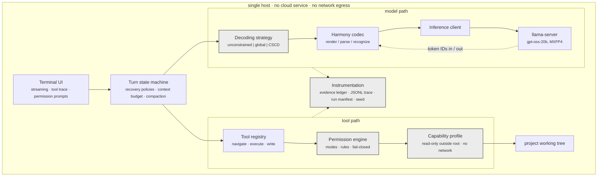
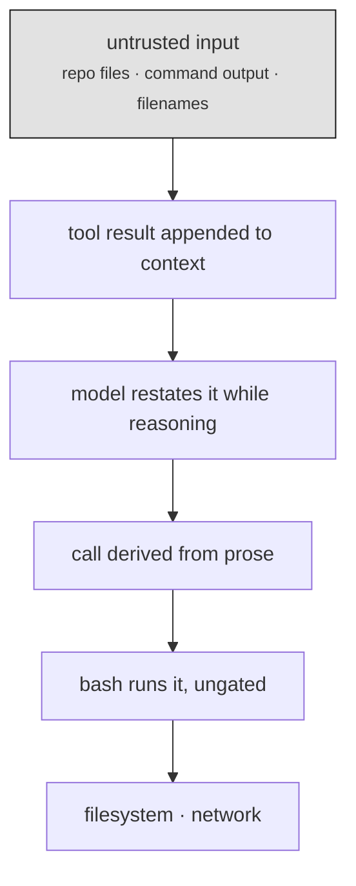

# The architecture in words — a spec for generating diagrams

Written to drive any of three things: an image generator, a diagram-as-code tool, or a human
illustrator. **Part A** is the complete specification (node inventory, edges, grouping, layout).
**Part B** is image-generator prompts. **Part C** is Mermaid source that renders correctly today.

> **Read this before using an image generator.** Diffusion image models cannot reliably render
> text. An architecture diagram here needs 35–60 exact labels (`to=functions.read`,
> `multi_edit`, `<|constrain|>json`), and a generator will produce confident-looking nonsense in
> place of most of them — unusable in a paper, and a plagiarism-adjacent hazard if a mangled
> label changes a technical claim. Use an image generator for a *poster, slide, or talk visual*
> where approximate text is acceptable. For the paper, use the SVGs in this directory or the
> Mermaid in Part C. Part B is written to maximise the odds anyway: few labels, simple shapes.

---

# Part A — Complete specification

## A.0 Component inventory

Everything below runs on **one host**. Nothing contacts a network service.

### Layer 1 — Interface
| Component | Responsibility |
|---|---|
| Terminal UI | prompt input, live token streaming, tool-call trace, status bar, slash commands |
| Permission prompt | shows the pending diff, reads allow-once / session / always / deny |

### Layer 2 — Orchestration
| Component | Responsibility |
|---|---|
| **Turn state machine** | drives one user turn: render → decode → parse → dispatch → repeat; emits a typed stop reason |
| **Recovery policy set** | pluggable policies: malformed-header salvage · prose-level call recovery *(the object of study)* · nudge · token escalation · tool-less synthesis. An experiment arm is a subset of these |
| Context manager | per-result truncation, stale-reasoning drop, pairing-preserving compaction on turn boundaries |

### Layer 3 — Decoding *(new)*
| Component | Responsibility |
|---|---|
| **Decoding strategy** | one of: `unconstrained` · `global_schema` · **`CSCD-I`** · `CSCD-G` |
| **Harmony region recognizer** | incremental scan of the output token stream; fires on commentary-channel onset |

### Layer 4 — Protocol
| Component | Responsibility |
|---|---|
| **Harmony codec** | renders the conversation to **token IDs**; parses returned **token IDs** into channels (`analysis`, `commentary`, `final`); incremental decoder for streaming |
| Offline BPE vocab | vendored `o200k_base`, SHA-pinned — no download, ever |

### Layer 5 — Inference
| Component | Responsibility |
|---|---|
| Inference client | raw `/completion`: token IDs in and out, SSE streaming, **seed**, `grammar` / `json_schema`, `cache_prompt` for KV reuse |
| Model runtime | `llama-server` · gpt-oss-20b, MXFP4 · single slot · 64 K context |

### Layer 6 — Tools (three tiers)
| Tier | Tools |
|---|---|
| **navigate** (read-only) | `list_dir` · `glob` · `grep` · `read` |
| **execute** | `bash` — one persistent shell, project venv active |
| **write** | `edit` · `write` · `multi_edit` — read-before-write, atomic, backed up, returns a diff |

### Layer 7 — Governance (three nested boundaries)
| Component | Responsibility |
|---|---|
| Path sandbox | every file path resolves inside the project root; blocks `..`, absolute paths, escaping symlinks |
| **Permission engine** | policy: five modes, path-scoped allow/ask/deny rules (deny wins), always-denied secret paths, session decisions. Fail-closed |
| **Capability profile** *(new)* | enforcement: read-only bind mounts outside the project root, read-write inside, **network namespace unshared**, die-with-parent (bubblewrap) |

### Layer 8 — Instrumentation *(new)*
| Component | Responsibility |
|---|---|
| **Evidence ledger** | append-only `(obs_id, tool, path, line range, content hash, turn)`; survives compaction; answers must cite it |
| JSONL trace | one record per event — render size, decode phase, parse outcome, tool, decision, latency |
| Run manifest | git SHA · GGUF hash · server commit · context size · sampling · **seed** · arm · profile |

### Offline, not part of the running agent
Evaluation suites (repository QA · issue resolution subset · injection suite), the sweep driver,
and the analysis scripts that turn traces into tables.

## A.1 Diagram 1 — System architecture

**Canvas.** Portrait, roughly 3 wide × 4 tall. One column, splitting into two parallel columns
in the middle, rejoining at the bottom.

**Outer container.** A dashed rounded rectangle enclosing *everything*. Label along the top
edge: `single host · no cloud service · no network egress`. This boundary is the privacy claim —
it must be visually unmistakable.

**Vertical order, top to bottom.**

1. **Full-width box:** `Terminal UI` (subtitle: `streaming · tool trace · permission prompts`)
2. **Full-width box:** `Turn state machine` (subtitle: `recovery policies · context budget · compaction`)
3. **The split.** Two arrows leave the bottom of box 2 — one down-left, one down-right — into two
   parallel columns of equal width.

   **Left column — the model path** (three stacked boxes, each feeding the next downward):
   - `Decoding strategy` (subtitle: `unconstrained | global | CSCD`) — **shaded**, it is new
   - `Harmony codec` (subtitle: `render / parse / recognize`)
   - `Inference client`
   - then a **heavy-bordered** box: `llama-server` (subtitle: `gpt-oss-20b, MXFP4`)

   **Right column — the tool path** (stacked, feeding downward):
   - `Tool registry`, containing three labelled rows: `navigate: list_dir, glob, grep, read` /
     `execute: bash` / `write: edit, write, multi_edit`
   - `Permission engine` (subtitle: `modes · rules · fail-closed`) — **shaded**
   - then a **heavy-bordered** box: `Capability profile` (subtitle: `read-only outside root · no network`)

4. **Rejoin.** An arrow from `Capability profile` down into a centred box: `project working tree`.
   A second arrow leaves `llama-server`, runs left and down, and re-enters the left column
   upward — label it `token IDs in / out`. (This is a loop, not a terminus: the model path is a
   round trip.)
5. **Full-width box at the bottom:** `Instrumentation` (subtitle:
   `evidence ledger · JSONL trace · run manifest · seed`), reached by **dotted** arrows from both
   columns. Caption beneath: `every decision and observation is recorded`.

**Edge styles.** Solid arrows for control and data flow. Dotted arrows for instrumentation.
Heavy borders mark the two components that are separate OS-level processes or boundaries
(`llama-server`, `Capability profile`). Light grey fill marks what is new in this work
(`Decoding strategy`, `Permission engine`, `Capability profile`, `Instrumentation`).

**The message the layout must carry.** Two parallel paths under one controller; the model path
is a closed loop in token-ID space; the tool path passes through two gates before touching disk;
everything is inside one dashed host boundary.

## A.2 Diagram 2 — Channel-scoped constrained decoding

**Canvas.** Wide landscape, roughly 3 wide × 1 tall. A left-to-right timeline, not a flowchart.

**Row 1 — the token stream.** One long horizontal bar, left to right, divided into five
segments of unequal width. Left-side row label: `tokens`.

| # | Width | Fill | Text inside |
|---|---|---|---|
| 1 | widest (~35 %) | white | `<|channel|>analysis<|message|>` and below it `… free-form reasoning …` |
| 2 | narrow (~10 %) | light grey | `read` |
| 3 | medium (~23 %) | **dark grey, white text** | `to=functions.read` and below it `<|constrain|>json<|message|>` |
| 4 | medium (~16 %) | light grey | `{"path":"loop.py"}` |
| 5 | narrow (~6 %) | light grey | `<|call|>` |

**Above row 1** — phase labels, each centred over its segment, bold name with a small subtitle:
`Phase A` / `unconstrained decode` · `B` / `tool name` · `B′` / `header injected` ·
`Phase C` / `schema-constrained`.

**A vertical dashed line** at the boundary between segment 1 and segment 2, rising above the bar,
annotated `commentary-channel onset detected`.

**Row 2 — the constraint band.** A second horizontal bar directly below, same left and right
extent, in exactly **two** parts: white under segment 1 labelled `INACTIVE`, and light grey
under segments 2–5 labelled `ACTIVE`. Left-side row label: `grammar`. **This band is the whole
contribution** — the reader must see at a glance that grey never overlaps the reasoning segment.

**Between the rows** — three small numbered circles, ①②③, positioned under segment 1, under the
dashed boundary, and under segment 4 respectively.

**Row 3 — three short captions** in three columns, each opening with its number:
1. `The reasoning channel is never constrained, so there is no constraint tax on reasoning.`
2. `The grammar starts only after the model has committed to a call, so call suppression cannot occur.`
3. `Arguments are checked against that one tool's schema, so invalid parameter names cannot be emitted.`

**Legend, top right.** A small dark-grey swatch labelled
`emitted by the orchestrator, not the model`.

## A.3 Diagram 3 — Dispatch surface, before and after

**Canvas.** Landscape, roughly 2 wide × 1 tall. **Two side-by-side panels of identical
geometry** — this is essential, the comparison only reads if the eye compares arrows rather
than layouts. Each panel in a dashed border, titled beneath the top edge:
`(a) repair-equipped agent` and `(b) CSCD + capability profile`.

**Both panels contain the same vertical chain of six boxes**, evenly spaced with generous gaps:

1. `untrusted input` (subtitle: `repo files · command output · filenames`) — **light grey fill**
2. `tool result appended to context`
3. `model restates it while reasoning`
4. `call derived from prose`
5. `bash runs it` — in (a) subtitle `ungated`; in (b) subtitle `permission-gated`
6. `filesystem · network`

**Panel (a).** Arrows between all six boxes drawn **thick and black, unbroken**. Bold text
beneath the chain: `injected command executes`.

**Panel (b).** Same chain, but:
- box 4 is drawn **faded**: dashed grey border, grey text — the mechanism is gone
- the arrow into box 4 is **cut** by a circled ✗, annotated to its right:
  `calls are already structurally valid`
- the arrow into box 6 is **cut** by a second circled ✗, annotated:
  `read-only outside root · no egress`
- all arrows thin and grey, not heavy
- bold text beneath: `blocked at two independent points`

**The message.** In (a) a single unbroken path runs from untrusted repository content all the way
to the filesystem and the network. In (b) that path is severed twice, by two independent
mechanisms — one from the decoding method, one from enforcement.

## A.4 Visual style, all three diagrams

- **Greyscale only.** Papers print black and white; distinguish by fill, border weight and
  label, never by hue.
- Flat fills. No gradients, no drop shadows, no 3-D, no glow, no perspective.
- Rectangles with slightly rounded corners. Plain triangular arrowheads.
- One sans-serif family throughout (Helvetica or Arial). Monospace **only** for literal tokens
  and code (`to=functions.read`, `{"path":"loop.py"}`).
- Four fills total: white (ordinary), light grey (new in this work / constrained),
  dark grey with white text (orchestrator-emitted), very light grey (untrusted input).
- Generous white space. No icons, no clip art, no decorative imagery, no logos, no human
  figures, no server-rack or cloud pictograms.
- Every label in **sentence case**, short. No label longer than six words except the three
  numbered captions in Diagram 2.

---

# Part B — Image-generator prompts

Paste one at a time. Each starts with the shared style preamble. Expect to regenerate several
times, and expect to fix text by hand afterwards.

**Style preamble** (prepend to every prompt):

> A clean, minimal, flat technical architecture diagram for an academic paper. Strictly
> greyscale — white, light grey and dark grey only, no colour. Flat fills, no gradients, no
> shadows, no 3-D, no perspective, no glow. Rectangular boxes with slightly rounded corners,
> thin black borders, plain triangular arrowheads. Sans-serif labels, generous white space, no
> icons, no clip art, no logos, no human figures, no cloud or server-rack pictures. Vector-style
> line art on a plain white background.

**Prompt 1 — system architecture (portrait).**

> …preamble… A portrait-orientation block diagram inside one large dashed rounded rectangle
> labelled "single host, no network egress". Inside, from top to bottom: a full-width box
> "Terminal UI"; below it a full-width box "Turn state machine"; below that the flow splits with
> two arrows into two equal parallel columns. The left column is a vertical stack of four boxes:
> "Decoding strategy" (light grey fill), "Harmony codec", "Inference client", and at the bottom a
> thick-bordered box "llama-server". The right column is a vertical stack of three boxes: a tall
> box "Tool registry" containing three text rows, then "Permission engine" (light grey fill),
> then a thick-bordered box "Capability profile". An arrow runs from the bottom of the right
> column into a single centred box "project working tree". At the very bottom, a full-width light
> grey box "Instrumentation", reached by dotted arrows from both columns.

**Prompt 2 — constrained decoding timeline (wide landscape).**

> …preamble… A wide horizontal timeline diagram, two stacked horizontal bars. The upper bar is
> divided left to right into five segments of unequal width: a wide white segment, a narrow light
> grey segment, a medium dark grey segment with white text, a medium light grey segment, and a
> narrow light grey segment. Above each segment a small bold label with a one-line subtitle. A
> vertical dashed line rises above the bar at the boundary between the first and second segments.
> The lower bar spans the same width in only two parts: white on the left under the first segment
> labelled "INACTIVE", and light grey across the whole remainder labelled "ACTIVE". Three small
> numbered circles sit between the two bars. Below, three short columns of caption text.

**Prompt 3 — before/after security comparison (landscape).**

> …preamble… Two side-by-side panels of identical layout, each in a dashed border with a bold
> title above. Each panel contains a single vertical chain of six evenly spaced rectangular
> boxes connected by downward arrows. In the left panel the arrows are thick, black and
> unbroken, with bold text beneath the chain. In the right panel the arrows are thin and grey,
> the fourth box is faded with a dashed grey border, and two of the arrows are interrupted by a
> small white circle containing a bold X, each with a short annotation to its right.

**Known failure modes.** Text inside the dark-grey segment of Prompt 2 usually fails first.
Prompt 1's two-column split frequently collapses into one column — add "two clearly separate
parallel vertical columns side by side" if it does. Prompt 3's panels often drift out of
alignment, which destroys the comparison; regenerate rather than accept it.

---

# Part C — Mermaid source (renders correctly, use for drafts)

Diagram 1. Paste into any Mermaid renderer, then export SVG.

Diagram 3 as a flowchart (Mermaid cannot do the two-panel comparison well — render twice, once
per configuration, and place them side by side in LaTeX with `subfigure`):

Diagram 2 is a timeline, not a graph — Mermaid renders it badly. Use
[`fig2-cscd.svg`](fig2-cscd.svg) in this directory, or hand-draw it in draw.io from §A.2.
